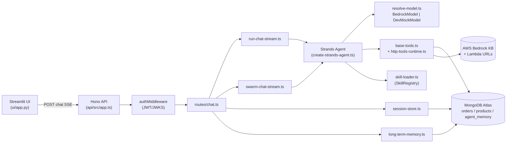
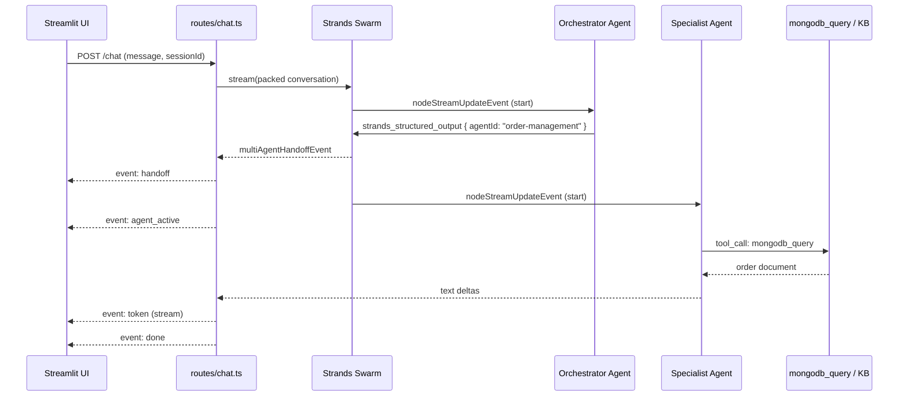

# MongoDB + AWS Bedrock Multi-Agent Framework: A Code Walkthrough

*2026-05-04T13:16:41Z by Showless dev*
<!-- showless-id: 36d75d07-8615-4783-971c-ee4646b07f4e -->

This is a configuration-driven multi-agent framework that runs on AWS Bedrock through the Strands Agents SDK and stores its memory in MongoDB Atlas. About **5,000 lines** of TypeScript and Python carry roughly **45 source files** across three deployable artifacts: a Hono-based Bun API, a Streamlit chat UI, and Terraform for the AWS side. The whole point is to add a new specialist agent — say, "billing" or "warranty" — by **dropping in two markdown files** instead of forking the runtime. The orchestrator routes every customer message to the right specialist; each specialist loads its own *skill* (a markdown package of instructions, references, and small `.mjs` policy scripts) and uses generic data tools (`mongodb_query`, `bedrock_kb_retrieve`, optional Lambda HTTP tools) to answer.

Two design decisions define the codebase. First, **agents are configuration, not code**: `config/agents/*.agent.md` files are parsed on every request with mtime-based caching, so editing an `.agent.md` hot-reloads without restarting the API. Second, **skills load progressively**: a skill's name and description cost ~100 tokens at startup, the full `SKILL.md` only loads when the agent activates it, and reference files inside the skill are read lazily through `read_skill_resource`.

Key features:

- One markdown file per agent (`.agent.md`), one folder per skill (`SKILL.md` + `references/` + `scripts/`).
- Streaming responses over Server-Sent Events: tokens, tool calls, skill loads, agent handoffs.
- Single-agent and multi-agent **Swarm** orchestration modes from the same Hono route.
- Local dev loop with **zero AWS dependencies**: a `DevMockModel` plus MongoDB-shaped fixtures.
- Optional **JWT/JWKS auth** (Cognito-friendly) that scopes sessions and long-term memory to a user.
- **Long-term memory** in a MongoDB `agent_memory` collection with an auto-managed TTL index.
- Skill-scoped HTTP tools so a skill can call a Lambda Function URL with no TypeScript change.



The **Streamlit UI** is a thin SSE client; everything intelligent happens in the Hono API. Inside the API, `routes/chat.ts` is the fork point — it reads the agent's frontmatter, decides between single-agent (`run-chat-stream.ts`) and multi-agent (`swarm-chat-stream.ts`), and bolts on optional long-term memory injection. Both streamers call `create-strands-agent.ts`, which builds a `SkillRegistry`, resolves a model (real Bedrock or `DevMockModel`), wires up `base-tools.ts`, and hands a fully configured `Strands Agent` back. **MongoDB Atlas** appears on the right edge three times: as the data layer for the `mongodb_query` and `mongodb_vector_search` tools, as the optional persistent backing store for sessions, and as the home of the `agent_memory` collection.

## Repository shape

The repository ships three deployable artifacts and a configuration tree that the API reads at runtime.

### Top-level layout

A `find` over the root, with build artifacts and dependencies pruned, gives a feel for what is hand-written and what isn't.

```bash
find . -maxdepth 2 -type d \
  -not -path '*/node_modules*' -not -path '*/.git*' \
  -not -path '*/.terraform*' -not -path '*/__pycache__*' \
  -not -path '*/.pytest_cache*' -not -path '*/dist*' \
  | sort

```

```output
.
./.cursor
./api
./api/scripts
./api/src
./api/tests
./config
./config/agents
./config/skills
./db-seeding
./deploy
./deploy/kb-docs
./deploy/scripts
./deploy/terraform
./docs
./docs/client
./e2e
./e2e/test-results
./e2e/tests
./lambda
./lambda/base-tools
./ui
./ui/lib
./ui/pages
./ui/tests
```

The shape is unsurprising: `api/` is the runtime, `ui/` is the chat client, `config/` is the markdown that defines agent and skill behavior, `deploy/` carries Terraform plus Docker scripts, and `db-seeding/` is a small set of TypeScript scripts that load fixtures into Atlas. The `lambda/` folder is a placeholder for future serverless tools — the API itself doesn't depend on it.

### Source size

The TypeScript footprint inside `api/src/` is the heart of the project. Here are the lines per file, sorted ascending so the largest files float to the bottom.

```bash
find api/src -type f -name '*.ts' | xargs wc -l | sort -n | tail -20

```

```output
      69 api/src/lib/tools/troubleshooting-tools.ts
      90 api/src/lib/jwt-verify.ts
      93 api/src/lib/environment-config.ts
     100 api/src/lib/prompt.ts
     124 api/src/lib/health-status.ts
     125 api/src/lib/http-tools-load.ts
     155 api/src/lib/long-term-memory.ts
     158 api/src/lib/run-chat-stream.ts
     159 api/src/adapters/mock-retrieval.ts
     164 api/src/lib/swarm-chat-stream.ts
     179 api/src/routes/chat.ts
     180 api/src/lib/skill-http-tools-load.ts
     188 api/src/lib/config-scan.ts
     190 api/src/adapters/mongo-data.ts
     215 api/src/lib/skill-loader.ts
     247 api/src/lib/session-store.ts
     260 api/src/lib/http-tools-runtime.ts
     355 api/src/lib/base-tools.ts
     383 api/src/adapters/dev-mock-model.ts
    4238 total
```

The biggest file — by a wide margin — is `dev-mock-model.ts` at **383 lines**. That is significant: the *test fixture* model is larger than any production module. It exists so a contributor can run the full agent loop with `DEV_MOCK_BACKENDS=1` and never touch AWS. After the mock model, the largest production files cluster around the boundary between agents and the world: `base-tools.ts` (355), `http-tools-runtime.ts` (260), `session-store.ts` (247), and `skill-loader.ts` (215). The pure pipeline files — `run-chat-stream.ts`, `swarm-chat-stream.ts`, `prompt.ts` — are all under 165 lines, which tells you the architecture leans hard on configuration loaders and tool wiring rather than on a thick orchestration core.

### Configuration tree

Behavior lives in markdown. Everything under `config/` is what a customer would edit to add a new agent or domain.

```bash
find config -type f | sort

```

```output
config/agents/orchestrator.agent.md
config/agents/order-management.agent.md
config/agents/product-recommendation.agent.md
config/agents/troubleshooting.agent.md
config/environment.yaml
config/http-tools.example.json
config/http-tools.json
config/skills/order-management/SKILL.md
config/skills/order-management/http-tools.example.json
config/skills/order-management/http-tools.json
config/skills/order-management/references/order-schema.md
config/skills/order-management/scripts/validate-return.mjs
config/skills/product-recommendation/SKILL.md
config/skills/product-recommendation/references/catalog-overview.md
config/skills/product-recommendation/references/search-patterns.md
config/skills/troubleshooting/SKILL.md
config/skills/troubleshooting/references/common-issues.md
config/skills/troubleshooting/references/error-codes.md
config/skills/troubleshooting/scripts/build-ticket.mjs
config/skills/troubleshooting/scripts/escalation-checklist.md
```

There are exactly **four `.agent.md` files** and **three skill folders** — that is the entire production behavior of the system. Two `.mjs` scripts (`validate-return.mjs` and `build-ticket.mjs`) live inside skills as executable policies that the agent calls through `run_skill_script`; they're plain ECMAScript modules, not part of the API build. Skill HTTP tools surface as `*/http-tools.json` files that the runtime loads on demand. The `*.example.json` files exist so customers can copy them, fill in real Lambda URLs, and avoid committing secrets.

With the shape settled, the rest of this walkthrough follows the path of a single chat message: from the markdown that defines an agent, through the skill loader and prompt builder, into the Strands stream, and back out as SSE events the Streamlit UI renders one token at a time.

## 1. Configuration as Data — `config/agents/*.agent.md` and `config-scan.ts`

The most important design choice in the codebase is hidden in `config-scan.ts`: agents are not registered in a Map, they are *files on disk*, scanned and parsed every request. This chapter shows what an agent looks like, how the scanner reads it without exploding under load, and why this enables hot-reload without a watcher.

### What an agent file contains

The orchestrator is the simplest agent — no skills, no tools, all behavior expressed as a system prompt and a list of `handoffs`.

```bash
sed -n '1,26p' config/agents/orchestrator.agent.md

```

```output
---
name: Orchestrator
description: Routes customer messages to the appropriate specialist agent.
id: orchestrator
skills: []
tools: []
model: us.anthropic.claude-3-7-sonnet-20250219-v1:0
maxTokens: 4096
temperature: 0.3
handoffs:
  - label: Order question
    agent: order-management
    prompt: >-
      Order domain: status, tracking, delivery, cancellation, return, or replacement.
      Pass any order IDs (e.g. ORD-…), SKUs, or customer email the user mentioned verbatim.
  - label: Product recommendation
    agent: product-recommendation
    prompt: >-
      Product domain: recommendations, comparisons, “which should I buy”, upgrades, or
      replacements after an order issue. Include budget, room size, or use case if given.
  - label: Troubleshooting
    agent: troubleshooting
    prompt: >-
      Product diagnosis: errors, won’t power on, connectivity, hardware symptoms, or
      error codes. Include device model, SKU, or order ID if the customer provided them.
---
```

The frontmatter is everything the runtime needs to construct a Strands `Agent`: a Bedrock `model` ID, sampling parameters, an empty `skills:` list (orchestrators don't need domain knowledge), and a `handoffs:` block that doubles as the routing rubric. The markdown body that follows the closing `---` becomes the system prompt. A specialist like `order-management.agent.md` looks the same shape but adds `skills: ['order-management']` and a `tools:` array of generic capabilities (`mongodb_query`, `read_skill_resource`, …). Adding a fifth specialist means a fifth file with the same shape — no TypeScript edit.

### A typed schema, not just YAML

The shape is enforced by a small Zod schema in `api/src/lib/schemas.ts`. Notice the defaults: `skills` and `tools` default to empty arrays, `temperature` defaults to `0.7`, and the optional `memory` block is parsed but not required.

```bash
sed -n '9,28p' api/src/lib/schemas.ts

```

```output
/** Frontmatter for config agents: `.agent.md` files (subset enforced at runtime). */
export const agentFrontmatterSchema = z.object({
  name: z.string().min(1),
  description: z.string(),
  id: z.string().min(1),
  skills: z.array(z.string()).default([]),
  tools: z.array(z.string()).default([]),
  model: z.string().optional(),
  maxTokens: z.coerce.number().int().positive().default(4096),
  temperature: z.coerce.number().min(0).max(2).default(0.7),
  memory: z
    .object({
      shortTerm: z.boolean().optional(),
      longTerm: z.boolean().optional(),
      longTermCollection: z.string().optional(),
    })
    .optional(),
  handoffs: z.array(agentHandoffSchema).default([]),
});

```

A bad frontmatter never reaches the model. `parseAgentDetail` calls `safeParse`, logs the validation issues through the structured logger, and returns `null` so the agent simply doesn't appear in `listAgents()`. The user gets a clean `AGENT_NOT_FOUND` from the route instead of a runtime crash deep inside the Strands SDK.

### Hot-reload without a watcher

Reading every `.agent.md` on every request would be slow under load. `config-scan.ts` solves this with **mtime-based caches** — one for the directory listing and one for each parsed file. The cache invalidates the moment the file's modification time changes.

```bash
sed -n '123,143p' api/src/lib/config-scan.ts

```

```output
export function listAgents(): AgentListItem[] {
  const dir = agentsDir();
  if (!fs.existsSync(dir)) return [];

  const currentMtime = dirMtimeMs(dir);
  if (agentListCache && agentListCache.mtimeMs === currentMtime) {
    return agentListCache.value;
  }

  const files = fs.readdirSync(dir).filter((f) => f.endsWith(".agent.md"));
  const out: AgentListItem[] = [];
  for (const file of files) {
    const full = path.join(dir, file);
    const detail = parseAgentDetail(full);
    if (detail) out.push({ id: detail.id, name: detail.name, description: detail.description });
  }
  const sorted = out.sort((a, b) => a.id.localeCompare(b.id));
  agentListCache = { value: sorted, mtimeMs: currentMtime };
  logger.debug("[agents] list cache refreshed", { count: sorted.length });
  return sorted;
}
```

The trick is comparing the *directory's* mtime, not the contents. Adding or removing a file bumps the directory mtime; editing a single agent file bumps the file's mtime, which `getAgent` checks separately. This means a new `.agent.md` shows up on the next request without the API restarting and without the kernel filesystem watchers a long-running daemon would need. The cache is intentionally not flushed on a timer — it's correct because mtime is the source of truth.

### Persona vs detail, two caches one file

A subtle detail: `loadAgentPersona` and `getAgent` parse the same file but cache different slices.

```bash
sed -n '162,177p' api/src/lib/config-scan.ts

```

```output
export function loadAgentPersona(agentId: string): string | undefined {
  const target = resolveAgentFile(agentId);
  if (!target) return undefined;

  const currentMtime = fileMtimeMs(target);
  const cached = agentPersonaCache.get(target);
  if (cached && cached.mtimeMs === currentMtime) {
    return cached.value;
  }

  const raw = fs.readFileSync(target, "utf8");
  const { content } = matter(raw);
  const persona = content.trim() || undefined;
  agentPersonaCache.set(target, { value: persona, mtimeMs: currentMtime });
  return persona;
}
```

`gray-matter` returns both `data` (the YAML frontmatter, used by `parseAgentDetail`) and `content` (the markdown body, used here as the persona). They're cached as separate values on separate `Map`s, both keyed by absolute path and invalidated by the same mtime. The result: editing the markdown body of an `.agent.md` invalidates the persona cache without re-running the schema validator, and editing the frontmatter invalidates the detail cache without re-reading the body. Both paths return in microseconds for a hot file.

## 2. Skills and Progressive Disclosure — `skill-loader.ts`

A skill is a folder of markdown that turns a generic agent into a domain expert. The trick is that a skill costs almost nothing to *advertise* and is only *fully loaded* when needed. `skill-loader.ts` implements three load phases and a per-turn `SkillRegistry` that the runtime mutates as the model decides what it needs.

### Phase 1 — discovery (cheap)

The discovery phase reads only the YAML frontmatter from each `SKILL.md` so the orchestrator can list every skill in its system prompt without paying the cost of the body.

```bash
sed -n '59,78p' api/src/lib/skill-loader.ts

```

```output
export function listSkillDiscovery(): SkillDiscovery[] {
  const root = skillsRoot();
  if (!fs.existsSync(root)) return [];

  let dirMtime = -1;
  try { dirMtime = fs.statSync(root).mtimeMs; } catch { /* */ }
  if (skillDiscoveryCache && skillDiscoveryCache.mtimeMs === dirMtime) {
    return skillDiscoveryCache.value;
  }

  const dirs = fs.readdirSync(root, { withFileTypes: true }).filter((d) => d.isDirectory());
  const out: SkillDiscovery[] = [];
  for (const d of dirs) {
    const fm = parseSkillFrontmatter(path.join(root, d.name, "SKILL.md"), d.name);
    if (fm) out.push(fm);
  }
  const sorted = out.sort((a, b) => a.name.localeCompare(b.name));
  skillDiscoveryCache = { value: sorted, mtimeMs: dirMtime };
  return sorted;
}
```

Each discovery record is just `{ name, description, version }` — about a hundred tokens once formatted. The orchestrator's system prompt embeds these as `- **order-management**: Query and manage customer orders…`. The model uses the description to decide which skill to activate; the body is invisible until then. With a dozen skills the discovery section is still under 1.5 KB.

### Phase 2 — activation (real cost)

When an agent needs to actually answer a domain question, it activates a skill, which loads the full markdown body of `SKILL.md`.

```bash
sed -n '178,193p' api/src/lib/skill-loader.ts

```

```output
  /** Activate a skill: load its full SKILL.md body (idempotent). */
  activate(skillName: string): { ok: true; body: string } | { ok: false; error: string } {
    if (!this.allowedSkills.has(skillName)) {
      return { ok: false, error: `skill '${skillName}' is not in this agent's skills list` };
    }
    if (this._activated.has(skillName)) {
      return { ok: true, body: this._activated.get(skillName)! };
    }
    const body = loadSkillInstructions(skillName);
    if (!body) {
      return { ok: false, error: `SKILL.md not found or empty for '${skillName}'` };
    }
    this._activated.set(skillName, body);
    return { ok: true, body };
  }

```

Notice the **two security gates** baked into a single function. First, `allowedSkills` — the agent's `skills:` array from frontmatter — is the *only* set of skills this agent can ever see. A malicious prompt asking the model to "activate the credit-card skill" cannot escape the allowlist. Second, activation is idempotent: calling `activate("order-management")` twice returns the cached body, not a second filesystem read. `SkillRegistry` is constructed fresh per turn, so different concurrent users never share activated state.

### Phase 3 — on-demand resources

A skill folder can carry references and policy scripts the agent reads only when the conversation needs them. The path resolver below is the choke point that keeps a Strands tool from escaping the skill directory.

```bash
sed -n '101,119p' api/src/lib/skill-loader.ts

```

```output
export function resolveSkillResourcePath(
  skillName: string,
  resourcePath: string,
): { ok: true; absolutePath: string } | { ok: false; error: string } {
  if (!skillName.trim() || resourcePath.includes("\0")) {
    return { ok: false, error: "invalid_input" };
  }
  const resolvedRoot = path.resolve(skillsRoot(), skillName);
  const normalized = resourcePath.replace(/^[/\\]+/, "");
  const resolvedFile = path.resolve(resolvedRoot, normalized);
  const rel = path.relative(resolvedRoot, resolvedFile);
  if (rel.startsWith("..") || path.isAbsolute(rel)) {
    return { ok: false, error: "path_not_under_skill_directory" };
  }
  if (!fs.existsSync(resolvedFile) || !fs.statSync(resolvedFile).isFile()) {
    return { ok: false, error: "not_found" };
  }
  return { ok: true, absolutePath: resolvedFile };
}
```

This is classic path-traversal protection: resolve to absolute, then check that the relative path back to the skill root does not start with `..` or become absolute. Null bytes are rejected up front. The same gate covers both `read_skill_resource` (which reads markdown like `references/order-schema.md`) and `run_skill_script` (which dynamic-imports `.mjs` policy files). Without this, a hostile prompt could ask the agent to read `../../etc/passwd` through the legitimate skill resource tool.

### Pre-activation for specialists

Specialist agents always need their skill, so the runtime pre-activates everything in their `skills:` list at turn start. The orchestrator does the opposite — it ships only the discovery index and trusts the model to call `activate_skill` (it actually doesn't, because the orchestrator's `skills:` list is empty).

```bash
sed -n '209,215p' api/src/lib/skill-loader.ts

```

```output
  /** Pre-activate all allowed skills (used for specialist agents that always need their skill). */
  activateAll(): void {
    for (const name of this.allowedSkills) {
      this.activate(name);
    }
  }
}
```

Six lines, but they're load-bearing. Specialists pay the full token cost of their skill body up front so the model has the full instructions in context from token zero. Calling `activateAll()` for an orchestrator with `skills: []` is a no-op — no special-casing needed in the route handler.

## 3. Building the System Prompt — `prompt.ts`

`prompt.ts` is one hundred lines of pure assembly: persona + memory + skill discovery + activated skill bodies, in that exact order, joined by predictable headings. There is no template engine and no reflection — the prompt is built from typed inputs and a few `\n\n` joins. That's a feature: a contributor reading the file knows exactly what the model will see.

### The combined builder

`buildSystemPrompt` is the single entry point. The order matters: long-term memory comes before skills so the agent reads "what we've discussed" before "how to do your job."

```bash
sed -n '82,100p' api/src/lib/prompt.ts

```

```output
export function buildSystemPrompt(
  persona: string,
  discoveries: SkillDiscovery[],
  activated: { name: string; body: string }[],
  memoryContext?: string,
): string {
  const base = persona.trim() || "You are a helpful assistant.";
  let prompt = base;
  if (memoryContext?.trim()) {
    prompt = withLongTermMemory(prompt, memoryContext);
  }
  if (discoveries.length > 0) {
    prompt = withSkillDiscoverySection(prompt, discoveries);
  }
  if (activated.length > 0) {
    prompt = withActivatedSkills(prompt, activated);
  }
  return prompt;
}
```

The fallback `"You are a helpful assistant."` saves the runtime when an `.agent.md` body is empty or stripped to nothing — defense in depth so a misconfigured agent still gets a sensible system prompt instead of an empty string. Each helper is a small append; nothing in this file mutates state. The result is a deterministic prompt that diffs cleanly when you change a persona or activate a different skill.

### Discovery section format

Each helper is one boring template, on purpose. The discovery section is a markdown bulleted list, prefixed with a sentence telling the model how to act on it.

```bash
sed -n '12,26p' api/src/lib/prompt.ts

```

```output
export function withSkillDiscoverySection(
  basePrompt: string,
  discoveries: SkillDiscovery[],
): string {
  if (discoveries.length === 0) return basePrompt;
  const lines = discoveries
    .map((d) => `- **${d.name}**: ${d.description}`)
    .join("\n");
  return (
    `${basePrompt}\n\n` +
    `## Available skills (discovery index)\n\n` +
    `Use \`activate_skill\` to load full instructions before answering domain questions.\n\n` +
    `${lines}`
  );
}
```

The discovery index is the contract between the orchestrator and the world: "here are the skills that exist, and here is the tool name to call to load any of them." When the orchestrator decides a customer message is about returns, it only needs the discovery line for `order-management` to know that handing off there is the right move. The discovery section is intentionally bare so a 12-skill deployment fits in a few hundred tokens.

### Memory comes first

Long-term memory is rendered with a header that doubles as instructions to the model.

```bash
sed -n '59,68p' api/src/lib/prompt.ts

```

```output
export function withLongTermMemory(basePrompt: string, memoryContext: string): string {
  if (!memoryContext.trim()) return basePrompt;
  return (
    `${basePrompt}\n\n` +
    `## Context from previous sessions (long-term memory)\n\n` +
    `The following are summaries of recent past conversations with this user. ` +
    `Use them to personalize your response and avoid asking for information already provided.\n\n` +
    `${memoryContext.trim()}`
  );
}
```

The header text is a soft instruction: "use them to personalize your response and avoid asking for information already provided." The model isn't forced to use the memory — but the header makes it weird *not* to. Empty memory short-circuits with the original prompt unchanged, which means a brand-new user gets exactly the same prompt structure as a returning user with zero past turns, just shorter.

## 4. Tools — `base-tools.ts` and `http-tools-runtime.ts`

The agent's hands are its tools. Some are static (any agent can use `mongodb_query`), some are factories that close over the per-turn `SkillRegistry` (`activate_skill`), and some are loaded from JSON at boot (HTTP/Lambda tools). `base-tools.ts` is the assembly point; this chapter walks the wiring.

### The static tool registry

Four tools are global and stateless. They appear in any agent's `tools:` array by name.

```bash
sed -n '282,287p' api/src/lib/base-tools.ts

```

```output
const staticToolByName: Record<string, Tool> = {
  mongodb_query: mongodbQueryTool,
  mongodb_vector_search: mongodbVectorSearchTool,
  bedrock_kb_retrieve: bedrockKbRetrieveTool,
  generate_embedding: generateEmbeddingTool,
};
```

This is the entire data-access surface for the agents: structured MongoDB queries, Atlas vector search, Bedrock Knowledge Base retrieval, and a Bedrock embedding helper. Each tool returns a `not_configured` JSON value when the corresponding env var is missing — no exceptions thrown, no half-initialized clients. The model sees the hint and routes around the missing dependency, which means the same agent definition works against an unconfigured local stack and against full Atlas + Bedrock without code changes.

### Per-turn factories: `activate_skill`

Some tools must close over per-turn state. `activate_skill` is the canonical example — it must mutate the current request's `SkillRegistry`, not some global store.

```bash
sed -n '250,277p' api/src/lib/base-tools.ts

```

```output
export function makeActivateSkillTool(registry: SkillRegistry): Tool {
  return tool({
    name: "activate_skill",
    description:
      "Load the full instructions for a domain skill. Call this before answering questions in that domain. " +
      "Available skills are listed in the system prompt discovery index.",
    inputSchema: z.object({
      skillName: z
        .string()
        .min(1)
        .describe("Skill name from the discovery index (e.g. order-management)"),
    }),
    callback: async (input): Promise<JSONValue> => {
      const result = registry.activate(input.skillName);
      if (!result.ok) {
        return { ok: false, error: result.error, skillName: input.skillName };
      }
      return {
        ok: true,
        skillName: input.skillName,
        instructions: result.body,
        message:
          "Skill instructions loaded. Use them to answer the user's question accurately.",
      };
    },
  });
}

```

The factory is called once per turn from `toolsForAgent`. Every concurrent `POST /chat` gets its own bound `activate_skill` tool, its own `SkillRegistry`, and therefore its own activated bodies — no cross-tenant leakage. The tool returns the loaded instructions *as the tool result*, which means even though Strands does not allow mid-stream mutation of the system prompt, the model still sees the activated body in the very next inference step (because tool results become user messages in the loop).

### Composing tools for an agent

`toolsForAgent` walks the agent's `tools:` array and resolves each name. Three indirections live here: factory tools, skill-scoped HTTP tools, and global HTTP tools.

```bash
sed -n '302,328p' api/src/lib/base-tools.ts

```

```output
export function toolsForAgent(toolNames: string[], registry: SkillRegistry): Tool[] {
  const out: Tool[] = [makeActivateSkillTool(registry)];
  const seen = new Set<string>(["activate_skill"]);
  const httpTools = getHttpToolsMap();
  for (const raw of toolNames) {
    const name = raw.trim();
    if (seen.has(name)) continue;
    seen.add(name);
    if (name === "read_skill_resource") {
      out.push(makeReadSkillResourceTool(registry));
      continue;
    }
    if (name === "run_skill_script") {
      out.push(makeRunSkillScriptTool(registry));
      continue;
    }
    const scoped = parseSkillScopedHttpToolName(name, registry.allowedSkills);
    if (scoped) {
      const def = findSkillHttpToolDefinition(scoped.skillName, scoped.localToolName);
      if (def) {
        out.push(makeSkillHttpConfigTool(name, scoped.skillName, def, registry));
        continue;
      }
      logger.warn("[tools] skill HTTP tool definition missing", {
        skill: scoped.skillName,
        tool: scoped.localToolName,
        agentEntry: name,
```

The resolution order is the trick: factory tools first (`read_skill_resource`, `run_skill_script`), then skill-scoped HTTP tools (`order-management/notify_customer`), then global HTTP tools, then static tools. Unknown names log a warning and are dropped — the agent simply doesn't have that tool, no crash. `activate_skill` is unconditional and always first in the list, because the discovery section in the system prompt promises it exists.

### Skill-scoped HTTP tools with SSRF gates

A skill can declare HTTP tools in `http-tools.json`, and the agent calls them as `skillName/toolName`. The runtime enforces the same activation gate as `read_skill_resource` *and* a host allowlist so the model can't be coaxed into hitting an internal URL.

```bash
sed -n '52,66p' api/src/lib/http-tools-runtime.ts

```

```output
function assertUrlAllowed(urlStr: string, file: HttpToolsFile): void {
  const sec = file.security;
  if (!sec?.allowedHostSuffixes?.length && !sec?.allowedHosts?.length) return;
  let host: string;
  try {
    host = new URL(urlStr).hostname;
  } catch {
    throw new Error("invalid_url");
  }
  const exact = sec.allowedHosts ?? [];
  if (exact.some((h) => h === host)) return;
  const suf = sec.allowedHostSuffixes ?? [];
  if (suf.some((s) => host === s || host.endsWith(s))) return;
  throw new Error(`host_not_allowed:${host}`);
}
```

The host allowlist lives in `config/http-tools.json` at the *repository root* — not inside the skill folder — so a single security policy covers every skill's HTTP tools. The convention is `lambda-url.us-east-1.on.aws` as a suffix, which lets every Lambda Function URL in that region pass through. A misspelled URL or a coerced URL produces `ssrf_blocked` as a JSON tool result; the agent sees the failure and adapts its reply, but the network call never leaves the process.

## 5. Choosing a Model — `resolve-model.ts` and `dev-mock-model.ts`

A Strands `Agent` needs a `Model`. The interesting part is that the runtime supports two: the production `BedrockModel` from the SDK, and a hand-rolled `DevMockModel` that produces deterministic Strands stream events without any AWS account. The choice happens in one tiny file.

### One env var picks the implementation

`resolveModel` is 25 lines of decision-making. The model ID always comes from the agent's frontmatter; the implementation is gated on `DEV_MOCK_BACKENDS=1`.

```bash
sed -n '7,31p' api/src/adapters/resolve-model.ts

```

```output
export function resolveModel(agentConfig: AgentDetail): Model {
  const modelId = agentConfig.model?.trim();
  if (!modelId) {
    throw new Error(
      `Agent '${agentConfig.id}' has no model configured. Add a 'model:' field to ${agentConfig.id}.agent.md.`,
    );
  }

  if (isDevMockBackends()) {
    return new DevMockModel({
      modelId,
      maxTokens: agentConfig.maxTokens,
      temperature: agentConfig.temperature,
      agentId: agentConfig.id,
    });
  }

  const region = process.env.AWS_REGION?.trim();
  return new BedrockModel({
    modelId,
    maxTokens: agentConfig.maxTokens,
    temperature: agentConfig.temperature,
    ...(region ? { region } : {}),
  });
}
```

Notice that `DevMockModel` is given the `agentId` — the mock needs to know whether it's playing the orchestrator or a specialist so it can produce realistic handoff payloads. The Bedrock path forwards `region` only when set, letting the AWS SDK fall back to its standard credential/region resolution chain. The function throws on a missing `model:` field, which is intentional — failing loudly at agent construction time is much better than streaming a confusing error mid-turn.

### The mock model exists to be deterministic

`DevMockModel` is the largest source file in the repo for a reason: it implements enough of the Strands streaming protocol to drive the full agent loop, including tool calls and Swarm structured outputs.

```bash
sed -n '146,156p' api/src/adapters/dev-mock-model.ts

```

```output
function* emitTextStream(text: string, stopReason: "endTurn" | "toolUse" = "endTurn"): Generator<ModelStreamEvent> {
  yield { type: "modelMessageStartEvent", role: "assistant" };
  yield { type: "modelContentBlockStartEvent" };
  yield {
    type: "modelContentBlockDeltaEvent",
    delta: { type: "textDelta", text },
  };
  yield { type: "modelContentBlockStopEvent" };
  yield { type: "modelMessageStopEvent", stopReason };
}

```

That five-event sequence — `messageStart`, `contentBlockStart`, `contentBlockDelta`, `contentBlockStop`, `messageStop` — is the same shape Bedrock would emit. The mock generator yields the entire reply as one delta, but downstream code can't tell the difference. The same `runChatStream` pipeline parses both with no branching for the mock case.

### Routing inside the mock

The mock has just enough knowledge of the four agents to be useful for end-to-end testing. When the orchestrator sees a message about an order, the mock emits a Strands `strands_structured_output` tool use that hands off to `order-management`.

```bash
sed -n '105,130p' api/src/adapters/dev-mock-model.ts

```

```output
function routeOrchestratorHandoff(userText: string): { agentId?: string; message: string } {
  const t = userText.toLowerCase();
  if (/\b(order|orders|ord-|tracking|shipment|delivery)\b/i.test(userText)) {
    return {
      agentId: "order-management",
      message: `Hand off: customer order question. User said: ${userText.slice(0, 500)}`,
    };
  }
  if (/\b(product|recommend|compare|which\s+one|buy)\b/i.test(t)) {
    return {
      agentId: "product-recommendation",
      message: `Hand off: product guidance. User said: ${userText.slice(0, 500)}`,
    };
  }
  if (/\b(fix|broken|error|issue|troubleshoot|not working|help)\b/i.test(t)) {
    return {
      agentId: "troubleshooting",
      message: `Hand off: troubleshooting. User said: ${userText.slice(0, 500)}`,
    };
  }
  return {
    message:
      "Thanks — I can help with orders, product recommendations, or troubleshooting. " +
      "Tell me which you need, or share an order id (e.g. ORD-1001).",
  };
}
```

Three regexes do the routing a real Claude-3.7 would do with reasoning. The fallback message is itself a useful integration test: a deterministic CI run can assert that an orchestrator with no recognizable intent always replies with the help text. The same structure powers `wantsMongoOrderQuery`, `wantsProductRecommend`, and `wantsTroubleshootingQuery` further up the file — together they let the mock generate plausible tool calls (`mongodb_query` for `ORD-1001`, `mongodb_vector_search` for product asks) and feed real fixture data through the loop.

## 6. The Chat Endpoint — `routes/chat.ts`

`POST /chat` is where the world meets the agent loop. It validates input, decides single-agent vs Swarm, fetches long-term memory, opens an SSE response, and translates Strands events into typed JSON the UI can render. Every other API route is much simpler than this one.

### A small Zod request schema

The request body is exactly three fields. Validation happens with Zod and the failure path returns a `400 INVALID_REQUEST` with the same envelope every other error uses.

```bash
sed -n '16,21p' api/src/routes/chat.ts

```

```output
const bodySchema = z.object({
  message: z.string().min(1),
  sessionId: z.string().min(1),
  agentId: z.string().optional(),
});

```

The optional `agentId` defaults to `"orchestrator"` further down — letting the UI ask the orchestrator to route, or pin a conversation to a specific specialist. The UI uses the latter for its agent picker. The schema lives in the route file rather than a shared module because no other endpoint accepts the same shape.

### User identity from a JWT claim

Every protected route exposes `c.get("jwtPayload")` — set by `authMiddleware` after `jose` verifies the bearer token against the JWKS. The chat route extracts the `sub` claim and uses it to scope sessions and memory.

```bash
sed -n '57,72p' api/src/routes/chat.ts

```

```output
  // Extract userId from JWT sub claim (available when REQUIRE_AUTH + JWKS is configured).
  const userId = c.get("jwtPayload")?.sub;

  await appendUserMessage(body.sessionId, body.message, userId);
  const session = await getSession(body.sessionId);
  const priorTurns = session ? session.messages.slice(0, -1) : [];

  // Fetch long-term memory when the agent opts in (memory.longTerm: true).
  let memoryContext: string | undefined;
  if (agent.memory?.longTerm && userId) {
    const ctx = await readLongTermMemory(userId, agentId);
    if (ctx) {
      memoryContext = ctx;
      logger.debug("[chat] injecting long-term memory", { userId, agentId });
    }
  }
```

The double gate on memory injection — `agent.memory?.longTerm && userId` — is deliberate. Memory is opt-in per agent (the `orchestrator` doesn't need it; the `order-management` specialist does), and it requires an authenticated user; otherwise the runtime has no key to look up. `priorTurns` slices off the just-appended user message, because the Strands `Agent` will receive that message as the `stream()` argument, not as part of the seeded history.

### SSE forwarding loop

The handler returns `streamSSE(c, …)` and converts every Strands-shaped event into a typed SSE event. The `agent_info` event fires first so the UI can label the assistant bubble before any tokens arrive.

```bash
sed -n '99,128p' api/src/routes/chat.ts

```

```output
    try {
      for await (const part of streamGen) {
        if (part.type === "stream_error") {
          streamFailed = { code: part.code, message: part.message };
          await stream.writeSSE({
            event: "error",
            data: JSON.stringify({
              code: part.code,
              message: part.message,
              requestId,
            }),
          });
          break;
        }
        if (part.type === "token") {
          fullReply += part.text;
          await stream.writeSSE({
            event: "token",
            data: JSON.stringify({ text: part.text }),
          });
        } else if (part.type === "skill_loaded") {
          await stream.writeSSE({
            event: "skill_loaded",
            data: JSON.stringify({ skillName: part.skillName }),
          });
        } else if (part.type === "tool_call") {
          await stream.writeSSE({
            event: "tool_call",
            data: JSON.stringify({ tool: part.tool, status: part.status }),
          });
```

Each branch flattens a typed `ChatStreamPart` into a JSON payload tagged with an SSE `event:` name. The UI consumes those names verbatim — `token`, `skill_loaded`, `tool_call`, `agent_active`, `handoff`, `done` — and renders icons or assistant-bubble text accordingly. `fullReply` accumulates only the textual tokens; tool calls and skill loads do not pollute what later gets persisted as the assistant message. After the loop, a successful turn appends the assistant message and writes long-term memory; a failed turn skips both so a half-formed reply never makes it into history.

## 7. The Single-Agent Stream — `run-chat-stream.ts`

When the request targets a specific agent (orchestrator or a specialist), `routes/chat.ts` calls `runChatStream`. The function is an async generator that yields the typed `ChatStreamPart` events the route forwards. It handles three distinct paths inside one function: stub mode, live mode, and error fallback.

### Stub mode for fast iteration

When `CHAT_MODE` is anything other than `"live"`, the stream produces a tokenized echo of the user's message. This is what powers the default local dev loop and CI smoke tests — no AWS, no MongoDB, no model server.

```bash
sed -n '24,34p' api/src/lib/run-chat-stream.ts

```

```output
function stubParts(agentName: string, agentId: string, userMessage: string): ChatStreamPart[] {
  const preview = userMessage.length > 200 ? `${userMessage.slice(0, 200)}…` : userMessage;
  const text =
    `[stub] **${agentName}** (\`${agentId}\`) received: "${preview}"\n\n` +
    `Set \`CHAT_MODE=live\` and configure AWS credentials + Bedrock model access to stream from Strands + Amazon Bedrock.`;
  const parts: ChatStreamPart[] = [];
  for (const chunk of text.split(/(\s+)/)) {
    if (chunk.length > 0) parts.push({ type: "token", text: chunk });
  }
  return parts;
}
```

The reply is split on whitespace so the UI sees a stream of tokens, not a single dump — the streaming experience matches live mode even though no model is involved. The stub also names the agent and includes the env hint, which is the first instruction a developer reads when they wonder why the agent is being so terse.

### Specialist pre-activation

The orchestrator gets only the discovery index; specialists pre-activate every skill on their list. The check in `runChatStream` is one branch.

```bash
sed -n '79,87p' api/src/lib/run-chat-stream.ts

```

```output
  const isOrchestrator = params.agentId === "orchestrator";

  if (!isOrchestrator && ALWAYS_ACTIVATE_SKILLS && agentConfig.skills.length > 0) {
    registry.activateAll();
    for (const block of registry.activatedBlocks) {
      yield { type: "skill_loaded", skillName: block.name };
    }
  }

```

After pre-activation, the generator yields a `skill_loaded` event for each loaded skill. The UI uses these to render a "Skill loaded: order-management" badge, so the user can see — *before* the first token — that the right domain knowledge is in scope. The orchestrator's `skills:` array is empty in production, so this branch becomes a no-op for that agent.

### Translating Strands events

The most repetitive part of the file is the `for await` over `strandsAgent.stream(...)`. Strands emits typed events; the function maps the ones we care about into `ChatStreamPart` and drops the rest.

```bash
sed -n '127,148p' api/src/lib/run-chat-stream.ts

```

```output
    for await (const ev of strandsAgent.stream(params.userMessage)) {
      if (ev.type === "modelStreamUpdateEvent") {
        const inner = ev.event;
        if (inner.type === "modelContentBlockDeltaEvent" && inner.delta.type === "textDelta") {
          const t = inner.delta.text;
          if (t) yield { type: "token", text: t };
        }
      } else if (ev.type === "beforeToolCallEvent") {
        const toolName = ev.toolUse.name;
        yield { type: "tool_call", tool: toolName, status: "started" };

        // Phase 2 activation event — emit skill_loaded when activate_skill is called
        if (toolName === "activate_skill") {
          const skillName = (ev.toolUse.input as { skillName?: string }).skillName;
          if (skillName) {
            yield { type: "skill_loaded", skillName };
          }
        }
      } else if (ev.type === "afterToolCallEvent") {
        yield { type: "tool_call", tool: ev.toolUse.name, status: "completed" };
      }
    }
```

Three event types matter: text deltas become `token`, `beforeToolCallEvent` becomes `tool_call/started`, and `afterToolCallEvent` becomes `tool_call/completed`. The clever bit is the `activate_skill` interception — when the model calls that tool, the runtime *also* emits a `skill_loaded` event so the UI doesn't have to guess what the activation tool actually did. Everything else from Strands (token usage, message-stop reasons, etc.) is intentionally dropped because the UI doesn't render it.

### Failure becomes a typed error event

Catching the exception and yielding `stream_error` — instead of letting it bubble — is what allows the route to send `event: error` over SSE and still close the connection cleanly with a `done` event.

```bash
sed -n '149,158p' api/src/lib/run-chat-stream.ts

```

```output
  } catch (err) {
    const msg = err instanceof Error ? err.message : String(err);
    logger.error("[chat-stream] agent stream failed", { agentId: params.agentId, error: msg });
    yield {
      type: "stream_error",
      code: "CHAT_STREAM_FAILED",
      message: `${msg}\n\nFall back with CHAT_MODE=stub, set DEV_MOCK_BACKENDS=1 for a local Strands loop without AWS, or fix AWS region/credentials and Bedrock access.`,
    };
  }
}
```

The error message itself is documentation: the three things a developer should try are listed inline. By the time it reaches the user, this becomes the exact text in the UI's error toast — saving a trip to the runbook for the most common cause (missing AWS credentials).

## 8. Swarm Mode — `swarm-chat-stream.ts`

When the request targets `orchestrator` and `ORCHESTRATOR_MODE=swarm`, the route uses Strands' `Swarm` primitive instead of a single `Agent`. The swarm hands the message off between specialist agents — each fully configured with its own skills and tools — until one of them decides the conversation is done.

### Building the roster from disk

The swarm's roster is **not** hardcoded. It's rebuilt from `listAgents()` every call so dropping in a new `.agent.md` joins the swarm on the next request.

```bash
sed -n '18,24p' api/src/lib/swarm-chat-stream.ts

```

```output
function buildSwarmAgentIds(): string[] {
  const all = listAgents().map((a) => a.id);
  if (all.length === 0) return ["orchestrator"];
  const specialists = all.filter((id) => id !== "orchestrator").sort();
  const hasOrch = all.includes("orchestrator");
  return hasOrch ? ["orchestrator", ...specialists] : all.sort();
}
```

The orchestrator always leads (it's the only agent that can route), and specialists follow alphabetically. The fallback to `["orchestrator"]` when no agents exist on disk is what keeps a freshly cloned repo from crashing on the first request — `getAgent("orchestrator")` will return `undefined`, the route emits `AGENT_NOT_FOUND`, and the user sees a clear error instead of a panic.

### A turn through the swarm

The swarm wires every agent together by passing each one's `Strands Agent` into a `Swarm` instance and starting at the orchestrator. The flow looks like this.



The orchestrator never streams a textual answer to the customer — it produces a single `strands_structured_output` tool use whose `agentId` field tells the swarm where to hand off. When the specialist takes over, its tokens stream straight to the UI, with `tool_call` and `agent_active` SSE events interleaved so the badges appear as the work happens. A swarm turn that involves a Mongo query takes roughly four "rounds" of model calls (orchestrator route, specialist plan, specialist after tool result, swarm wrap-up), each visible to the UI as discrete events.

### Routing inner events

The handler distinguishes three Strands event kinds and reacts differently to each. Type guards keep the `unknown`-typed `for await` honest.

```bash
sed -n '101,118p' api/src/lib/swarm-chat-stream.ts

```

```output
      if (isBeforeNode(ev)) {
        currentNodeId = ev.nodeId;
        currentNodeTokenCount = 0;
        const meta = getAgent(ev.nodeId);
        yield {
          type: "agent_active",
          agentId: ev.nodeId,
          agentName: meta?.name ?? ev.nodeId,
        };
      } else if (isHandoff(ev)) {
        const to = ev.targets[0] ?? "";
        yield {
          type: "handoff",
          from: ev.source,
          to,
          label: "",
        };
      } else if (isNodeStreamUpdate(ev)) {
```

`beforeNodeCallEvent` resets `currentNodeTokenCount` so the next handler can detect "this specialist never streamed text, only a structured output" and surface the structured output's `message` field as the final reply. Without that count, certain swarm turns would end without sending any tokens to the UI and the assistant bubble would be empty. The empty `label` on the handoff is a TODO worth noting — the route preserves the field so a future contributor can wire labels through from `.agent.md` `handoffs:` declarations without changing the event shape.

### Capping the loop

A swarm with bad routing could ping-pong forever. The runtime caps it at twelve steps maximum, configurable down via env var.

```bash
sed -n '92,99p' api/src/lib/swarm-chat-stream.ts

```

```output
  try {
    const startId = nodes.some((n) => n.id === "orchestrator") ? "orchestrator" : nodes[0]!.id;
    const swarm = new Swarm({
      nodes,
      start: startId,
      maxSteps: Math.min(12, Number(process.env.SWARM_MAX_STEPS ?? 8)),
    });

```

`Math.min(12, Number(env ?? 8))` is belt-and-suspenders. The env var lets a developer raise the cap, but the hard ceiling of twelve protects production from a misconfigured cluster. With four agents in the roster, twelve steps is enough for two full handoff rounds plus tool calls — generous for any sensible conversation.

## 9. Sessions and Long-Term Memory — `session-store.ts` and `long-term-memory.ts`

The runtime carries two flavors of memory: short-term per-session history that gets replayed into Strands, and long-term per-user history that gets injected into the system prompt. They live in separate modules because they have different lifetimes, different keys, and different storage strategies.

### Sessions: in-memory by default

Every session is keyed by `sessionId` and lives in a process-local `Map`. When `PERSIST_CHAT_SESSIONS=1` is set, the same session is mirrored to the `chat_sessions` MongoDB collection so it survives restarts.

```bash
sed -n '108,123p' api/src/lib/session-store.ts

```

```output
export async function getOrCreateSession(sessionId: string, userId?: string): Promise<SessionRecord> {
  let s = memory.get(sessionId);
  if (!s && usePersistentChatSessions()) {
    s = await loadFromMongo(sessionId);
  }
  if (!s) {
    const now = new Date().toISOString();
    s = { sessionId, userId, createdAt: now, messages: [] };
    memory.set(sessionId, s);
    if (usePersistentChatSessions()) await saveToMongo(s);
  } else if (userId && !s.userId) {
    s.userId = userId;
    if (usePersistentChatSessions()) await saveToMongo(s);
  }
  return s;
}
```

The in-memory `Map` always acts as the L1 cache, even with persistence enabled — every read goes through `memory.get` first, only falling through to MongoDB on a miss. The "promote unauthenticated session to authenticated" branch (`else if (userId && !s.userId)`) handles the upgrade path: a user starts chatting unauthenticated, then signs in, and from that point the session belongs to them and survives `DELETE /sessions` ownership checks.

### Long-term memory: keyed by user and agent

Long-term memory lives in the `agent_memory` collection. The schema is intentionally tiny so it can grow to millions of rows without a custom shard strategy.

```bash
sed -n '101,125p' api/src/lib/long-term-memory.ts

```

```output
export async function writeLongTermMemory(
  userId: string,
  agentId: string,
  userMessage: string,
  assistantReply: string,
): Promise<void> {
  if (!userId || !assistantReply.trim()) return;
  const turn: MemoryTurn = {
    userId,
    agentId,
    userMessage: userMessage.slice(0, 2000),
    assistantReply: assistantReply.slice(0, 4000),
    ts: new Date().toISOString(),
  };
  try {
    await prodWrite(turn);
    logger.debug("[memory] wrote long-term memory turn", { userId, agentId });
  } catch (err) {
    logger.warn("[memory] failed to write long-term memory", {
      userId,
      agentId,
      error: err instanceof Error ? err.message : String(err),
    });
  }
}
```

Two hard caps protect the database: 2,000 characters for the user message, 4,000 for the assistant reply. A model that produces an essay-length response gets truncated at write time, not at read time, so the storage cost stays bounded. A failed write logs but doesn't propagate — losing one memory turn is not worth failing the user-visible request.

### TTL index, auto-managed

The collection has a TTL index that expires entries after 90 days by default. The runtime ensures the index exists on the first production write and never tries again in the same process.

```bash
sed -n '39,56p' api/src/lib/long-term-memory.ts

```

```output
async function ensureTtlIndex(db: Awaited<ReturnType<typeof getMongoDb>>): Promise<void> {
  if (ttlIndexEnsured || !db) return;
  ttlIndexEnsured = true; // optimistic — only attempt once per process lifetime
  const ttlDays = Number(process.env.MEMORY_TTL_DAYS ?? 90);
  const expireAfterSeconds = Math.max(1, Math.round(ttlDays * 86400));
  try {
    await db.collection(COLLECTION).createIndex(
      { ts: 1 },
      { expireAfterSeconds, background: true },
    );
    logger.info("[memory] TTL index ensured on agent_memory", { expireAfterSeconds });
  } catch (err) {
    // Index may already exist with a different TTL — log and continue.
    logger.warn("[memory] could not create TTL index on agent_memory (may already exist)", {
      error: err instanceof Error ? err.message : String(err),
    });
  }
}
```

Setting `ttlIndexEnsured` to `true` *before* the `createIndex` call is intentional: if it fails (e.g. an index with different options already exists), the runtime only logs and continues. The next process restart will retry once. This trades a small risk of a single retry-failure for the much bigger benefit of never spamming `createIndex` calls during normal operation. The 90-day default means a customer-service interaction from three months ago naturally falls out of the agent's "memory" without any cleanup job.

## 10. Authentication — `middleware/auth.ts`

The auth middleware is sixty lines and supports three operating modes selected by environment variables alone. Knowing which mode you're in is a recurring source of confusion, so this chapter walks each one explicitly.

### Three modes, two env vars

The flow chart is short: open if not required, opaque-bearer if required without JWKS, fully verified JWT if JWKS is configured.

```bash
sed -n '1,8p' api/src/middleware/auth.ts

```

```output
import type { MiddlewareHandler } from "hono";
import { isJwksAuthConfigured, verifyBearerJwt } from "../lib/jwt-verify.ts";

const allowUnauthenticated = () =>
  process.env.ALLOW_UNAUTHENTICATED === "true" ||
  process.env.ALLOW_UNAUTHENTICATED === "1" ||
  process.env.REQUIRE_AUTH !== "true";

```

The default is **open** — `REQUIRE_AUTH` is not `"true"`, so requests pass without a header. Setting `REQUIRE_AUTH=true` flips the gate. The `ALLOW_UNAUTHENTICATED` override exists for staging environments where some operators want to keep the gate closed in production but bypass it for smoke tests. Three lines that pack a lot of operational meaning.

### Bearer extraction with no JWKS

When the gate is closed but no JWKS endpoint is configured, the runtime accepts any non-empty Bearer token. This is the local dev mode: a developer sends `Authorization: Bearer dev-user-1`, gets through the gate, and *gets no `userId`* (because nothing parsed the token). For long-term memory testing, this is the recommended setup.

```bash
sed -n '14,40p' api/src/middleware/auth.ts

```

```output
  const auth = c.req.header("Authorization");
  if (!auth?.startsWith("Bearer ") || auth.length < 15) {
    return c.json(
      {
        error: {
          code: "UNAUTHORIZED",
          message: "Missing or invalid Authorization header.",
          requestId: c.get("requestId") ?? "unknown",
        },
      },
      401,
    );
  }
  const token = auth.slice(7).trim();
  if (!token) {
    return c.json(
      {
        error: {
          code: "UNAUTHORIZED",
          message: "Missing or invalid Authorization header.",
          requestId: c.get("requestId") ?? "unknown",
        },
      },
      401,
    );
  }

```

The minimum-length check (`auth.length < 15`) is a cheap defense against `Authorization: Bearer ` (literal trailing space) and similarly malformed headers — there's no real JWT shorter than that. Both rejection paths use the same `UNAUTHORIZED` envelope with a `requestId` correlation id, which lines up with the rest of the API's error shape.

### Full JWT verification with `jose`

When `AUTH_JWKS_URI` and `AUTH_ISSUER` are both set, `isJwksAuthConfigured()` returns true and the middleware actually verifies the signature, expiry, issuer, and audience.

```bash
sed -n '41,57p' api/src/middleware/auth.ts

```

```output
  if (isJwksAuthConfigured()) {
    try {
      const payload = await verifyBearerJwt(token);
      c.set("jwtPayload", payload);
    } catch {
      return c.json(
        {
          error: {
            code: "INVALID_TOKEN",
            message: "Invalid or expired token.",
            requestId: c.get("requestId") ?? "unknown",
          },
        },
        401,
      );
    }
  }
```

The verified payload is stashed on the Hono context as `jwtPayload`, where every protected route reads it as `c.get("jwtPayload")?.sub`. Note the distinct error code: `UNAUTHORIZED` for "no Bearer", `INVALID_TOKEN` for "Bearer that doesn't verify". A monitoring dashboard can alarm on a sudden spike of `INVALID_TOKEN` (key rotation gone wrong) without drowning in baseline `UNAUTHORIZED` (logged-out users hitting protected URLs).

## 11. The Streamlit UI — `ui/app.py`, `chat_panel.py`, `api_client.py`

The UI is intentionally thin. `app.py` wires settings and renders the layout, `api_client.py` is a typed SSE parser, and `chat_panel.py` is a streaming view that updates an `st.empty()` placeholder for every token. There is no client-side state machine — Streamlit's session state plus the API's typed events are enough.

### App entry: forty-five lines

`app.py` is the most legible entry point in the project — every line is either layout, settings, or a delegated function call.

```bash
sed -n '20,45p' ui/app.py

```

```output
st.set_page_config(page_title="Multi-Agent Chat", layout="wide")

settings = load_settings()
api_token = ensure_api_bearer_token(settings)

st.title("Multi-agent chat")
_auth_hint = (
    "API calls use **Cognito** access tokens (`STREAMLIT_COGNITO_*`). "
    if settings.cognito
    else "no UI auth — API is unauthenticated unless you set `STREAMLIT_COGNITO_*` "
    "(then this app signs in via Cognito and sends `Authorization: Bearer`). "
    "With `REQUIRE_AUTH=true`, configure the same pool on the API (`AUTH_JWKS_URI`, `AUTH_ISSUER`, …). "
)
st.caption(
    f"API: `{settings.api_base}` — {_auth_hint}"
    "Use **Sessions** in the sidebar for a full list."
)

ensure_defaults()

with st.sidebar:
    render_cognito_logout(settings)
    agent_id = render_session_and_agent_sidebar(settings.api_base, api_token)

render_message_history()
handle_chat_input(settings.api_base, api_token, agent_id)
```

`ensure_api_bearer_token` returns either a Cognito access token or `None`. The auth caption changes shape based on whether Cognito is configured, so a developer running locally sees one help text and a Cognito-deployed user sees a shorter one. The sidebar lets a user pick which agent to chat with — it can talk directly to the orchestrator or pin the conversation to a specialist. The two-line `render_message_history` + `handle_chat_input` at the bottom is the entire chat UI; everything else lives in the helpers.

### Typed SSE events

The API client decodes the SSE stream into dataclasses, one per event kind. Streaming a token straight through Python without classes would work, but losing the typed envelope means `chat_panel.py` would need an `if event.startswith(...)` chain.

```bash
sed -n '25,52p' ui/lib/api_client.py

```

```output
@dataclass
class TokenEvent:
    text: str


@dataclass
class AgentActiveEvent:
    agent_id: str
    agent_name: str


@dataclass
class HandoffEvent:
    from_agent: str
    to_agent: str


@dataclass
class ToolCallEvent:
    tool: str
    status: str  # "started" | "completed"


@dataclass
class SkillLoadedEvent:
    skill_name: str


```

Six dataclasses cover every event the API can emit. The union type at the bottom of the file, `ChatStreamEvent`, makes the generator's return type honest — a caller can `match` or `isinstance`-check exhaustively. This is the same shape as the API's `ChatStreamPart` discriminated union, just translated into Python idioms. Keeping the names identical (`tool`, `status`, `agent_name`) reduces friction when a contributor jumps between the two languages.

### Streaming a token at a time

`chat_panel.py` is the magic. It carries an `st.empty()` placeholder for the current agent's text and rewrites it on every `TokenEvent`, with a trailing `▌` cursor that disappears when the stream ends.

```bash
sed -n '70,90p' ui/lib/chat_panel.py

```

```output
                if isinstance(ev, TokenEvent):
                    full += ev.text
                    current_text += ev.text
                    text_placeholder.markdown(current_text + "▌")

                elif isinstance(ev, AgentActiveEvent):
                    if agent_seen:
                        # New agent coming in — close previous block, open new one
                        _new_agent_block()
                    agent_seen = True
                    badge = f"{_AGENT_ICON} **{ev.agent_name}** active"
                    badges.append(badge)
                    with status_container:
                        st.caption(badge)

                elif isinstance(ev, HandoffEvent):
                    badge = f"{_HANDOFF_ICON} Handoff: `{ev.from_agent}` → `{ev.to_agent}`"
                    badges.append(badge)
                    with status_container:
                        st.caption(badge)

```

The double accumulator (`full` and `current_text`) lets the UI start a new text block when an `AgentActiveEvent` fires after the orchestrator has already sent something. The previous text gets finalized (cursor removed), a fresh placeholder opens, and the new agent's tokens stream into it. The result, visually, is a chat bubble that looks like a transcript of "Orchestrator: Let me check… [handoff badge] Order Management: Your order ORD-1001 is in transit." Every `▌` you see in the bubble is the streaming cursor for the *current* agent block; the other blocks are already finalized.

### Robust SSE parsing

The line parser ignores empty lines, resets `pending_event` between events, and silently drops any data that isn't valid JSON. This is deliberate: a misbehaving proxy or chunked-transfer hiccup shouldn't crash the chat.

```bash
sed -n '103,125p' ui/lib/api_client.py

```

```output
        pending_event: str | None = None
        for line in resp.iter_lines(decode_unicode=True):
            if line is None:
                continue
            line = line.strip()
            if not line:
                pending_event = None
                continue
            if line.startswith("event:"):
                pending_event = line[6:].strip()
                continue
            if not line.startswith("data:"):
                continue
            raw = line[5:].strip()
            try:
                data = json.loads(raw)
            except json.JSONDecodeError:
                continue
            if not isinstance(data, dict):
                continue
            ev = pending_event or "message"
            if ev == "error":
                code = str(data.get("code") or "UNKNOWN")
```

The parser implements just enough of the SSE spec for this app: `event:`/`data:` pairs separated by blank lines. A blank line clears the pending event, which means a malformed `data:` block in between two well-formed events doesn't poison the next event's typing. The `event == "error"` branch raises `ChatStreamError`, which `chat_panel.py` catches to render the error inside the assistant's bubble — no separate toast, no popup, just an in-line error message where the response would have been.

## 12. The Whole Picture

A single chat message walks the entire system in under a second. The Streamlit UI (`ui/app.py`, `ui/lib/chat_panel.py`, `ui/lib/api_client.py`) opens a POST to `/chat`. The Hono app (`api/src/app.ts`) routes through three middleware (`request-id`, `access-log`, `cors`) and into `auth.ts`, which optionally verifies a JWT against a JWKS. The chat route (`api/src/routes/chat.ts`) reads the `agentId` from the body, asks `config-scan.ts` for the agent's frontmatter, and decides between `run-chat-stream.ts` and `swarm-chat-stream.ts` via `orchestrator-mode.ts`.

Both stream functions ask `create-strands-agent.ts` for a fully wired Strands `Agent`. That involves four collaborators: `skill-loader.ts` builds a per-turn `SkillRegistry`, `prompt.ts` assembles the system prompt from persona + memory + skill bodies, `resolve-model.ts` picks `BedrockModel` or `DevMockModel` (defined in `dev-mock-model.ts`), and `base-tools.ts` constructs the tool list — combining static tools, factory tools that close over the registry, and HTTP tools loaded from `http-tools-runtime.ts` and `skill-http-tools-load.ts`. Long-term memory comes from `long-term-memory.ts` (which manages its own TTL index against the `agent_memory` MongoDB collection), and short-term history from `session-store.ts` (with optional persistence via `chat-sessions-collection.ts`).

When the model needs data, it calls `mongodb_query` or `mongodb_vector_search`, both implemented in `adapters/mongo-data.ts` against the shared client in `lib/mongo-client.ts`. When it needs RAG, it calls `bedrock_kb_retrieve` from `adapters/mock-retrieval.ts`. When it needs a domain skill's reference markdown or to invoke a `.mjs` policy script, the per-turn `SkillRegistry` in `skill-loader.ts` enforces the allowlist + activation gates and `base-tools.ts` reads or imports the file. When it calls a Lambda Function URL, `http-tools-runtime.ts` runs the request through the SSRF allowlist defined in `config/http-tools.json`.

Every domain decision is markdown. Every infrastructure decision is an env var. The TypeScript in between (`api/src/lib/`, `api/src/routes/`, `api/src/middleware/`, `api/src/adapters/`) is a thin, typed plumbing layer that makes the same agent loop work in three configurations: a fully mocked local dev loop, a half-real Atlas-backed integration test, and a production deploy on Bedrock with Cognito-secured users. Adding a fifth specialist agent — say, `warranty.agent.md` with a matching `config/skills/warranty/SKILL.md` — needs zero TypeScript changes. That is the system in one sentence.

