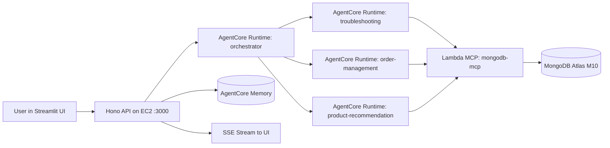
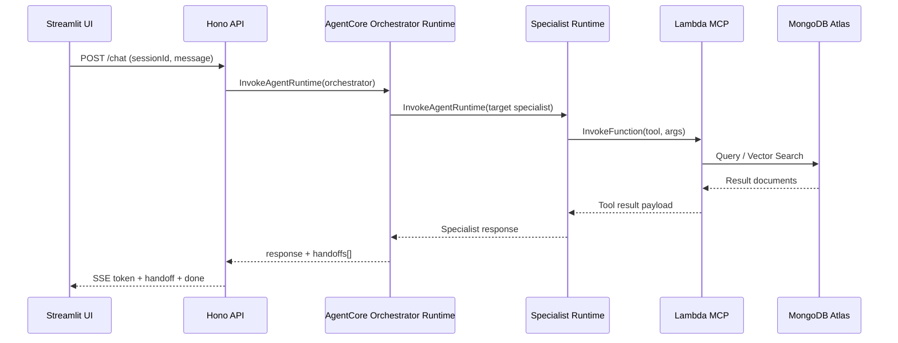

# Frozen End-to-End Design (Current Baseline)

Last updated: 2026-05-01  
Status: **Frozen implementation baseline for demo/POC**

---

## 1) Scope and Intent

This document captures the **current, deployed end-to-end design** of the multi-agent system and freezes it as the baseline for further work.

This baseline is explicitly:

- **AgentCore-first** for orchestration/specialists
- **Lambda MCP-first** for MongoDB tool execution
- **No AgentCore Gateway in the tool execution path**
- **S3 direct-code artifact** for AgentCore runtime deployment (default)

---

## 2) High-Level Architecture

### Compute and hosting

- API/UI run on **EC2 t3.medium** (Docker + systemd)
- Agent logic executes in **4 Bedrock AgentCore runtimes**
- Tool backend executes in **Lambda** (`mongodb-mcp`)
- Primary data store is **MongoDB Atlas**

---

## 3) Runtime Topology (4 AgentCore Runtimes)

Deployed runtimes:

1. `orchestrator`
2. `troubleshooting`
3. `order-management`
4. `product-recommendation`

Behavior model:

- API always invokes `AGENTCORE_ORCHESTRATOR_ARN` for `agentId=orchestrator`
- Orchestrator chooses specialist and invokes specialist runtime ARN
- Specialist produces final response
- API emits SSE tokens and handoff events to UI

Observed handoff examples in live validation:

- `orchestrator -> troubleshooting`
- `orchestrator -> order-management`

---

## 4) Tooling Path (Frozen Decision)

### Current tool hosting mode

- `TOOL_HOSTING_MODE=lambda`

### What this means

- Specialist runtimes do **not** call AgentCore Gateway for MongoDB tools
- Specialist runtimes call Lambda MCP directly via AWS SDK `InvokeFunction`
- Lambda MCP executes:
  - `mongodb_query`
  - `mongodb_vector_search`
  - `mongodb_aggregate`
- Lambda reaches Atlas via VPC + PrivateLink routing configuration

### Why frozen this way

- Removes Gateway auth/token coupling from the tool path
- Keeps AgentCore runtime orchestration intact
- Preserves MCP abstraction while improving reliability

---

## 5) End-to-End Request Flow

Notes:

- API remains owner of session history and memory context injection
- Runtime mode response is currently emitted to UI as a token burst (compatible SSE contract)

---

## 6) Data and Memory

### Data sources used by agents

- `orders`, `products`, `customers`, `troubleshooting_docs`, `support_tickets` in Atlas
- Vector search on troubleshooting docs via Atlas vector index

### Memory

- AgentCore Memory store is enabled and wired in runtime environment
- API also manages short-term chat session state and long-term context behavior

---

## 7) Artifact and Deployment Strategy

### AgentCore runtime artifacts

- Source: TypeScript
- Build: `esbuild` bundle to `agent-runtime-code.js` (CommonJS)
- Package: zip with runtime JS + required `config/` assets
- Publish: `s3://<shared-bucket>/artifacts/agentcore-runtime/<git-sha>/deployment_package.zip`
- Runtime config: `codeConfiguration` with `NODE_22`, entrypoint `agent-runtime-code.js`

### Lambda MCP artifact

- Zipped and deployed via Terraform module
- Function environment includes normalized Atlas private URI

### Deploy flow

- `deploy/scripts/deploy.sh --auto-approve [--skip-docker]`
- Key phases:
  1. Terraform apply
  2. First-time seed check (idempotent)
  3. Lambda MCP URI normalization for PrivateLink
  4. AgentCore runtime env updates
  5. EC2 service restart and health checks

---

## 8) Configuration Contract (Critical Env)

Runtime-critical variables:

- `AGENTCORE_ORCHESTRATOR_ARN`
- `AGENTCORE_RUNTIME_ARN_TROUBLESHOOTING`
- `AGENTCORE_RUNTIME_ARN_ORDER_MANAGEMENT`
- `AGENTCORE_RUNTIME_ARN_PRODUCT_RECOMMENDATION`
- `TOOL_HOSTING_MODE=lambda`
- `LAMBDA_MCP_FUNCTION_NAME`
- `AGENTCORE_MEMORY_STORE_ID`
- `MONGODB_DB`
- `AWS_REGION`

API mode requirements:

- `ORCHESTRATOR_MODE=runtime`
- AgentCore ARN present

---

## 9) Verified Behavior (Frozen Acceptance)

Validated on live EC2 endpoint:

- `/chat` order tracking flow returns expected result
- `/chat` troubleshooting flow returns expected result
- Handoff event emitted in SSE (orchestrator -> specialist)
- Lambda CloudWatch logs show real tool invocations:
  - `mongodb_vector_search`
  - `mongodb_query`
- UI mojibake issue fixed by forcing UTF-8 decode in SSE client

---

## 10) Non-Goals in This Baseline

- AgentCore Gateway as mandatory tool path (intentionally bypassed)
- Playwright full-suite stability hardening
- Production-grade HA/auto-scaling architecture changes

---

## 11) Risks and Watch Items

- Runtime env drift if manual updates are done outside `deploy.sh`
- Lambda cold-start latency may affect first tool call
- Long generated responses can still vary by model behavior/prompting

Mitigation direction:

- Keep deploy-driven env sync as source of truth
- Add a post-deploy verifier that checks runtime env for `LAMBDA_MCP_FUNCTION_NAME`
- Keep backend curl validation in CI/dev smoke checks

---

## 12) Freeze Statement

As of this baseline, the accepted architecture for the POC is:

1. **AgentCore orchestrator + specialist runtimes**
2. **Direct Lambda MCP invocation for MongoDB tools**
3. **S3 direct-code runtime artifacts on NODE_22**
4. **EC2-hosted API/UI with SSE chat contract preserved**

All future changes should treat this as the reference implementation unless an explicit redesign decision supersedes it.

