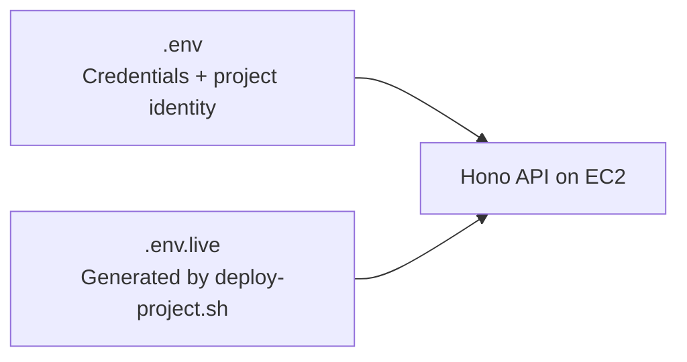

# Deploy Tweak Guide

> **Audience:** advanced operators tuning the deployed system — switching between local/EC2 modes, swapping models, enabling auth, adjusting tool routing, or wiring local dev to live AWS. Most contributors will not need this guide; routine deploys are covered in [`../deployment-guide.md`](../deployment-guide.md), and `config/`-folder edits live in [`../configuration-guide.md`](../configuration-guide.md).
>
> **Companion:** [`../configuration-guide.md`](../configuration-guide.md) covers the `config/` folder (agent personas, skill bundles, `environment.yaml`, `http-tools.json`). [`../reference/env-vars.md`](../reference/env-vars.md) catalogs **every** environment variable read by the stack with defaults and the file that consumes it. This guide is the prose explanation of the most-touched knobs and how they interact.

Every operational behavior is controlled by **environment variables** read at boot. There is no GUI config, no database-stored settings, and no hot-reloadable `.json` for runtime behavior.

---

## 1. Where env config comes from



| Source | Purpose | Loaded by |
|---|---|---|
| `.env` | AWS credentials, Atlas creds, project name (gitignored) | Sourced manually before `bun run dev` or whichever orchestrator matches your `NETWORK_MODE` (`deploy-full-with-privatelink.sh` or `deploy-full-with-vpc-peering.sh`) |
| `.env.live` | Generated by `deploy-project.sh` Phase 7. Runtime config (ARNs, URIs, mode flags) | Sourced by EC2 systemd unit; sourced manually for local dev after a full EC2 deploy |

The `config/` folder also feeds the API at boot — see [`../configuration-guide.md`](../configuration-guide.md) for the agent persona, skill, and HTTP tool surface.

---

## 2. The mode flags

The default chat path is: **Hono API classifies the message → invokes the matching specialist AgentCore Runtime directly**. There is no orchestrator runtime hop on the happy path. The mode flags below let you fall back to the legacy two-hop topology when needed.

### `AGENTCORE_ORCHESTRATOR_ARN`

**Required at startup** (asserted by `assertAgentcoreOrchestratorArn()` in `api/src/index.ts`). Set to the orchestrator AgentCore Runtime ARN. The legacy alias `AGENTCORE_RUNTIME_ARN` is also accepted.

Even though the default request path bypasses the orchestrator runtime, the ARN is still required at boot because (a) the orchestrator persona owns the canonical `handoffs:` roster that the in-API classifier reads, and (b) the rollback escape hatch (`USE_ORCHESTRATOR_RUNTIME=1`) still needs a valid ARN to invoke.

In production (EC2), this is set by `deploy-project.sh`.

### `USE_ORCHESTRATOR_RUNTIME`

| Value | Effect |
|---|---|
| unset (default) | In-API classifier picks the specialist; API invokes the specialist runtime directly (single hop) |
| `1` | API forwards every request to the orchestrator runtime, which classifies and forwards to a specialist (two hops). Use only as a one-release rollback. |

### `CLASSIFIER_*` knobs

Read by `api/src/lib/agent-classifier.ts` when the API does in-process classification.

| Variable | Default | Effect |
|---|---|---|
| `CLASSIFIER_BACKEND` | unset → heuristic + Haiku fallback | `heuristic` disables the Bedrock fallback (the heuristic always picks the top candidate, even with low margin) |
| `CLASSIFIER_MODEL_ID` | `us.anthropic.claude-haiku-4-5-20251001-v1:0` | Bedrock model for the LLM fallback |
| `CLASSIFIER_HEURISTIC_MIN_SCORE` | `1.5` | If the top heuristic score is below this, fall through to Haiku |
| `CLASSIFIER_HEURISTIC_MARGIN` | `0.75` | Required margin between top and runner-up before the heuristic accepts |

### `ORCHESTRATOR_MODE`

Read **inside** the orchestrator runtime container — applies only when `USE_ORCHESTRATOR_RUNTIME=1` is also set on the API.

| Value | Effect |
|---|---|
| `swarm` (default for the orchestrator runtime) | The orchestrator runtime runs Strands Swarm; specialists run in their own runtime containers. |
| `single` / `runtime` / anything else | Single-agent routing — the orchestrator picks one specialist and invokes its runtime ARN directly via `InvokeAgentRuntime`. |

### Tool hosting

There is no `TOOL_HOSTING_MODE` switch. Mongo tool calls in deployed runtimes always go through the AgentCore Gateway (`AGENTCORE_GATEWAY_URL`). `MCP_SERVER_URL` is a local-development override only. The Gateway target invokes the dedicated MongoDB MCP AgentCore Runtime; application runtimes do not call the MongoDB MCP runtime ARN directly. The legacy Lambda MCP target is deleted.

### `NETWORK_MODE`

Controls **how** the deploy scripts and Terraform stacks wire MongoDB Atlas connectivity. Mutually exclusive — switching modes requires destroy + redeploy.

| Value | Effect |
|---|---|
| `privatelink` (default) | `envs/network` provisions an Atlas Interface VPCE; `envs/ec2` adds a per-cluster Route 53 private zone; `MONGODB_URI` is the Atlas `awsPrivateLink` multi-host non-SRV URI |
| `peering` | `envs/network` provisions VPC peering + Atlas Private DNS for Peering; `envs/ec2` uses the direct multi-host `connectionStrings.private` URI for `MONGODB_URI`. **KB ingestion via peering NLB is EXPERIMENTAL.** |

See [`docs/deployment-guide.md` § VPC peering mode](../deployment-guide.md#vpc-peering-mode).

---

## 3. AWS resource identifiers

These are typically set in `.env.live` by `deploy-project.sh`. For local dev with real AWS, set them manually.

### Bedrock + AgentCore

| Variable | Example value | Purpose |
|---|---|---|
| `AWS_REGION` | `us-east-1` | All AWS SDK calls |
| `AGENTCORE_ORCHESTRATOR_ARN` | `arn:aws:bedrock-agentcore:<region>:<account>:runtime/<project>-orchestrator-<env>-...` | API → orchestrator runtime (required at boot; used for classifier roster + `USE_ORCHESTRATOR_RUNTIME=1` rollback) |
| `AGENTCORE_RUNTIME_ARN_TROUBLESHOOTING` | `arn:aws:bedrock-agentcore:...troubleshooting...` | API + orchestrator → specialist (injected on both surfaces) |
| `AGENTCORE_RUNTIME_ARN_ORDER_MANAGEMENT` | `arn:aws:bedrock-agentcore:...order_management...` | Same |
| `AGENTCORE_RUNTIME_ARN_PRODUCT_RECOMMENDATION` | `arn:aws:bedrock-agentcore:...product_recommendation...` | Same |
| `AGENTCORE_MEMORY_STORE_ID` | `<project>_memory_<env>-<suffix>` | AgentCore short-term memory store in deployed AWS; also used as the LTM fallback if MongoDB is unavailable |
| `AGENTCORE_GATEWAY_URL` | `https://<project>-gw-<env>-...gateway.bedrock-agentcore.<region>.amazonaws.com/mcp` | Required Gateway MCP endpoint for deployed runtimes. Mongo tool calls use this path. |
| `MONGODB_MCP_RUNTIME_ARN` | `arn:aws:bedrock-agentcore:...:runtime/<project>-mongodb-mcp-runtime-<env>-...` | Infrastructure output used to wire the AgentCore Gateway target to the MongoDB MCP runtime. Not used by app runtimes for tool calls. |
| `MONGODB_MCP_RUNTIME_ENDPOINT` | `https://bedrock-agentcore.../runtimes/.../invocations?qualifier=DEFAULT` | Infrastructure output for the Gateway target's backend endpoint. Not injected into app runtime env. |
| `AGENTCORE_ACTOR_ID` | `default` or JWT sub | AgentCore session actor |
| `BEDROCK_KB_ID` | `YDF16V4CRX` | Default knowledge base for `bedrock_kb_retrieve` |
| `EMBEDDINGS_PROVIDER` | `titan` or `voyage` | Explicit embedding provider. `titan` needs no Voyage ARN; `voyage` provisions/uses SageMaker from `VOYAGE_MODEL_PACKAGE_ARN`. |
| `EMBEDDING_MODEL_ID` | `amazon.titan-embed-text-v2:0` | Bedrock embedding model for `EMBEDDINGS_PROVIDER=titan` and fallback paths. Must match Atlas vector index dimensionality (Titan v2 = 1024-d). |
| `VOYAGE_MODEL_PACKAGE_ARN` | `arn:aws:sagemaker:...:model-package/voyage-...` | Required only for `EMBEDDINGS_PROVIDER=voyage`. Must point at a Voyage package. The default is `voyage-multimodal-3`; AWS may expose that family as `voyage-multimodel-3-updated-*`. |
| `VOYAGE_MARKETPLACE_MODEL` | `voyage-multimodal-3` or `voyage-multimodal-3.5` | Selected Voyage Marketplace model — only the two multimodal listings are supported. |
| `VOYAGE_SAGEMAKER_ENDPOINT` | `mongodb-multiagent3-voyage-multimodal-3-dev` | Runtime endpoint name written by deploy when Voyage is enabled. If empty, API + AgentCore runtimes use Titan. |

### MongoDB

| Variable | Example value | Purpose |
|---|---|---|
| `MONGODB_URI` | `mongodb+srv://...` (local) or `mongodb://...:1024,...:1025/?ssl=true` (AgentCore Runtime PrivateLink) | Atlas connection string |
| `MONGODB_DB` | `<project>_<env>` (e.g. `mongodb_multiagent_dev`) | Database name; project+env-derived (underscored) by `.env` |
| `MONGODB_ALLOW_WRITE` | `1` or `true` | Required for `insertOne` / `updateOne` against real Atlas. Default off (read-only). Set it in `.env` and run a full redeploy (`deploy-full-with-*` → `deploy-project.sh`): the script derives `TF_VAR_mongodb_allow_write` from it for first-create Terraform config, and Phase 6 runtime-env sync pushes `MONGODB_ALLOW_WRITE` to existing mongodb-mcp AgentCore Runtimes. Destructive ops (`delete*`, `drop*`, `replaceOne`) stay refused regardless. |
| `SHORT_TERM_MEMORY_BACKEND` | `agentcore` (EC2 deploy default) | `agentcore` makes AgentCore Memory the short-term conversation backend when authenticated. This is the production deployment default. |
| `PERSIST_CHAT_SESSIONS` | unset (default-on when `MONGODB_URI` is set), `0`/`false` to opt out | Mirror session history to MongoDB `chat_sessions` for the Sessions page, audit/debug history, and cold-read fallback. This does not make MongoDB the primary short-term memory backend in deployed AWS. |
| `MEMORY_TTL_DAYS` | `30` in EC2 `.env.live` (`90` code fallback if unset) | TTL for `agent_memory_facts` long-term facts collection |
| `MEMORY_INJECT_TURNS` | `5` (default) | Number of past turns injected into system prompt as long-term memory |

### Auth

JWKS auth is mandatory — the API refuses to boot without `AUTH_JWKS_URI` + `AUTH_ISSUER` (`assertJwksAuthConfigured()` in `api/src/lib/jwt-verify.ts`). There is no `ALLOW_UNAUTHENTICATED` / `REQUIRE_AUTH=false` bypass.

| Variable | Example | Purpose |
|---|---|---|
| `AUTH_JWKS_URI` | `https://cognito-idp.<region>.amazonaws.com/<pool-id>/.well-known/jwks.json` | **Required** — JWKS for JWT signature verification |
| `AUTH_ISSUER` | `https://cognito-idp.<region>.amazonaws.com/<pool-id>` | **Required** — JWT `iss` claim must match |
| `AUTH_APP_CLIENT_ID` | Cognito app ID | Optional `aud`/`client_id` validation |
| `AUTH_TOKEN_USE` | `access` (recommended) or `id` | Optional Cognito token type pin |

### Streamlit UI

| Variable | Purpose |
|---|---|
| `STREAMLIT_API_URL` | API URL the UI calls. Default: `http://127.0.0.1:3000`. |
| `STREAMLIT_COGNITO_POOL_ID` | If set, UI gates with Cognito hosted-UI or embedded login |
| `STREAMLIT_COGNITO_CLIENT_ID` | Cognito app ID |
| `STREAMLIT_COGNITO_DOMAIN` | Optional; if set with `REDIRECT_URI` + `CLIENT_SECRET`, uses hosted UI |
| `STREAMLIT_COGNITO_REDIRECT_URI` | OAuth callback |
| `STREAMLIT_COGNITO_CLIENT_SECRET` | Hosted UI mode only |

Notes:
- UI sends Cognito bearer tokens to API.
- Current UI logic prefers `id_token` (contains richer profile claims like email), then falls back to `access_token`.

---

## 4. Embedding Provider Modes

The deployment supports two explicit modes:

| Mode | Required env | Runtime behavior |
|---|---|---|
| Titan/no ARN | `EMBEDDINGS_PROVIDER=titan` | No SageMaker endpoint is created. API + AgentCore runtimes use Bedrock Titan v2 (`amazon.titan-embed-text-v2:0`). Text-only. |
| Voyage multimodal | `EMBEDDINGS_PROVIDER=voyage`, `VOYAGE_MARKETPLACE_MODEL=voyage-multimodal-3` (or `voyage-multimodal-3.5`), `VOYAGE_MODEL_PACKAGE_ARN=...multimodal...` | Provisions SageMaker and uses Voyage multimodal embeddings. Supports interleaved text + images at the tool boundary. |

Text-only Voyage listings (`voyage-3*`, `voyage-4*`, `voyage-code-*`, …) are unsupported — the legacy `{ "input": [...] }` request branch was removed in the multimodal-only migration. The bash SSOT (`voyage_supported_models`) is the source of truth; preflight refuses anything outside it.

`products`, `troubleshooting_docs`, `agent_memory_facts`, and `chat_messages` are the collections with semantic retrieval. The first two are embedded by `db-seeding/seed-embeddings.ts`; long-term memory facts and chat-message mirrors are embedded online by the API as they are written. `orders`, `customers`, `chat_sessions`, and `traces` remain structured-only.

### What you get vs Titan v2

| | Titan v2 | Voyage on SageMaker |
|---|---|---|
| Hosting | AWS-managed Bedrock API | Self-hosted SageMaker endpoint in your account |
| Dimensions | 1024-d (fixed) | `voyage-multimodal-3`: 1024-d; `voyage-3-5-lite`: configurable, pinned to **1024** |
| Context window | 8K tokens | Larger Voyage context; model-specific |
| Cost | $0.00002 / 1K tokens | ~$2.45 / hour while endpoint is running (ml.g6.xlarge) |
| Quality | Good baseline | Higher retrieval quality (esp. for long docs); Matryoshka + int8 quant supported |
| Tradeoff | Pay-per-token, no cold start | Always-on cost, but no per-call charges |

### One-time setup

1. **Subscribe to the Marketplace listing** (manual; cannot be automated — requires EULA acceptance):
   - [MongoDB voyage-multimodal-3](https://aws.amazon.com/marketplace/pp/prodview-hrid2zxusacxy) — recommended
   - [voyage-multimodal-3.5](https://aws.amazon.com/marketplace/) — same envelope, slightly newer
   - Click **Continue to Subscribe** → **Accept Offer**
2. **Request GPU quota** (if not already granted):
   - Open [SageMaker Service Quotas — us-east-1](https://console.aws.amazon.com/servicequotas/home/services/sagemaker/quotas)
   - Search `ml.g6.xlarge for endpoint usage`. If 0, request increase to 1. Usually instant.
3. **Discover the region-specific Product ARN and persist it to `.env`:**
   ```bash
   aws sagemaker list-model-packages \
     --region "$AWS_REGION" \
     --query "ModelPackageSummaryList[?contains(ModelPackageGroupName, 'voyage-multimodal-3')].ModelPackageArn | [0]" \
     --output text
   ```
   Set `EMBEDDINGS_PROVIDER=voyage`, `VOYAGE_MODEL_PACKAGE_ARN`, `VOYAGE_MARKETPLACE_MODEL`, and `TF_VAR_voyage_endpoint_name_suffix` in `.env`. The endpoint suffix may be model-derived; deploy scripts and Terraform normalize invalid SageMaker endpoint-name characters to hyphens before endpoint creation. Non-multimodal models are refused by `voyage_assert_multimodal_or_die` in [`deploy/scripts/_voyage-config.sh`](../../deploy/scripts/_voyage-config.sh).

### Enable on a deployed environment

```bash
source .env                                          # EMBEDDINGS_PROVIDER=voyage + ARN are now exported
# Run whichever orchestrator matches your NETWORK_MODE:
./deploy/deploy-full-with-privatelink.sh --auto-approve  # privatelink mode (default)
# or
./deploy/deploy-full-with-vpc-peering.sh --auto-approve  # peering mode

# Deployment auto-detects provider drift and re-seeds embeddings in Phase 5b — no manual step required.
# If you need to force a re-seed (e.g. you tweaked seed-embeddings.ts):
REWIRE_EMBEDDINGS=1 bun db-seeding/seed-embeddings.ts
```

**Automatic REWIRE detection.** `deploy/scripts/_seed-embeddings.sh::run_embedding_seed` (Phase 5b) inspects three signals before invoking the seeder:
1. SSM `/<SHARED_VPC_NAME>/<region>/embeddings/dim` vs `voyage_embedding_dims` (TS SSOT).
2. A sampled seeder-owned row's stored `embedding.length`.
3. A sampled seeder-owned row's `embeddingModel` prefix (`voyage:` vs `bedrock:`).

Any mismatch forces `REWIRE_EMBEDDINGS=1` automatically and the seeder wipes seeder-owned rows (KB-managed chunks are explicitly excluded via `bedrock_text_chunk: { $exists: false }`) before regenerating.

### What deploy-project.sh does for you

When `EMBEDDINGS_PROVIDER=voyage`, `deploy-shared.sh` provisions the SageMaker endpoint and `deploy-project.sh` validates the selected multimodal Voyage model (via `voyage_assert_multimodal_or_die` from the bash SSOT) and sets `VOYAGE_SAGEMAKER_ENDPOINT` on all surfaces that need it. The request envelope is generated by the TS SSOT (`buildVoyageRequestBody` → multimodal) at runtime, so no per-environment flag controls it:

1. **EC2 API** — written into `/opt/multiagent/.env.live`, picked up on next API restart
2. **AgentCore Runtimes** (orchestrator + 3 specialists + MongoDB MCP runtime) — `aws bedrock-agentcore-control update-agent-runtime --environment-variables ...` in Phase 6b. The MongoDB MCP runtime receives precomputed `queryVector` (the API embeds first), but other runtimes need the env var for any in-runtime embedding paths.
3. **Runtime IAM role** — `voyage_sagemaker_endpoint_arn` Terraform input grants `sagemaker:InvokeEndpoint` on the endpoint ARN. Without it, the runtime gets `AccessDenied` and `embedQueryText` silently falls back to Bedrock Titan (visible in traces as `embeddingSource: "bedrock"`).

Forgetting any one of these makes vector search silently degrade to "catalog appears empty" because Titan-generated 1024-d vectors don't match the Voyage-seeded index. See [`status/debugging.md` § 5](../status/debugging.md) and [`status/debugging.md` § 10 Known persistent pitfalls](../status/debugging.md) for the failure modes.

### Disable / fall back to Titan

Set `EMBEDDINGS_PROVIDER=titan` in `.env` and re-run the orchestrator that matches your `NETWORK_MODE` (`deploy-full-with-privatelink.sh` or `deploy-full-with-vpc-peering.sh`). The next apply skips the SageMaker module (`count = 0`), the runtimes get `VOYAGE_SAGEMAKER_ENDPOINT=""`, and the adapters use `bedrockGenerateEmbedding(EMBEDDING_MODEL_ID)`. Then re-seed:

```bash
EMBEDDING_MODEL_ID=amazon.titan-embed-text-v2:0 REWIRE_EMBEDDINGS=1 \
  bun db-seeding/seed-embeddings.ts
```

To also tear down the running endpoint and stop incurring cost (Voyage SageMaker now lives in `envs/shared`, not `envs/ec2`):

```bash
# Option A — full shared-stack teardown (also removes log groups + dashboards + invocation logging)
./deploy/scripts/destroy.sh --mode shared --auto-approve

# Option B — keep dashboards / log groups, just unset the endpoint:
unset VOYAGE_MODEL_PACKAGE_ARN   # in .env
./deploy/scripts/deploy-shared.sh --auto-approve   # re-applies with the SageMaker module count = 0
```

### Verify it's active

```bash
# 1. SageMaker endpoint InService (name is normalized by the shared stack)
VOYAGE_ENDPOINT_NAME="$(terraform -chdir=deploy/terraform/envs/shared output -raw voyage_endpoint_name)"
aws sagemaker describe-endpoint --endpoint-name "$VOYAGE_ENDPOINT_NAME" \
  --query EndpointStatus

# 2. EC2 API has the env var
aws ssm send-command --instance-ids "$EC2_INSTANCE_ID" --document-name AWS-RunShellScript \
  --parameters 'commands=["grep VOYAGE /opt/multiagent/.env.live"]'

# 3. AgentCore runtimes have the env var
aws bedrock-agentcore-control get-agent-runtime --agent-runtime-id "$RT_ID" \
  --query "environmentVariables.VOYAGE_SAGEMAKER_ENDPOINT"

# 4. End-to-end: the SSE stream from /chat shows score'd vector hits
curl -sN -X POST "http://$EC2_IP:3000/chat" -H "Authorization: Bearer $JWT" \
  -d '{"sessionId":"v","message":"rugged outdoor widget for a workshop, ~$60"}' \
  | grep -E '"embeddingSource":"voyage"|SKU-'
```

---

## 5. Operational tunables

| Variable | Default | Purpose |
|---|---|---|
| `PORT` / `API_PORT` | `3000` | API listen port |
| `CORS_ORIGINS` | from `environment.yaml` | Comma-separated allowed origins |
| `RATE_LIMIT_PER_MIN` | `60` | Per-IP rate limit. Set `RATE_LIMIT_DISABLED=1` to turn off. |
| `LOG_LEVEL` | `info` | `error` / `warn` / `info` / `debug` |
| `SWARM_MAX_STEPS` | `8` | Max iterations in local swarm mode |
| `HTTP_TOOLS_MOCK` | unset | If `1`, all HTTP tools return mock payloads (useful for demos with no Lambda) |
| `HTTP_TOOLS_CONFIG_PATH` | `<CONFIG_ROOT>/http-tools.json` | Override path to global HTTP tools config |
| `SKILL_RESOURCE_MAX_BYTES` | (sensible default) | Cap on file reads via `read_skill_resource` |
| `CONFIG_ROOT` | inferred | Absolute path to `config/` if cwd isn't next to it |

---

## 6. Local development examples

The API requires `AUTH_JWKS_URI`, `AUTH_ISSUER`, and `AGENTCORE_ORCHESTRATOR_ARN` at startup (`api/src/index.ts`). All examples assume a **prior full EC2 deploy** that wrote `.env.live`.

### Laptop API + UI (recommended)

```bash
source .env && source .env.live
export PATH="$HOME/.bun/bin:$PATH"
cd api && bun run dev

# separate terminal:
cd ui && streamlit run app.py
```

Set `STREAMLIT_COGNITO_*` from `.env.live` so the UI can mint Bearer tokens for the API.

### Manual JWKS from Terraform outputs

If you need auth vars without sourcing the full `.env.live`:

```bash
source .env
export AUTH_JWKS_URI="$(cd deploy/terraform/envs/ec2 && terraform output -raw cognito_jwks_uri)"
export AUTH_ISSUER="https://cognito-idp.${AWS_REGION}.amazonaws.com/$(cd deploy/terraform/envs/ec2 && terraform output -raw cognito_user_pool_id)"
export AGENTCORE_ORCHESTRATOR_ARN="$(cd deploy/terraform/envs/ec2 && terraform output -raw acr_orchestrator_arn)"
cd api && bun run dev
```

Get a Cognito token via the Streamlit login UI or your IdP, then:

```bash
curl -H "Authorization: Bearer eyJ..." http://localhost:3000/sessions
```

---

## 7. Sanity / introspection endpoints

The API exposes these for debugging:

| Endpoint | What it returns |
|---|---|
| `GET /health` | Live dependency probes only — see [`api-reference.md`](../api-reference.md) § `GET /health` (`mongodb`, `longTermMemory`, `agentcore`, `mcpServer`, `bedrockKnowledgeBase`) |
| `GET /agents` | All loaded agent configs |
| `GET /agents/:id` | One agent config (parsed) |
| `GET /skills` | All skills, their tool definitions |
| `GET /http-tools` | Configured HTTP tools (per-skill + global) and whether their URLs are set |
| `GET /sessions` | Sessions for the calling user (filtered by JWT sub if auth on) |

```bash
curl -s http://localhost:3000/health | jq .
curl -s http://localhost:3000/agents | jq '.[] | {id, name, model}'
```

---

## 8. Validation scripts

| Script | Purpose |
|---|---|
| `bun run typecheck` | TypeScript type-check |
| `bun run validate:bun` | Bun-specific runtime checks |
| `bun run validate:agentcore` | Constructs `BedrockAgentCoreClient` to verify SDK + creds (no network unless `AGENTCORE_MEMORY_ID` + `AGENTCORE_ACTOR_ID` set) |
| `bun test` | Unit tests |
| `bun run test:integration` | Integration tests (slow — Swarm mock loop) |

---

## 9. Critical files reference (deploy/runtime)

| File | Purpose |
|---|---|
| [`api/src/lib/environment-config.ts`](../../api/src/lib/environment-config.ts) | Reads YAML defaults + env vars at boot |
| [`api/src/lib/orchestrator-mode.ts`](../../api/src/lib/orchestrator-mode.ts) | Decides Strands Swarm vs single-agent routing inside the orchestrator runtime |
| [`api/src/adapters/agentcore-runtime.ts`](../../api/src/adapters/agentcore-runtime.ts) | `invokeAgentRuntime` + the `AGENTCORE_ORCHESTRATOR_ARN` startup guard |
| [`api/src/adapters/mongodb-mcp-client.ts`](../../api/src/adapters/mongodb-mcp-client.ts) | StreamableHTTP MCP client used by the API to call the MongoDB MCP AgentCore Runtime, with Gateway fallback |
