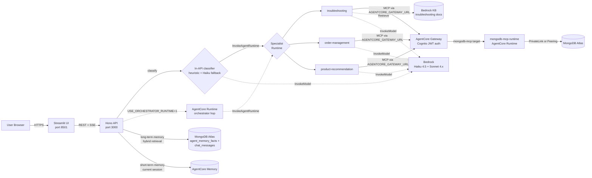
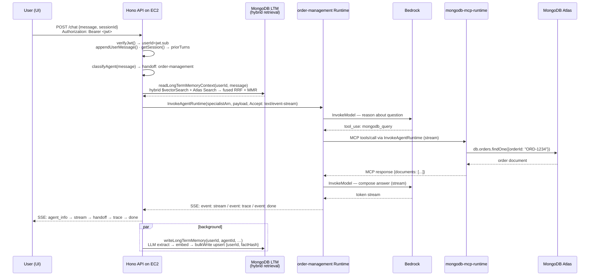
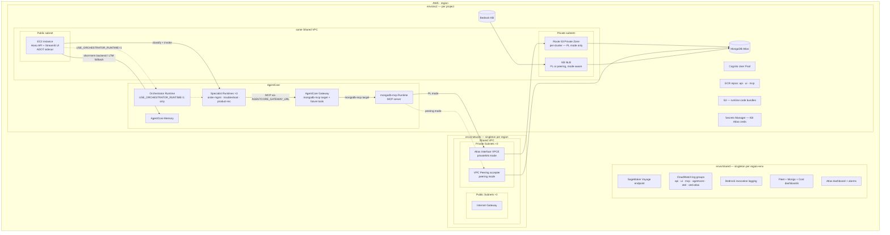
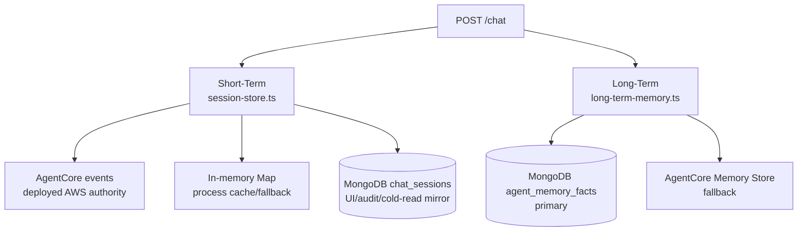

# Architecture

> **Audience:** anyone who needs to understand how this system works — from project managers to engineers picking it up cold.
> **Reading time:** 10 minutes for the big picture, 25 minutes if you read every section.

---

## 1. The 30-second version

You type a question into a chat box. A web API on a small AWS server receives it. The API itself classifies the user message (in-process, using a lightweight heuristic + Bedrock Haiku fallback) and invokes the matching **specialist** AgentCore Runtime directly. The specialist looks up data in MongoDB through AgentCore Gateway, whose target invokes a small **MCP runtime** (a dedicated AgentCore Runtime that fronts the MongoDB driver). The reply streams back to your screen token-by-token over SSE. In deployed AWS, **short-term conversation memory lives in AgentCore Memory**; **long-term cross-session memory lives in MongoDB Atlas** (`agent_memory_facts` + `chat_messages`) with hybrid vector + BM25 retrieval.

The legacy orchestrator-hop path through the `orchestrator` runtime is still available behind `USE_ORCHESTRATOR_RUNTIME=1` as a one-release rollback escape hatch.

That is the entire system. The rest of this document explains *how* each step works and *why* it was designed that way.

---

## 2. The Lego pieces



| Piece | What it is | What it does |
|---|---|---|
| **Streamlit UI** | A small Python web app | Renders the chat box, streams answers token-by-token, hosts the Trace Viewer + Sessions page |
| **Hono API** | A TypeScript web server (Bun runtime) | Receives `/chat` calls, classifies them, routes to the specialist AgentCore Runtime, owns sessions + memory |
| **In-API classifier** | `api/src/lib/agent-classifier.ts` | Heuristic (token + bigram overlap) over the orchestrator's `handoffs:` roster with Bedrock Haiku 4.5 fallback when the heuristic margin is below `CLASSIFIER_HEURISTIC_MARGIN` |
| **AgentCore Runtimes** | AWS-managed agent containers (5 total) | One per specialist (3) + a legacy orchestrator hop + a dedicated MongoDB MCP runtime |
| **Specialist agents** | 3 specialist runtimes | Each is an expert: `order-management`, `troubleshooting`, `product-recommendation` |
| **Bedrock** | AWS's foundation model service | Models per agent: orchestrator + `order-management` = Claude Haiku 4.5; `troubleshooting` + `product-recommendation` = Claude Sonnet 4.x. Source of truth: [`config/agents/*.agent.md`](../config/agents/) |
| **MongoDB MCP Runtime** | A dedicated AgentCore Runtime ([`mcp-runtimes/mongodb-mcp/`](../mcp-runtimes/mongodb-mcp/)) | The only thing that talks to MongoDB. Exposes `mongodb_query`, `mongodb_vector_search`, `mongodb_aggregate` and the internal `mongodb_hybrid_search`. Reached through the AgentCore Gateway target — never `lambda:InvokeFunction`. The legacy Lambda host was deleted in CLIENT_REVIEW Phase 7e. |
| **MongoDB Atlas** | Managed MongoDB cluster (M10 default) | Stores customers, orders, products, troubleshooting docs, long-term memory collections (`agent_memory_facts`, `chat_messages`), session mirrors (`chat_sessions`), and traces |
| **Long-term memory** | `agent_memory_facts` + `chat_messages` with hybrid retrieval | Vector + BM25 fused with RRF, weighted, recency-decayed, MMR-diversified. See [`docs/long-term-memory-design.md`](long-term-memory-design.md) |
| **AgentCore Memory** | An AWS-managed memory store | Authoritative short-term conversation memory backend in deployed AWS (`SHORT_TERM_MEMORY_BACKEND=agentcore`); LTM fallback if Mongo write fails |
| **Bedrock KB** | A vector-search knowledge base | RAG over uploaded manuals. Ingestion path is mode-aware (PL NLB by default in privatelink mode; peering NLB by default in peering mode — both private) |

For the editable historical diagram: [`diagrams/01-aws-infrastructure.drawio`](diagrams/01-aws-infrastructure.drawio) — note this drawio source is **historical** and may show the older orchestrator-hop topology. The Mermaid diagram above is the current truth.

---

## 3. Why five runtimes instead of one?

You could put all the agent logic in one big container. We don't, for two reasons:

1. **Separation of concerns.** The reference architecture shows the orchestrator as a separate AgentCore Runtime from the specialists.
2. **Isolation.** Each runtime has its own IAM role, its own log group, its own scaling envelope. If the troubleshooting agent crashes or hangs, the order-management agent keeps serving requests.

The **5 AgentCore Runtimes** are:

| Runtime | Source | What it does |
|---|---|---|
| `<project>-orchestrator-<env>` | `agent-runtime-code.js` with `AGENT_ID=orchestrator` | Legacy hop. Invoked only when `USE_ORCHESTRATOR_RUNTIME=1`. Default path bypasses it via the in-API classifier. |
| `<project>-troubleshooting-<env>` | Same bundle, `AGENT_ID=troubleshooting` | Diagnoses device problems, queries KB |
| `<project>-order-management-<env>` | Same bundle, `AGENT_ID=order-management` | Looks up orders, processes returns, tracks shipments |
| `<project>-product-recommendation-<env>` | Same bundle, `AGENT_ID=product-recommendation` | Recommends products, vector-searches the catalog |
| `<project>-mongodb-mcp-runtime-<env>` | `mcp-runtimes/mongodb-mcp/` | Dedicated MCP server fronting the MongoDB driver. `server_protocol=MCP`. |

The agent runtimes (orchestrator + 3 specialists) share the **same code bundle**; the `AGENT_ID` environment variable selects the persona at boot. The MongoDB MCP runtime is a separate container with its own image and lifecycle.

> The four agent runtimes are deployed in `code` mode by default (S3-uploaded JS bundle on the AgentCore `NODE_22` runtime). The MongoDB MCP runtime uses `container` mode (its own ECR image) because the MCP host needs a long-lived process and the MongoDB driver pool. See § 7.2.

---

## 4. The end-to-end request flow

Here is what happens when a user types **"Where is my order ORD-1234?"**:



For the editable historical version: [`diagrams/02-request-flow.drawio`](diagrams/02-request-flow.drawio) — **historical**; the current request flow is the Mermaid above.

**Key things to notice:**

- The API stays *outside* AgentCore. It owns sessions, classification, memory read + write. The runtimes are stateless — they get full context (including `## Relevant prior context`) on every call.
- The default path is **single hop**: in-API classifier → specialist runtime. The orchestrator runtime hop is enabled only under `USE_ORCHESTRATOR_RUNTIME=1`.
- `InvokeAgentRuntime` with `Accept: text/event-stream` is **true SSE streaming**. The specialist emits `event: stream` per token, `event: trace` per trace event (throttled by `TRACE_SSE_THROTTLE_MS=100` to the UI; full batch still lands in the persisted trace), and a terminating `event: done`. The Hono API forwards verbatim so TTFB equals the specialist's first Bedrock token, not the buffered full reply.
- The `runtimeSessionId` must be at least 33 characters (an AgentCore requirement). The API pads short session IDs.
- MongoDB tools always go through the MongoDB MCP Runtime. The agents themselves never open MongoDB connections.
- LTM **write** is a dangling microtask off the chat path so it never sits on TTFB. The trace is re-persisted after the microtask settles, so `memory.long_term_write` / `memory.long_term_skip` events reliably land in the stored trace.

---

## 5. The AWS infrastructure

The infrastructure is split into three live Terraform environments: `envs/network` (shared VPC + Atlas connectivity, singleton per region), `envs/shared` (SageMaker + log groups + dashboards + invocation logging, singleton per region+env), and `envs/ec2` (per-project app stack). See [`reference/terraform-modules.md`](reference/terraform-modules.md) for the full composition matrix and [`reference/ssm-parameters.md`](reference/ssm-parameters.md) for the cross-stack SSM contract.

Here is everything that gets created when you run `deploy/deploy-full-with-privatelink.sh` (or `deploy/deploy-full-with-vpc-peering.sh` — same topology, peering primitives swapped in):



For the editable historical version: [`diagrams/01-aws-infrastructure.drawio`](diagrams/01-aws-infrastructure.drawio) — **historical**; defer to the Mermaid above.

### Resource inventory

Per-environment resource names are emitted into `deploy-manifest.json` after each deploy. The shapes are:

| Service | Resource | Naming pattern |
|---|---|---|
| EC2 | Instance, EIP, security group | `<project>-ec2-<env>` |
| ECR | API / UI / MCP repos | `<project>-{api,ui,mongodb-mcp}-<env>` |
| AgentCore | 5 runtimes | `<project>-{orchestrator,troubleshooting,order-management,product-recommendation,mongodb-mcp-runtime}-<env>` |
| AgentCore | Memory store | `<project>_memory_<env>-<auto-suffix>` |
| AgentCore | Gateway | `<project>-gw-<env>-<auto-suffix>` (target: `mongodb-mcp` → `mongodb-mcp-runtime`; additional non-Mongo target slots when wired) |
| Bedrock | KB | KB id from `module.bedrock_kb.knowledge_base_id` |
| Atlas | Cluster | `<project>-<env>` (M10 default) |
| Atlas | Connectivity | PrivateLink endpoint (PL mode) **or** network peering (peering mode) |
| Cognito | User pool + app + JWKS | Read `jwks_uri` from `module.cognito` |
| Route 53 | Private zone (PL mode only) | per-cluster zone bound to the shared VPC |
| S3 | Shared bucket | `<project>-<env>-<account-id>` (tfstate + KB docs + runtime code) |
| Secrets Manager | KB Atlas creds | `<project>-bedrock-kb-creds-<env>` |
| CloudWatch | Log groups | `/<SHARED_RESOURCE_PREFIX>/<env>/{api,ui,mcp,agentcore,otel,otel-atlas}` (default `SHARED_RESOURCE_PREFIX=multiagent`) |
| CloudWatch | Dashboards | `<SHARED_RESOURCE_PREFIX>-{fleet,mongo,cost,atlas}-<env>` |
| Bedrock | Invocation logging | `/aws/bedrock/invocations` + `/aws/bedrock/invocations-audit` (singleton per account) |

Inspect the live values for your environment:

```bash
jq . deploy-manifest.json
aws ssm get-parameters-by-path --path "/${SHARED_VPC_NAME}/${AWS_REGION}/" --recursive --output table
```

### What is *not* in the architecture (deliberately)

- **No NAT Gateway** — EC2 is in a public subnet and reaches AWS APIs over the internet. NAT is $33/month and unnecessary for a POC.
- **No VPC Interface Endpoints** for Bedrock/AgentCore — those would cost ~$102/month for marginal security benefit on a POC.
- **No ALB/CloudFront/auto-scaling** — single EC2 instance is enough for the POC.
- **No ECS** — Docker runs directly on EC2 via systemd. ECS is overkill at this scale.
- **No DynamoDB lock for Terraform state** — the deploy account's SCP blocks `dynamodb:CreateTable`. We rely on S3 versioning + manual coordination.

These are intentional simplifications. Don't add them back without explicit approval.

---

## 6. Data and memory

### What's in MongoDB

| Collection | Purpose | Approximate size |
|---|---|---|
| `customers` | Customer profiles, contact info | ~10 docs (POC) |
| `orders` | Orders with status, tracking, line items | ~12 docs (POC) |
| `products` | Product catalog with prices, ratings, embeddings | ~9 docs (POC) |
| `troubleshooting_docs` | Diagnostic guides, error codes (with embeddings for vector search) | ~7 docs (POC) |
| `agent_memory_facts` | Long-term memory facts (primary, TTL-managed) | grows over time |
| `chat_messages` | Long-term memory retrieval mirror of individual turns | grows over time |
| `chat_sessions` | Session history mirror for UI/audit/cold-read fallback; AgentCore is the short-term memory authority in deployed AWS | grows over time |

### Memory: short-term vs long-term



- **Short-term**: every message in the current chat session. In deployed AWS this is read/written via AgentCore events keyed by `(userId, sessionId)`. MongoDB `chat_sessions` is a mirror used for the Sessions page, audit/debug history, and cold-read fallback. The full backend selection matrix (`SHORT_TERM_MEMORY_BACKEND` × `AGENTCORE_MEMORY_STORE_ID` × `MONGODB_URI`) lives in [memory-architecture.md §1](memory-architecture.md).
- **Long-term**: memorable user facts/preferences. Primary store is MongoDB Atlas (`agent_memory_facts` plus the `chat_messages` retrieval mirror), with AgentCore fallback if Mongo read/write fails. Fact extraction is LLM-only via `api/src/lib/llm-fact-extractor.ts` — there is no regex fallback, by design (a regex fallback would silently store false-positive "facts" on every Bedrock blip).
- **Auth context**: per-turn prompt context includes authenticated identity (`sub`, resolved email, customer tier, recent SKUs) so "my orders/my open tickets/recommend for me" resolve without asking for email.

JWKS auth is mandatory end-to-end (see `assertJwksAuthConfigured()` in [`api/src/lib/jwt-verify.ts`](../api/src/lib/jwt-verify.ts)), so `userId = jwtPayload.sub` is always present and long-term memory always has an identity to scope by. See [memory-architecture.md](memory-architecture.md) for the full picture.

### Embedding strategy across collections

This answers the question _"the system currently lacks embeddings across all collections — how is user preference maintained and coherence ensured?"_

| Collection | Has embeddings? | How user-preference / coherence is preserved |
|---|---|---|
| `products` | **Yes** (Voyage AI 1024-d) | `mongodb_vector_search` against `embedding` from the product specialist. |
| `troubleshooting_docs` | **Yes** (Voyage AI 1024-d, also indexed by Bedrock KB) | `mongodb_vector_search` and Bedrock KB retrieve. |
| `orders`, `customers` | **No** (structured-only today) | Deterministic primary-key queries from `mongodb_query` (e.g. `{customerId, orderId}`); embeddings would not improve "show me ORD-1234." |
| `agent_memory_facts` | **Yes** (Voyage AI 1024-d / Bedrock fallback) | LLM-extracted facts are embedded at write time and retrieved through hybrid `$vectorSearch` + Atlas Search BM25, fused with RRF, weights, recency decay, and MMR. |
| `chat_messages` | **Yes** (Voyage AI 1024-d / Bedrock fallback) | Individual chat turns are mirrored as vector-searchable documents and included in the same hybrid long-term memory retriever. |
| `chat_sessions` | **No** | Session metadata mirror for UI/history/cold-read fallback; semantic retrieval uses the `chat_messages` mirror instead. |
| `traces` | **No** | Operational data, not in-context. |

Coherence comes from the orchestrator routing decision plus skill activation plus identity-aware context. Embeddings are used where the corpus is natural language (`products`, `troubleshooting_docs`, `agent_memory_facts`, `chat_messages`); structured operational collections stay deterministic.

---

## 7. Key design decisions (and why)

### 7.1 MongoDB MCP runs behind AgentCore Gateway

Every Mongo tool call from every runtime goes to the AgentCore Gateway (`AGENTCORE_GATEWAY_URL`). The Gateway target invokes the dedicated `mongodb-mcp-runtime` AgentCore Runtime ([`mcp-runtimes/mongodb-mcp/`](../mcp-runtimes/mongodb-mcp/)), which owns the MongoDB driver, query guards, and vector search. Application runtimes do not call `MONGODB_MCP_RUNTIME_ARN` / `MONGODB_MCP_RUNTIME_ENDPOINT` directly; those values are deploy/Terraform wiring for the Gateway target. `MCP_SERVER_URL` is reserved for local-development overrides only. The legacy Lambda host (`lambda/mongodb-mcp/`) and its `deploy/terraform/modules/lambda-mcp/` module were physically deleted in CLIENT_REVIEW Phase 7e — the canonical home for Mongo tool implementations is now [`mcp-runtimes/mongodb-mcp/src/vendor/`](../mcp-runtimes/mongodb-mcp/src/vendor/). There is no `TOOL_HOSTING_MODE` switch and no `lambda:InvokeFunction` path.

**Auth:** the caller's Cognito access token is forwarded from the Hono API through the AgentCore Runtime invocation payload (`userJwt`). The MCP client injects it into Gateway calls via an `AsyncLocalStorage`-scoped `Authorization: Bearer <jwt>` header.

| Knob | Where | Meaning |
|---|---|---|
| `AGENTCORE_GATEWAY_URL` | Per-runtime env / `.env.live` (generated by `deploy-project.sh`) | Gateway MCP endpoint used by all deployed Mongo tool calls. |
| `MCP_SERVER_URL` | Local shell env only | Local-development override for a manually run MCP server. Not emitted by deploy scripts. |
| `MONGODB_MCP_RUNTIME_ARN` / `MONGODB_MCP_RUNTIME_ENDPOINT` | Terraform/deploy outputs | Gateway target backend wiring only; not consumed by app runtimes. |

**Trade-off:** routing Mongo through the Gateway adds one IAM-authorized hop (~10–30 ms) over a direct `bedrock-agentcore:InvokeAgentRuntime` call, but in exchange:
- Every Mongo tool call shares the same Cognito-authenticated audit surface as future tools — one place to enforce policy and inspect traffic.
- The application runtime never needs `bedrock-agentcore:InvokeAgentRuntime` IAM on the MongoDB MCP runtime ARN, just `GET` on the Gateway URL.
- The legacy direct-invoke path remains in deploy/Terraform outputs (`MONGODB_MCP_RUNTIME_ARN`, `MONGODB_MCP_RUNTIME_ENDPOINT`) for Gateway-target wiring only. The MCP client (`api/src/adapters/mongodb-mcp-client.ts::resolveMcpEndpoint`) fails fast when `AGENTCORE_GATEWAY_URL` is missing — there is **no localhost fallback** in deployed runtimes; `MCP_SERVER_URL` is honored only when `ENVIRONMENT=local`, `NODE_ENV=development`, or `DEV_MOCK_BACKENDS=1` is set.

Gateway-target schema cache (the Gateway snapshots `tools/list` from the upstream MCP server at target-create time and serves it from cache thereafter) is invalidated on every redeploy by `deploy-project.sh` Phase 4d: the MCP image digest is exported as `TF_VAR_mongodb_mcp_image_digest`, fed to the gateway module's `null_resource` triggers, and any digest change re-creates the target so fresh tool schemas are picked up. See `docs/status/debugging.md` "AgentCore Gateway target caches tool schemas".

### 7.2 S3 code artifacts, not ECR containers, for AgentCore runtimes

AgentCore Runtimes can be deployed in two modes:

| Mode | Artifact | Pros |
|---|---|---|
| **container** | ARM64 Docker image in ECR | Familiar to Docker users |
| **code** (default) | Zip uploaded to S3, executed on `NODE_22` runtime | No Docker build, faster deploys, no ARM64 toolchain needed |

We default to **code mode**. The `deploy-project.sh` script:
1. Bundles `api/src/agent-runtime-code.ts` with esbuild → `agent-runtime-code.js` (CommonJS)
2. Zips it with the `config/` directory
3. Uploads to `s3://shared-bucket/artifacts/agentcore-runtime/{git-sha}/deployment_package.zip`
4. Tells AgentCore to use that S3 object as the runtime artifact

To switch to container mode, set `TF_VAR_agentcore_runtime_deployment_mode=container` and re-run the orchestrator matching your `NETWORK_MODE` (`deploy-full-with-privatelink.sh` or `deploy-full-with-vpc-peering.sh`). The Terraform module supports both — see [`deploy/terraform/modules/agentcore-agent-runtime/`](../deploy/terraform/modules/agentcore-agent-runtime/).

### 7.3 EC2 + Docker + systemd, not ECS

Two reasons:

1. **POC scale.** A single t3.medium handles all expected POC traffic. ECS would add a control plane to operate.
2. **Cost.** EC2 + EIP + systemd is ~$50/month. ECS Fargate at the same compute capacity is ~$60-80 plus an ALB at $20.

The API and UI run as Docker containers managed by systemd. ECR is the image registry. SSM Session Manager is used for remote ops (no SSH key).

<a id="private-atlas-connectivity"></a>
### 7.4 Private Atlas connectivity — PrivateLink (default) or VPC peering

MongoDB credentials traversing the public internet would be a security concern, so Atlas access is always private. The framework supports **two mutually-exclusive connectivity modes** selected by `NETWORK_MODE` in `.env` (default `privatelink`):

* **PrivateLink mode** (`NETWORK_MODE=privatelink`, default) — Atlas Interface VPCE + per-cluster Route 53 private zone + VPC endpoint. partner-validated, recommended.
* **VPC peering mode** (`NETWORK_MODE=peering`) — AWS-side VPC peering accepter + route entries in both route tables + Atlas-side `mongodbatlas_network_peering` + Atlas Private DNS for Peering (auto-enabled via Admin API). The `-pri.mongodb.net` SRV resolves directly to private peering IPs.

The two modes are **mutually exclusive per account** — there is no hybrid path. Switching modes requires destroy + redeploy (`./deploy/scripts/destroy.sh --mode ec2 / shared / network`, then re-run the matching orchestrator). SSM canary `/{SHARED_VPC_NAME}/{REGION}/network_mode` guards against silent mode swaps; an `envs/ec2` `check` block also fails plan when the tfvars mode disagrees with the SSM canary.

Use the matching orchestrator:

| Mode | Orchestrator |
|---|---|
| `privatelink` | [`deploy/deploy-full-with-privatelink.sh`](../deploy/deploy-full-with-privatelink.sh) |
| `peering` | [`deploy/deploy-full-with-vpc-peering.sh`](../deploy/deploy-full-with-vpc-peering.sh) |

See [`docs/deployment-guide.md` § VPC peering mode](deployment-guide.md#vpc-peering-mode) for the runtime URI selection, security-group narrowing, KB ingestion caveats (NLB-over-peering is experimental, mongod IP drift recovery), and CIDR pre-flight rules.

#### `atlas-privatelink-dns` — per-cluster private zone

The shared **Atlas Interface VPCE** is provisioned once per region in `envs/network`; the **per-cluster** Route 53 private hosted zone is created by [`deploy/terraform/modules/atlas-privatelink-dns/`](../deploy/terraform/modules/atlas-privatelink-dns/). The module builds:

1. A private hosted zone named `<cluster>.<id>.mongodb.net`, bound to the shared VPC.
2. A wildcard `CNAME` at `*.<cluster>.<id>.mongodb.net` pointing at the Atlas Interface VPCE DNS name.

Why a separate module: Atlas SRV connection strings (`mongodb+srv://...`) resolve to multiple per-shard / per-mongos hostnames under `<cluster>.<id>.mongodb.net`. PrivateLink alone gives you a VPCE — without a private DNS zone in your VPC that maps every per-shard hostname to that VPCE, the MongoDB driver still resolves the per-shard records over public DNS and the connection fails. The Atlas VPCE is shared across all clusters in the region (one-time, expensive); the private zone is per-cluster because the SRV hostname differs per cluster. Each per-project env (`envs/ec2`) calls the module once to bind the zone for *its* cluster.

> **Bedrock KB ingestion — private by default in both modes.** The EC2 / `mongodb-mcp-runtime` runtime paths and Bedrock KB ingestion are both private by default:
>
> - In **PrivateLink mode**, KB ingestion runs through [`bedrock-kb-privatelink/`](../deploy/terraform/modules/bedrock-kb-privatelink/) (internal NLB → VPC Endpoint Service in front of the existing Atlas Interface VPCE). Gated by `TF_VAR_enable_kb_privatelink` (defaults to `true` in PL mode). Verify with `terraform output bedrock_kb_endpoint_service_name`. partner-validated, recommended.
> - In **VPC peering mode**, KB ingestion runs through [`bedrock-kb-peering/`](../deploy/terraform/modules/bedrock-kb-peering/) (internal NLB pointed at the peered Atlas mongod IPs). Gated by `TF_VAR_enable_kb_peering`. **EXPERIMENTAL — NLB-over-peering is not partner-validated**; mongod IP drift on Atlas-side scaling/upgrade requires re-running `envs/ec2` to re-pin NLB targets.
> - Setting `TF_VAR_enable_kb_privatelink=false` (in PL mode) or `TF_VAR_enable_kb_peering=false` (in peering mode) falls back to the **public Atlas SRV endpoint**. This is **not the default and not recommended** — KB traffic leaves the private fabric and constitutes a privacy regression. TLS + Atlas auth still apply, but documented deviation is required.
>
> See [`status/debugging.md` § 5 — common failures: Bedrock KB ingestion](status/debugging.md) for the full trade-off and the design rationale.

Bedrock, AgentCore, Cognito, ECR, S3 — all are reached over the public internet from EC2. They use AWS SDK signing (SigV4) which is sufficient for a POC. Adding VPC interface endpoints for these would cost ~$102/month with no meaningful security gain at this scale.

### 7.5 Per-agent Bedrock model selection

The original design specified Amazon Nova. Per a verbal product decision, the agents now run on Anthropic Claude. Per-agent models are configured in each `.agent.md` frontmatter:

| Agent | Model | Why |
|---|---|---|
| `orchestrator` | `us.anthropic.claude-haiku-4-5-20251001-v1:0` | Classifier fallback only — cheap, fast |
| `order-management` | `us.anthropic.claude-haiku-4-5-20251001-v1:0` | Structured order-lookup queries; Haiku is sufficient |
| `troubleshooting` | `us.anthropic.claude-sonnet-4-6` | Long KB-anchored diagnostic narratives benefit from Sonnet quality |
| `product-recommendation` | `us.anthropic.claude-sonnet-4-6` | Comparison + ranking explanations benefit from Sonnet quality |

The in-API classifier (`api/src/lib/agent-classifier.ts`) uses the orchestrator's model for the Bedrock-LLM fallback when the heuristic margin is below `CLASSIFIER_HEURISTIC_MARGIN` (default `0.15`). The fact-extractor for long-term memory uses `MEMORY_EXTRACTION_MODEL_ID` (defaults to `us.anthropic.claude-haiku-4-5-20251001-v1:0`).

Model access for every model used must be enabled in the Bedrock console for the deploy account + region. When Anthropic deprecates a default, bump it in [`config/agents/`](../config/agents/) **and** [`docs/reference/env-vars.md`](reference/env-vars.md) **and** [`AGENTS.md`](../AGENTS.md) in the same PR.

### 7.6 VoyageAI SageMaker utilization

Voyage AI on SageMaker is the **active** embedding provider for both online query embedding and offline corpus embedding. Bedrock Titan v2 (`amazon.titan-embed-text-v2:0`) is the documented fallback only.

| Path | What runs Voyage | Triggered by |
|---|---|---|
| **Online query** | `embedQueryText()` in [`api/src/lib/embed-query.ts`](../api/src/lib/embed-query.ts) → `voyageGenerateEmbedding(text, endpoint, "query")` | Every `mongodb_vector_search` call from a specialist. The vector is computed in the API process (or runtime) **before** the MCP envelope is sent — the Mongo MCP host receives an already-vectorised `queryVector`. |
| **Offline corpus** | [`db-seeding/seed-embeddings.ts`](../db-seeding/seed-embeddings.ts) using `input_type: "document"` | `bun db-seeding/seed-embeddings.ts` (re-runnable via `REWIRE_EMBEDDINGS=1`) for both `products` and `troubleshooting_docs`. |
| **Bedrock KB ingestion** | Bedrock Titan v2 (no Voyage support yet on the KB side) | Bedrock KB sync. |

`deploy/scripts/deploy-project.sh` writes `VOYAGE_SAGEMAKER_ENDPOINT` and `VOYAGE_OUTPUT_DIM=1024` into both the EC2 API's `.env.live` and into each AgentCore Runtime's env vars, so Voyage is reachable from every place that needs an embedding. If the SageMaker endpoint is unconfigured or fails, the wrapper falls back to Bedrock Titan / Cohere via `EMBEDDING_MODEL_ID`; if neither is available the tool returns a structured `status: "error"` so the LLM can degrade to keyword search via `mongodb_query`.

The Voyage **model name** historically (`voyage-3.5-lite` vs `voyage-multimodal-3`) is pinned to `voyage-multimodal-3` in `.env.sample` and [`deploy/scripts/setup-voyage-marketplace.sh`](../deploy/scripts/setup-voyage-marketplace.sh).

---

## 8. Two modes: local dev vs EC2 production

| | **Local dev** (Docker Compose / `bun run dev`) | **EC2 production** |
|---|---|---|
| Where agents run | In-process inside the Hono API (Strands SDK) when `AGENTCORE_ORCHESTRATOR_ARN` is unset, or via `DEV_MOCK_BACKENDS=1` for a fixture loop | 5 separate AgentCore Runtimes (managed by AWS) — default path classifies in-API and invokes a specialist directly |
| Tool execution | Fixtures (`DEV_MOCK_BACKENDS=1`) or real MongoDB/AgentCore depending on env. `MCP_SERVER_URL` honored only when `ENVIRONMENT=local`, `NODE_ENV=development`, or `DEV_MOCK_BACKENDS=1` | All MCP tool calls (including every Mongo tool) go through AgentCore Gateway → `mongodb-mcp-runtime`. No localhost fallback. |
| Long-term memory | In-process `Map` when `MONGODB_URI` unset, else live hybrid retriever | MongoDB `agent_memory_facts` + `chat_messages` (primary) + AgentCore fallback |
| MongoDB connection | Direct SRV (public) | PrivateLink **or** peering (private) |
| Bedrock access | Local AWS creds via `aws sso login` / IAM user | EC2 instance profile |
| Auth | Cognito JWKS (mandatory — local dev points at the dev account's Cognito pool) | Cognito JWKS (mandatory) |
| Switch mechanism | `AGENTCORE_ORCHESTRATOR_ARN` unset → in-process; `CHAT_MODE=stub` for fixture replies | `AGENTCORE_ORCHESTRATOR_ARN` set → AgentCore. `USE_ORCHESTRATOR_RUNTIME=1` adds the orchestrator hop. |

The same codebase serves both. There is **no auth bypass** anywhere — `assertJwksAuthConfigured()` refuses to boot the API in either mode without `AUTH_JWKS_URI` and `AUTH_ISSUER`.

For local dev with multi-agent orchestration, set `ORCHESTRATOR_MODE=swarm` to use the in-process Strands Swarm. This is **not used in production** — production uses the per-specialist AgentCore runtime path.

---

## 9. What is *not yet* implemented

Implemented today: Voyage `multimodal-3` (default), Streamlit Cognito hosted-UI gate, mandatory JWKS auth, hybrid LTM retriever, per-cluster Atlas private DNS, mode-aware Bedrock KB connectivity, fleet/Atlas/Cost dashboards, EMF metrics, ADOT OTel sidecar, AgentCore Memory short-term backend, per-turn trace with developer projection.

Still open:

- **AgentCore Code Interpreter** — skill scripts run as local `.mjs` imports under `config/skills/<name>/scripts/`. Treat skill scripts as trusted code.
- **Customer-scoped multi-tenancy on operational collections** — agents query by user-supplied IDs. The auth-context block (`buildAuthenticatedUserContext`) injects the JWT `sub`, but Mongo queries do not yet enforce a `customerId == ctx.sub` predicate at the MCP layer.
- **Browser/Streamlit E2E** — Playwright API-side E2E exists (`e2e/`); browser-driven UI E2E is not in CI.
- **CI/CD as the primary deploy path** — `.github/workflows/{ci,deploy}.yml` exist; the canonical deploy path is still `deploy-full-with-privatelink.sh` / `deploy-full-with-vpc-peering.sh` from a developer laptop.
- **ECS/ALB rollout** — container images + scripts are ECS-ready; ECS task definitions + ALB are not provisioned. EC2 + Docker + systemd is the live shape.

See [`deployment-guide.md`](deployment-guide.md) for current deployment status.

---

## 10. Observability and tracing

### Structured logs and trace correlation

- **OpenTelemetry (OTLP export via ADOT sidecar):** `api/src/lib/otel.ts` bootstraps a `NodeTracerProvider` with W3C `traceparent` propagation and an async-hooks context manager. When `OTEL_EXPORTER_OTLP_ENDPOINT` is set (EC2 default: `http://127.0.0.1:4318`), the bootstrap installs `BatchSpanProcessor` + `OTLPTraceExporter` pointing at the ADOT Collector sidecar on the EC2 host. The sidecar (`modules/adot-collector`) signs SigV4 outbound to the AWS X-Ray OTLP endpoint, so spans land in **`aws/spans`** and feed CloudWatch **Transaction Search** + **GenAI Observability**. Locally (`docker compose`), the env var is unset and tracing stays in-process.
- **JSON logger:** `api/src/lib/logger.ts` emits one JSON object per line (`level`, `ts`, `msg`, `service`, optional `trace_id` / `span_id` / `trace_flags` from the active span). `STRANDS_LOG_REDIRECT=1` sends Strands SDK `console.*` into the same logger (`api/src/lib/strands-console-redirect.ts`).
- **HTTP:** `api/src/middleware/request-id.ts` + `api/src/middleware/otel.ts` run on the Hono app (`api/src/app.ts`). Responses expose **`X-Request-Id`** and **`X-Trace-Id`** (W3C trace id hex) for support correlation and CloudWatch Logs Insights filters. CORS exposes these headers to the Streamlit origin.
- **EC2 shipping:** Terraform creates the log groups in `envs/shared`; EC2 `user_data` installs **amazon-cloudwatch-agent** and tails **journald** for `multiagent-api.service` and `multiagent-ui.service` into `/<SHARED_RESOURCE_PREFIX>/<env>/api` and `/<SHARED_RESOURCE_PREFIX>/<env>/ui` respectively.
- **UI:** `ui/lib/log.py` mirrors JSON lines to stdout; `stream_chat_events` logs the response `X-Trace-Id`. The main chat page shows the last trace id in a footer caption for copy/paste. The Streamlit container launches via `opentelemetry-instrument`, so HTTP server spans and outbound `requests` calls auto-export to the same ADOT sidecar.
- **CloudWatch GenAI Observability + fleet dashboards:** `modules/cloudwatch-genai`, `modules/bedrock-invocation-logging`, `modules/cloudwatch-fleet-dashboards`, and `modules/cloudwatch-atlas-dashboard` together produce: the managed AgentCore + Model Invocations tabs, three custom dashboards (`<project>-{fleet,mongo,cost}-<env>`), seven alarms wired to an SNS topic, a PII Data Protection Policy on `/aws/bedrock/invocations` (body logging **OFF** by default), and an optional MongoDB Atlas Prometheus scrape via the ADOT sidecar. See [observability-runbook.md](observability-runbook.md) for day-2 ops.

### Trace collector (product trace)

- **Collector**: `api/src/lib/trace-collector.ts` runs inside an
  `AsyncLocalStorage` context (`api/src/lib/trace-context.ts`) so any module
  on the request path can call `currentTrace()?.event(…)` without explicit
  plumbing.
- **Event union**: `api/src/lib/trace-types.ts` — covers chat-turn
  boundaries, auth context, memory reads/writes, prompt assembly, model
  calls (request / usage / stop / text-delta batches / stripped thinking
  blocks), Strands tool calls, MongoDB intent → query → plan → result →
  diagnostic / vector-search, HTTP tools, MCP tools, AgentCore runtime
  hops (with nested-trace splicing), and errors.
- **AgentCore nesting**: when the EC2 API calls an AgentCore Runtime, the
  runtime container builds its own `Trace`, returns the events in the JSON
  response, and the parent splices them in via
  `TraceCollector.attachEventsNested(...)` (ID rewiring + clock
  normalization).
- **Persistence**: `traces` MongoDB collection with TTL
  (`TRACE_TTL_DAYS`), plus an in-process ring buffer
  (`TRACE_RING_BUFFER_SIZE`).
- **Surface**: SSE `event: trace` per emitted event (live stream),
  plus `GET /traces/:id`, `GET /trace`, `GET /trace/mongo`, `GET /traces`
  for later inspection.
- **UI**: per-turn inline summary card in the chat panel and a
  full-page Trace Viewer at `ui/pages/2_Trace_Viewer.py` with timeline,
  routing attribution, MongoDB dashboard, AgentCore hops, memory dashboard,
  and a raw-event developer expander. See
  [demo/demo-mode-guide.md](demo/demo-mode-guide.md) for the env knobs and the UI
  walkthrough.

---

## 11. Where to go next

- **For deployment**: [deployment-guide.md](deployment-guide.md)
- **For `config/` folder**: [configuration-guide.md](configuration-guide.md)
- **For deploy/runtime env tuning (advanced)**: [advanced/deploy-tweak-guide.md](advanced/deploy-tweak-guide.md) and the comprehensive [reference/env-vars.md](reference/env-vars.md)
- **For the API contract**: [api-reference.md](api-reference.md)
- **To understand memory in depth**: [memory-architecture.md](memory-architecture.md), [long-term-memory-design.md](long-term-memory-design.md), [hybrid-search.md](hybrid-search.md)
- **For the trace UI walkthrough**: [demo/demo-mode-guide.md](demo/demo-mode-guide.md), [trace-ui-system-overview.md](trace-ui-system-overview.md)
- **For Terraform modules and SSM parameters**: [reference/terraform-modules.md](reference/terraform-modules.md), [reference/ssm-parameters.md](reference/ssm-parameters.md)
- **For debugging the live stack**: [status/debugging.md](status/debugging.md)
