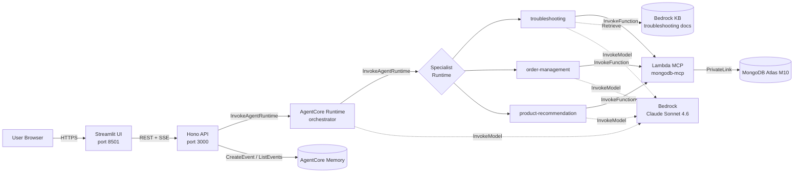
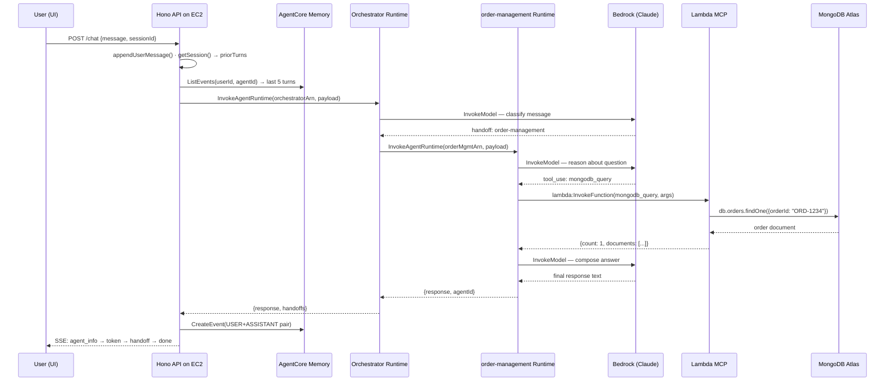
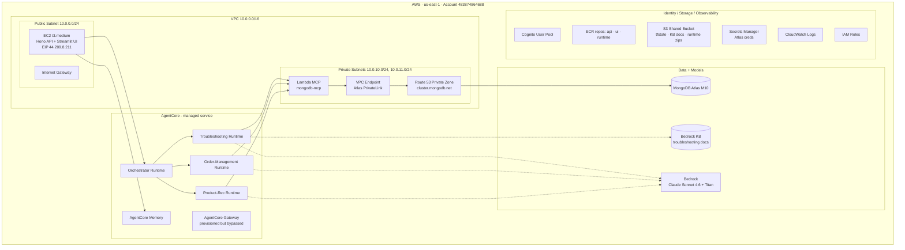
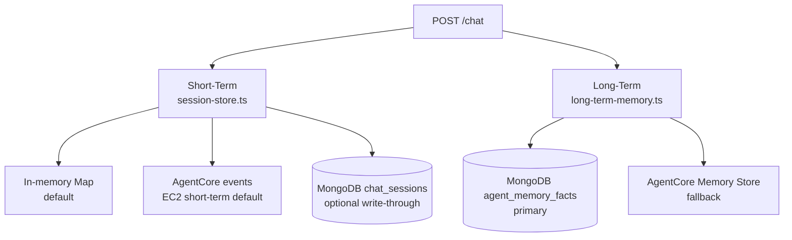

# Architecture

> **Audience:** anyone who needs to understand how this system works — from project managers to engineers picking it up cold.
> **Reading time:** 10 minutes for the big picture, 25 minutes if you read every section.

---

## 1. The 30-second version

You type a question into a chat box. A web API on a small AWS server receives it and hands it to an "orchestrator" AI agent. The orchestrator reads the question, picks the right specialist (one of three), and forwards the question. The specialist looks up data in MongoDB through a small AWS Lambda function and writes a reply. The reply streams back to your screen. Past conversations are remembered between sessions.

That is the entire system. The rest of this document explains *how* each step works and *why* it was designed that way.

---

## 2. The Lego pieces

| Piece | What it is | What it does |
|---|---|---|
| **Streamlit UI** | A small Python web app | Renders the chat box, streams answers token-by-token |
| **Hono API** | A TypeScript web server (Bun runtime) | Receives `/chat` calls, routes them to AgentCore, manages sessions and memory |
| **AgentCore Runtime** | An AWS-managed container service | Hosts each agent in its own isolated runtime |
| **Specialist agents** | 3 separate AgentCore runtimes | Each is an expert: orders, troubleshooting, products |
| **Bedrock** | AWS's foundation model service | Runs Claude Sonnet 4.6 (the brain doing the reasoning) |
| **Lambda MCP** | A small AWS Lambda function | The only thing that talks to MongoDB. Exposes 3 tools: `mongodb_query`, `mongodb_vector_search`, `mongodb_aggregate` |
| **MongoDB Atlas M10** | A managed MongoDB cluster | Stores customers, orders, products, troubleshooting docs |
| **AgentCore Memory** | An AWS-managed memory store | Remembers past conversations (per user, per agent) |
| **Bedrock KB** | A vector-search knowledge base | Used by troubleshooting agent for RAG over manuals |

For an editable picture: [`diagrams/01-aws-infrastructure.drawio`](diagrams/01-aws-infrastructure.drawio).

---

## 3. Why four runtimes instead of one?

You could put all the agent logic in one big container. We don't, for two reasons:

1. **The SoW asked for it.** The architecture diagram in the Statement of Work shows the orchestrator as a separate AgentCore Runtime from the specialists.
2. **Isolation.** Each runtime has its own IAM role, its own log group, its own scaling envelope. If the troubleshooting agent crashes or hangs, the order-management agent keeps serving requests.

The 4 runtimes share the **same code bundle** (`agent-runtime-code.js`). The `AGENT_ID` environment variable on each runtime tells it which persona to wear:

| Runtime name | `AGENT_ID` | What it does |
|---|---|---|
| `bedrock-ma-use1-orchestrator-dev` | `orchestrator` | Reads the question, picks a specialist, calls it |
| `bedrock-ma-use1-troubleshooting-dev` | `troubleshooting` | Diagnoses device problems, queries knowledge base |
| `bedrock-ma-use1-order-management-dev` | `order-management` | Looks up orders, processes returns, tracks shipments |
| `bedrock-ma-use1-product-recommendation-dev` | `product-recommendation` | Recommends products, vector-searches the catalog |

---

## 4. The end-to-end request flow

Here is what happens when a user types **"Where is my order ORD-1234?"**:

For an editable version: [`diagrams/02-request-flow.drawio`](diagrams/02-request-flow.drawio).

**Key things to notice:**

- The API stays *outside* AgentCore. It owns sessions and memory. The runtimes are stateless — they get full context on every call.
- `InvokeAgentRuntime` is **request/response, not streaming**. The full reply comes back as one chunk and the API wraps it in a single SSE `token` event so the UI client doesn't need to know.
- The `runtimeSessionId` must be at least 33 characters (an AgentCore requirement). The API pads short session IDs.
- Tools always go through Lambda MCP. The agents themselves never talk to MongoDB.

---

## 5. The AWS infrastructure

Here is everything that gets created when you run `deploy/scripts/deploy.sh`:

For the editable, fully-labeled version: [`diagrams/01-aws-infrastructure.drawio`](diagrams/01-aws-infrastructure.drawio).

### Resource inventory

| Service | Resource | Identity / value |
|---|---|---|
| EC2 | t3.medium instance | `i-0693ae9edd898fb2e` |
| EC2 | Elastic IP | `44.209.8.211` |
| EC2 | Security Group | ingress 3000 (API) + 8501 (UI) from 0.0.0.0/0 |
| ECR | API repo | `bedrock-ma-use1-api` |
| ECR | UI repo | `bedrock-ma-use1-ui` |
| ECR | Agent runtime repo (only if container mode) | `bedrock-ma-use1-agent-runtime` |
| AgentCore | 4 runtimes | `bedrock-ma-use1-{orchestrator,troubleshooting,order_management,product_recommendation}-dev` |
| AgentCore | Memory store | `bedrock_ma_use1_memory_dev-aaTMdv52rv` |
| AgentCore | Gateway | `bedrock-ma-use1-gw-dev-jslrisrr8k` (provisioned, not in tool path) |
| Lambda | MCP function | `bedrock-ma-use1-mongodb-mcp-dev` |
| Bedrock | Knowledge base | `YDF16V4CRX` |
| Bedrock | Model access | `us.anthropic.claude-sonnet-4-6`, `amazon.titan-embed-text-v2:0` |
| Atlas | Cluster | `bedrock-ma-use1-dev` (M10, 3 nodes, us-east-1) |
| Atlas | PrivateLink endpoint | linked via VPC endpoint to private subnets |
| Cognito | User pool | `us-east-1_giTk8MWzq` |
| Route 53 | Private zone | `Z016186537N2SVS43FXN` (Atlas SRV resolution) |
| S3 | Shared bucket | `bedrock-ma-use1-dev-483874864688` (tfstate, KB docs, runtime zips) |
| Secrets Manager | Atlas creds | `<project>-bedrock-kb-creds-<env>` (e.g. `mongodb-multiagent-bedrock-kb-creds-dev`) |
| CloudWatch | Log groups | `/<project>/<env>/{api,mcp,agentcore}` |

### What is *not* in the architecture (deliberately)

- **No NAT Gateway** — EC2 is in a public subnet and reaches AWS APIs over the internet. NAT is $33/month and unnecessary for a POC.
- **No VPC Interface Endpoints** for Bedrock/AgentCore — those would cost ~$102/month for marginal security benefit on a POC.
- **No ALB/CloudFront/auto-scaling** — single EC2 instance is enough for the POC.
- **No ECS** — Docker runs directly on EC2 via systemd. ECS is overkill at this scale.
- **No DynamoDB lock for Terraform state** — the deploy account's SCP blocks `dynamodb:CreateTable`. We rely on S3 versioning + manual coordination.

These are intentional simplifications. Don't add them back without explicit approval.

---

## 6. Data and memory

### What's in MongoDB

| Collection | Purpose | Approximate size |
|---|---|---|
| `customers` | Customer profiles, contact info | ~10 docs (POC) |
| `orders` | Orders with status, tracking, line items | ~12 docs (POC) |
| `products` | Product catalog with prices, ratings, embeddings | ~9 docs (POC) |
| `troubleshooting_docs` | Diagnostic guides, error codes (with embeddings for vector search) | ~7 docs (POC) |
| `agent_memory_facts` | Long-term memory facts (primary, TTL-managed) | grows over time |
| `chat_sessions` | Persistent short-term chat history (only if `PERSIST_CHAT_SESSIONS=1`) | grows over time |

### Memory: short-term vs long-term

- **Short-term**: every message in the current chat session. In EC2 auth mode it is primarily read/written via AgentCore events keyed by `(userId, sessionId)` with `session-store` fallback.
- **Long-term**: memorable user facts/preferences. Primary store is MongoDB `agent_memory_facts` (TTL), with AgentCore fallback if Mongo read/write fails.
- **Auth context**: per-turn prompt context includes authenticated identity (`sub`, resolved email, customer tier, recent SKUs) so "my orders/my open tickets/recommend for me" resolve without asking for email.

Long-term memory **only works when authentication is enabled** because it needs `userId` from the JWT `sub` claim. With auth off, the API silently skips memory writes/reads. See [memory-architecture.md](memory-architecture.md) for the full picture.

---

## 7. Key design decisions (and why)

### 7.1 Lambda MCP by default, AgentCore Gateway as an opt-in alternative

Both paths are wired. Operators choose per runtime via a single env knob; the two paths are mutually exclusive on any given agent.

**Default — `TOOL_HOSTING_MODE=lambda`:** specialist runtimes call Lambda MCP directly via `lambda:InvokeFunction`. Simple IAM, low latency, easy to debug.

**Opt-in — `TOOL_HOSTING_MODE=gateway`:** the runtime's tools come from the AgentCore Gateway's MCP target (which still fronts the same Lambda). Authentication is the caller's Cognito access token, forwarded from the Hono API through the AgentCore Runtime invocation payload (`userJwt`) and injected on every outbound MCP request via an `AsyncLocalStorage`-scoped `Authorization: Bearer <jwt>` header.

| Knob | Where | Meaning |
|---|---|---|
| `GATEWAY_DEMO_RUNTIMES` | [`env.sh`](../env.sh) | Space-separated list of AgentCore Runtime names to flip to gateway mode. Empty (default) = every runtime stays on lambda. |
| `MCP_SERVER_URL` | Per-runtime env (set by `deploy.sh`) | Populated to `AGENTCORE_GATEWAY_URL` when a runtime is opted in; empty otherwise. The validator in `deploy.sh` enforces this. |

Flipping a runtime to gateway mode only requires editing `env.sh` and re-running `deploy.sh` (no `terraform apply` — Terraform's static `TOOL_HOSTING_MODE = "lambda"` defaults flow through unchanged, and the env override is layered on top in deploy.sh's per-runtime update phase).

**Why we keep lambda as the default:** direct Lambda invoke avoids the extra HTTPS hop, the customJWTAuthorizer roundtrip, and Cognito-dependent runtime startup. **Why we wire gateway as an option:** it showcases the full AgentCore stack for client demos, supports bring-your-own-tool via the Gateway's MCP target schema, and validates the auth-passthrough plumbing end to end.

**Trade-off:** gateway mode adds one HTTPS hop (~30–80 ms per tool call) and requires `REQUIRE_AUTH=true` + a working Cognito pool because every tool call needs a valid JWT. The cached `McpClient` singleton is safe across many users because only the header varies per request, not the client itself. A mid-conversation Cognito token expiry surfaces a 401 to the chat and invalidates the singleton; the next user turn brings a fresh token and reconnects.

### 7.2 S3 code artifacts, not ECR containers, for AgentCore runtimes

AgentCore Runtimes can be deployed in two modes:

| Mode | Artifact | Pros |
|---|---|---|
| **container** | ARM64 Docker image in ECR | Familiar to Docker users |
| **code** (default) | Zip uploaded to S3, executed on `NODE_22` runtime | No Docker build, faster deploys, no ARM64 toolchain needed |

We default to **code mode**. The `deploy.sh` script:
1. Bundles `api/src/agent-runtime-server.ts` with esbuild → `agent-runtime-code.js` (CommonJS)
2. Zips it with the `config/` directory
3. Uploads to `s3://shared-bucket/artifacts/agentcore-runtime/{git-sha}/deployment_package.zip`
4. Tells AgentCore to use that S3 object as the runtime artifact

To switch to container mode, set `TF_VAR_agentcore_runtime_deployment_mode=container` and re-run `deploy.sh`. The Terraform module supports both — see [`deploy/terraform/modules/agentcore-agent-runtime/`](../deploy/terraform/modules/agentcore-agent-runtime/).

### 7.3 EC2 + Docker + systemd, not ECS

Two reasons:

1. **POC scale.** A single t3.medium handles all expected POC traffic. ECS would add a control plane to operate.
2. **Cost.** EC2 + EIP + systemd is ~$50/month. ECS Fargate at the same compute capacity is ~$60-80 plus an ALB at $20.

The API and UI run as Docker containers managed by systemd. ECR is the image registry. SSM Session Manager is used for remote ops (no SSH key).

### 7.4 PrivateLink for Atlas, public internet for everything else

MongoDB credentials traversing the public internet would be a security concern, so Atlas access is via **PrivateLink + Route 53 private zone + VPC endpoint** to keep that traffic on the AWS backbone.

Bedrock, AgentCore, Lambda, Cognito, ECR, S3 — all are reached over the public internet from EC2. They use AWS SDK signing (SigV4) which is sufficient for a POC. Adding VPC interface endpoints for these would cost ~$102/month with no meaningful security gain at this scale.

### 7.5 Claude Sonnet 4.6 for every agent

The SoW originally specified Amazon Nova. Per a verbal client decision, **all agents now use `us.anthropic.claude-sonnet-4-6`** (the inference profile). This applies to orchestrator and all 3 specialists.

Model access for Claude Sonnet 4.6 on the deploy account requires the Anthropic use-case form to be filled out in the Bedrock console. This was unblocked on 2026-04-30.

---

## 8. Two modes: local dev vs EC2 production

| | **Local dev** | **EC2 production** |
|---|---|---|
| Where agents run | In-process inside the Hono API (Strands SDK) | 4 separate AgentCore Runtimes (managed by AWS) |
| Tool execution | In-process MongoDB driver | Lambda MCP via `InvokeFunction` |
| Long-term memory | MongoDB `agent_memory_facts` (primary) + AgentCore fallback | MongoDB `agent_memory_facts` (primary) + AgentCore fallback |
| MongoDB connection | Direct SRV (public) | PrivateLink (private) |
| Bedrock access | Local AWS creds | EC2 instance profile |
| Auth | Optional (off by default) | Cognito JWT |
| Switch mechanism | `AGENTCORE_ORCHESTRATOR_ARN` is unset → in-process | `AGENTCORE_ORCHESTRATOR_ARN` is set → AgentCore |

The same codebase serves both. The `useAgentcoreOrchestratorArn()` check in [`api/src/routes/chat.ts:88`](../api/src/routes/chat.ts) flips the entire request path.

For local dev with multi-agent orchestration, set `ORCHESTRATOR_MODE=swarm` to use the in-process Strands Swarm. This is **not used in production** — production uses 4 separate AgentCore runtimes via `ORCHESTRATOR_MODE=runtime`.

---

## 9. What is *not yet* implemented

For the full delta against the SoW, see [gap-analysis.md](gap-analysis.md). Highlights:

- **Voyage AI on SageMaker** for embeddings — parked. Bedrock Titan is used instead.
- **AgentCore Code Interpreter** — not implemented. Skill scripts run as local `.mjs` imports.
- **Streamlit Cognito hosted-UI** — implemented but not production-hardened (cookie persistence, multi-region QA).
- **Multi-tenancy / customerId scoping** — agents query by user-supplied IDs, not by authenticated `customerId`.
- **CI/CD for cloud deploy** — `deploy.sh` runs locally; a GitHub Actions workflow exists but is not the primary path.

---

## 10. Observability and tracing

Every chat turn produces a structured `Trace`:

- **Collector**: `api/src/lib/trace-collector.ts` runs inside an
  `AsyncLocalStorage` context (`api/src/lib/trace-context.ts`) so any module
  on the request path can call `currentTrace()?.event(…)` without explicit
  plumbing.
- **Event union**: `api/src/lib/trace-types.ts` — covers chat-turn
  boundaries, auth context, memory reads/writes, prompt assembly, model
  calls (request / usage / stop / text-delta batches / stripped thinking
  blocks), Strands tool calls, MongoDB intent → query → plan → result →
  diagnostic / vector-search, HTTP tools, MCP tools, AgentCore runtime
  hops (with nested-trace splicing), and errors.
- **AgentCore nesting**: when the EC2 API calls an AgentCore Runtime, the
  runtime container builds its own `Trace`, returns the events in the JSON
  response, and the parent splices them in via
  `TraceCollector.attachEventsNested(...)` (ID rewiring + clock
  normalization).
- **Persistence**: `traces` MongoDB collection with TTL
  (`TRACE_TTL_DAYS`), plus an in-process ring buffer
  (`TRACE_RING_BUFFER_SIZE`).
- **Surface**: SSE `event: trace` per emitted event (live stream),
  plus `GET /traces/:id`, `GET /trace`, `GET /trace/mongo`, `GET /traces`
  for later inspection.
- **UI**: per-turn inline summary card in the chat panel and a
  full-page Trace Viewer at `ui/pages/2_Trace_Viewer.py` with timeline,
  routing attribution, MongoDB dashboard, AgentCore hops, memory dashboard,
  and a raw-event developer expander. See
  [demo-mode-guide.md](demo-mode-guide.md) for the env knobs and the UI
  walkthrough.

---

## 11. Where to go next

- **For deployment**: [deployment-guide.md](deployment-guide.md)
- **For configuration**: [configuration-guide.md](configuration-guide.md)
- **For the API contract**: [api-reference.md](api-reference.md)
- **To understand memory in depth**: [memory-architecture.md](memory-architecture.md)
- **For the trace UI walkthrough**: [demo-mode-guide.md](demo-mode-guide.md)
- **For the SoW gap**: [gap-analysis.md](gap-analysis.md)
- **For the formal frozen design**: [FROZEN_E2E_DESIGN.md](FROZEN_E2E_DESIGN.md)
