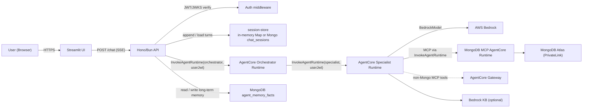
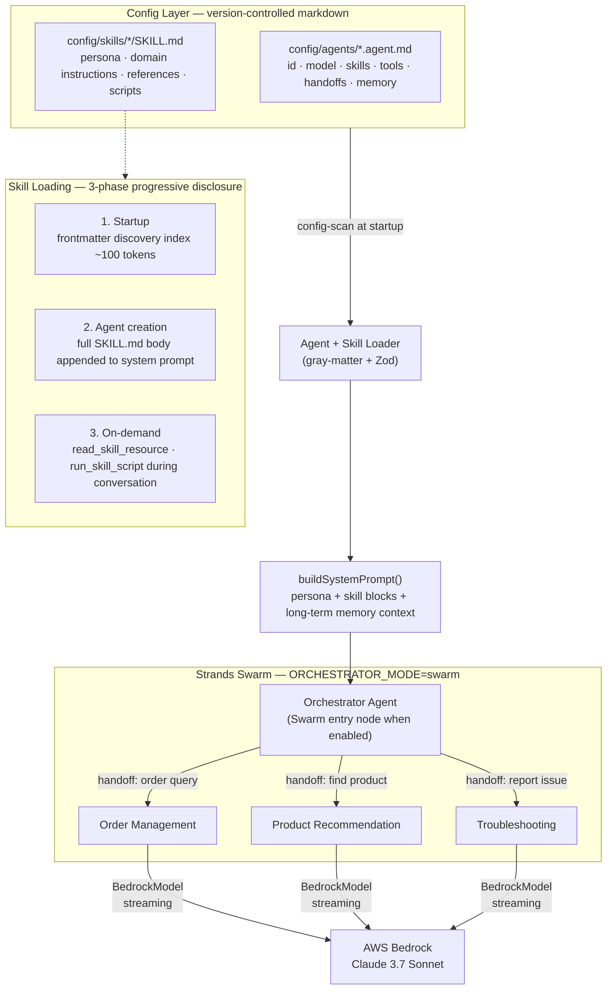
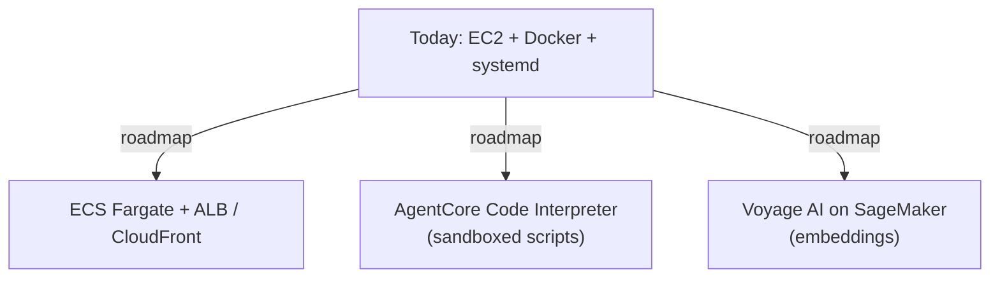
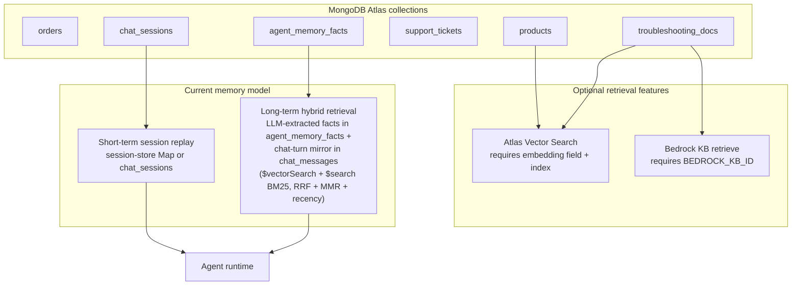

# Technical Approach: AWS Bedrock Multi-Agent Framework

## 1. Solution Overview

A **configuration-driven multi-agent customer PoC platform** built around a Bun/Hono API, a Streamlit UI, the **Strands Agents SDK**, and MongoDB-backed tools. In the current repository, agents run directly inside the API process; short-term session history lives in an in-memory store or optional MongoDB `chat_sessions`, and long-term memory is stored in MongoDB as LLM-extracted facts (`agent_memory_facts`) and a vector-searchable mirror of each chat turn (`chat_messages`), retrieved with a hybrid `$vectorSearch` + `$search` (BM25) pipeline. The SOW target extends this baseline with **Bedrock AgentCore Runtime/Gateway**, broader AWS networking and observability, and production container hosting. New specialist behavior is primarily added through `.agent.md` and `SKILL.md` files, as long as it can reuse the existing base tools.

---

## 2. Architecture Diagrams

### 2a. Current Runtime

What the repository implements today.

---

### 2b. Agent Orchestration & Config Loading

How markdown config becomes a running agent or, when enabled, a running Swarm.

Inside the orchestrator AgentCore runtime, Swarm activates when `ORCHESTRATOR_MODE=swarm`; otherwise the runtime falls back to single-agent routing (it picks one specialist and invokes its runtime ARN directly).

---

### 2c. Remaining Production Extensions

The AgentCore Runtime path is already the default: MongoDB MCP runs in a dedicated AgentCore Runtime, and the AgentCore Gateway remains available for non-Mongo tools. Items still on the roadmap:

---

### 2d. Current Data & Memory Layer

---

## 3. Tech Stack

**Implemented in the repository today**

| Area | Technology |
|---|---|
| **API runtime** | Bun (TypeScript, ES2022), Hono v4, Zod validation |
| **Agent runtime** | Strands Agents SDK — `Agent`, `Swarm`, `BedrockModel`, hosted on Bedrock AgentCore Runtime |
| **UI** | Streamlit (Python 3.12), multipage (Chat + Sessions), SSE streaming, `streamlit-cognito-auth` |
| **Data access** | MongoDB Atlas — `orders`, `products`, `troubleshooting_docs`, `support_tickets`, `agent_memory_facts`, `chat_messages`, optional `chat_sessions` |
| **Tools** | `mongodb_query`, `mongodb_vector_search`, `bedrock_kb_retrieve`, `generate_embedding`, `read_skill_resource`, `run_skill_script`, `create_support_ticket` |
| **Retrieval prerequisites** | Atlas vector search needs embeddings + an Atlas vector index; Bedrock KB needs AWS credentials + `BEDROCK_KB_ID` |
| **Short-term sessions** | In-memory `session-store`; optional Mongo `chat_sessions` when `PERSIST_CHAT_SESSIONS=1` and `MONGODB_URI` are set |
| **Long-term memory** | Mongo `agent_memory_facts` (LLM-extracted facts) + `chat_messages` (vector-searchable chat-turn mirror) with TTL; hybrid `$vectorSearch` + `$search` (BM25) retrieval with RRF / weights / recency decay / MMR injected as prompt context |
| **Auth** | Optional Bearer JWT verification via `jose`; unauthenticated mode also supported |
| **Infra in repo** | Docker / Compose; Terraform bootstrap + IAM / Secrets / Bedrock KB lifecycle |

**Target production extensions from the SOW**

| Area | Target architecture |
|---|---|
| **Cloud runtime** | Bedrock AgentCore Runtime |
| **Tool hosting** | MongoDB MCP AgentCore Runtime + AgentCore Gateway for non-Mongo tools |
| **Sandboxed execution** | AgentCore Code Interpreter |
| **Hosting** | ECR -> ECS Fargate + ALB / CloudFront |
| **Networking / ops** | VPC, PrivateLink, CloudWatch, broader Cognito integration |

---

## 4. Agent & Config Architecture

**Agent definition** (`config/agents/<name>.agent.md`) follows the [VS Code custom agents format](https://code.visualstudio.com/docs/copilot/customization/custom-agents) — a widely adopted standard for defining AI agent personas as plain markdown files. Each file combines a YAML frontmatter block (declaring `id`, `model`, `skills`, `tools`, `handoffs`, and `memory` flags) with a free-form markdown body that becomes the agent's system prompt — covering persona, guardrails, and tool-usage workflows. This means agent behaviour is fully readable and editable by non-engineers without touching any code.

**Skill definition** (`config/skills/<name>/SKILL.md`) follows the [agentskills.io specification](https://agentskills.io/specification) — an open standard for packaging domain knowledge as portable, reusable skill files. Skills use three-phase progressive disclosure to stay token-efficient:
1. **Startup** — only the frontmatter (name + description, ~100 tokens) is loaded for discovery
2. **Agent creation** — the full `SKILL.md` body is appended to the system prompt when an agent activates that skill
3. **On-demand** — `references/` docs and `scripts/` are fetched at runtime only when the agent explicitly needs them

In code today, the Hono API always invokes the AgentCore Orchestrator Runtime via `InvokeAgentRuntimeCommand`. Inside that runtime, `ORCHESTRATOR_MODE=swarm` selects Strands Swarm; otherwise the runtime routes to a single specialist runtime ARN.

---

## 5. Request Data Flow

1. `POST /chat` receives `{ message, sessionId, agentId? }`; when `agentId` is omitted the route defaults to `orchestrator`.
2. Auth middleware verifies the Bearer token against the Cognito JWKS and extracts `jwt.sub` as `userId`.
3. The API appends the user turn to `session-store` (in-memory `Map`; mirrored to Mongo `chat_sessions` when `MONGODB_URI` is set).
4. If the selected agent has `memory.longTerm: true` and a `userId` is present, the route calls `readLongTermMemoryContext(userId, message, { agentId })`, which embeds the message and runs hybrid `$vectorSearch` + `$search` (BM25) across `agent_memory_facts` and `chat_messages` (RRF-fused, weighted, recency-decayed, MMR-diversified) and passes the result into the prompt builder as `memoryContext`.
5. The route invokes the AgentCore Orchestrator Runtime via `InvokeAgentRuntimeCommand`, forwarding the user's JWT in the payload as `userJwt` plus session/agent metadata.
6. Inside the orchestrator runtime: `ORCHESTRATOR_MODE=swarm` runs Strands Swarm; otherwise the runtime picks one specialist and invokes its runtime ARN directly via `InvokeAgentRuntime`.
7. Specialist runtimes call MongoDB MCP tools directly against the MongoDB MCP AgentCore Runtime via `InvokeAgentRuntime`; that runtime executes the MongoDB driver call against Atlas via PrivateLink. Non-Mongo MCP tools remain Gateway-hosted.
8. The orchestrator runtime returns the final assistant message + handoff metadata; the API wraps it as SSE `token` + `handoff` + `done` events for UI compatibility.
9. On successful completion the API appends the assistant message to the session and, when eligible, writes the extracted facts to `agent_memory_facts` (LLM extractor; falls back to skipping the write on Bedrock failure).

---

## 6. Memory Architecture

| Tier | Mechanism | Storage | Scope |
|---|---|---|---|
| **Short-term** | Per-turn chat transcript replayed each turn | AgentCore short-term events (primary, when authenticated); in-memory `Map` + Mongo `chat_sessions` (default-on when `MONGODB_URI` is set) as the cache/fallback | Per session |
| **Long-term** | Hybrid vector + BM25 retrieval injected as `## Relevant prior context` | Mongo `agent_memory_facts` (LLM-extracted facts, embedded at write time, deduped on `factHash`) + `chat_messages` (vector-searchable chat-turn mirror written by a microtask). Both TTL `MEMORY_TTL_DAYS`; AgentCore Memory store as fallback. Final top-K capped by `MEMORY_VECTOR_TOPK`. | Per `userId` × `agentId` |

Long-term recall is **hybrid**: the LLM extractor (`api/src/lib/llm-fact-extractor.ts`) distills facts on write; the retriever ([`api/src/lib/long-term-memory.ts`](../api/src/lib/long-term-memory.ts) + [`api/src/lib/vector-retrieval.ts`](../api/src/lib/vector-retrieval.ts)) embeds the incoming query and fuses `$vectorSearch` + `$search` (BM25) across both collections with **Reciprocal Rank Fusion**, collection weights, **exponential recency decay**, and **MMR diversification**. Embedding failures are non-fatal — the lexical leg keeps recall working until the embedder is back.

---

## 7. Deployment Model

**Current repository path**

- `./deploy/deploy-full-with-privatelink.sh` provisions the full AWS stack: VPC + PrivateLink, MongoDB MCP AgentCore Runtime, AgentCore Runtimes (orchestrator + 3 specialists), AgentCore Gateway, AgentCore Memory store, Bedrock KB, Cognito, and an EC2 host running the API + Streamlit UI under systemd.
- `docker compose up --build` starts the API + Streamlit UI locally pointed at the deployed AgentCore Orchestrator runtime (`AGENTCORE_ORCHESTRATOR_ARN` is asserted at startup).

**Infrastructure currently implemented in Terraform**

- VPC, subnets, PrivateLink endpoints, EC2 host, security groups
- MongoDB MCP AgentCore Runtime + log group
- AgentCore Runtimes (4) + AgentCore Gateway + AgentCore Memory store
- Bedrock KB + S3 docs + ingestion helpers
- Cognito user pool + app client
- IAM, Secrets Manager, CloudWatch log groups

**Target production extensions**

- ECS Fargate + ALB / CloudFront for the containerized UI and API (currently EC2 + systemd)
- AgentCore Code Interpreter for sandboxed script execution
- Voyage AI on SageMaker for embeddings (currently Bedrock Titan v2)

---

## 8. Key Design Decisions

- **Config-over-code:** Every agent persona, routing rule, skill body, and HTTP integration lives in version-controlled markdown. New domains ship with zero TypeScript changes and no Lambda deploys (unless new infra is needed).
- **AgentCore-hosted MCP tools:** MongoDB MCP runs in a dedicated AgentCore Runtime with IAM invocation; the AgentCore Gateway remains the path for non-Mongo MCP tools. No agent runtime opens a MongoDB driver directly.
- **Unified Atlas data layer:** Operational queries, optional Atlas vector search, chat-session persistence, long-term agent memory, and support tickets can all sit in one Atlas deployment.
- **Two memory horizons:** Short-term session replay and long-term hybrid retrieval over `agent_memory_facts` + `chat_messages` are intentionally separate, keeping the current implementation simple and inspectable.
- **Optional advanced retrieval:** Vector search and Bedrock KB are both opt-in capabilities that only become active when their indexes and environment variables are provisioned.
- **Typed SSE contract:** The API emits a well-defined event vocabulary (`token`, `agent_active`, `handoff`, `tool_call`, `skill_loaded`, `done`, `error`), decoupling the streaming backend from any future UI replacement.

---

## 9. Demo Use Cases

The following scenarios are grounded in the seeded Atlas dataset under `db-seeding/` (customers: Alex Rivera, Blake Chen, Casey Morgan, Dana Patel; products: SKU-1 through SKU-9; orders: ORD-1001 through ORD-3002).

To run them exactly as written today, use a seeded MongoDB Atlas instance, choose `agentId=orchestrator`, and ensure the deployed orchestrator runtime has `ORCHESTRATOR_MODE=swarm`. For ticket demos, also set `MONGODB_ALLOW_WRITE=1` on the Lambda MCP function. For vector-search demos, seed embeddings and create the Atlas vector indexes. For Bedrock KB supplementation, configure `BEDROCK_KB_ID` and AWS credentials. Long-term-memory recall always uses authenticated requests because JWKS auth is mandatory.

---

**Use Case 1 — Order tracking**

> *"Hey, where is my Compact Widget order?"*

Alex Rivera asks about order **ORD-1001** (Compact Widget SKU-1, status: `shipped`). In Swarm mode, the Orchestrator routes to the **Order Management** agent, which looks up the order in the `orders` collection and returns the seeded status, estimated delivery date, and tracking link (`TRK-9001-US`).

---

**Use Case 2 — Return request + upgrade recommendation**

> *"My widget from last month stopped working. Can I return it and get something better?"*

Alex's **ORD-1003** (Compact Widget SKU-1, status: `delivered`, `returnEligible: true`, order note: *"stopped working after 2 weeks — replacement eligible. Suggest SKU-4 or SKU-5"*). The Orchestrator routes to the **Order Management** agent, which runs `validate-return.mjs` via `run_skill_script` to confirm eligibility and report the verdict. On a follow-up turn such as *"what should I get instead?"*, the Orchestrator can re-route to the **Product Recommendation** agent. If product embeddings and the Atlas vector index are provisioned, the seeded catalog supports replacement suggestions such as:
- **SKU-4 Compact Widget Plus** — direct drop-in replacement, metal body, 30% faster, 2-year warranty
- **SKU-5 Smart Widget Hub** — smart home upgrade with Wi-Fi + Bluetooth, Alexa/Google support

---

**Use Case 3 — Connectivity troubleshooting → escalation ticket**

> *"My Pro Gadget keeps dropping Wi-Fi and shows a NET-204 error."*

Blake Chen's **ORD-1006** (Pro Gadget SKU-2, status: `return_requested`, order note: *"intermittent NET-204 error after firmware update"*). The Orchestrator routes to the **Troubleshooting** agent, which in the current skill first searches `troubleshooting_docs` and lands on the seeded NET-204 playbook (`ts-2`). Bedrock KB retrieval can supplement that answer if `BEDROCK_KB_ID` is configured, but it is not the primary retrieval path. If the steps do not resolve the issue and writes are enabled, the agent calls `create_support_ticket`, which inserts a `support_tickets` record and returns a `ticketId`, priority, and next steps.

---

**Use Case 4 — Non-recoverable hardware fault → immediate replacement**

> *"My Compact Widget is showing an HW-900 error and blinking red three times."*

Dana Patel's **ORD-3002** (Compact Widget SKU-1, status: `return_requested`, order note: *"HW-900 error code — hardware fault. Escalation required"*). The Orchestrator routes to the **Troubleshooting** agent, which matches the seeded hardware-fault article (`ts-3`) in `troubleshooting_docs`. That article explicitly treats HW-900 as non-recoverable. If writes are enabled, the agent calls `create_support_ticket`, which assigns `priority: high` because `HW-900` is in the code's high-priority list. The "premium-tier 36-month window" comes from the seeded troubleshooting article text, not from a separate warranty rules engine.

---

**Use Case 5 — Cross-session memory recall**

> *"I'm back — last time we talked about a lighter gadget option. What did you suggest?"*

Casey Morgan (premium tier) discussed Pro Gadget preferences in a prior authenticated session. On returning, the API can read Casey's facts and prior chat-message context for that same `userId × agentId` pair (hybrid `$vectorSearch` + `$search` over `agent_memory_facts` + `chat_messages`) and inject them into the system prompt. In that setup, the Product Recommendation agent has enough seeded catalog context to continue the conversation around lighter alternatives such as **SKU-8 Pro Gadget Lite**. The exact wording and ranking remain model-driven.
