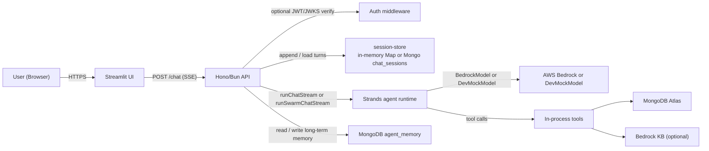
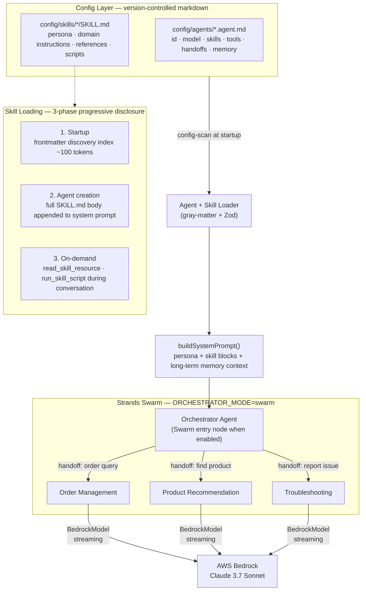
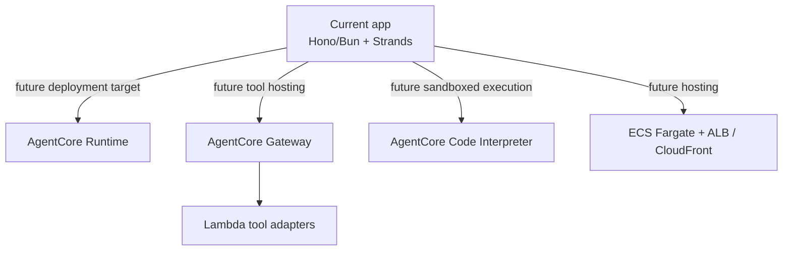
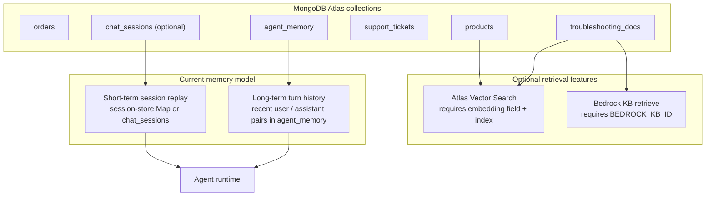

# Technical Approach: AWS Bedrock Multi-Agent Framework

## 1. Solution Overview

A **configuration-driven multi-agent customer PoC platform** built around a Bun/Hono API, a Streamlit UI, the **Strands Agents SDK**, and MongoDB-backed tools. In the current repository, agents run directly inside the API process; short-term session history lives in an in-memory store or optional MongoDB `chat_sessions`, and long-term memory is stored as recent conversation turns in MongoDB `agent_memory`. The SOW target extends this baseline with **Bedrock AgentCore Runtime/Gateway**, broader AWS networking and observability, and production container hosting. New specialist behavior is primarily added through `.agent.md` and `SKILL.md` files, as long as it can reuse the existing base tools.

---

## 2. Architecture Diagrams

### 2a. Current Runtime

What the repository implements today.

---

### 2b. Agent Orchestration & Config Loading

How markdown config becomes a running agent or, when enabled, a running Swarm.

When Swarm is disabled, the selected agent runs as a single Strands `Agent`; Swarm only activates when `agentId=orchestrator`, `CHAT_MODE=live`, and `ORCHESTRATOR_MODE=swarm`.

---

### 2c. Target Production Extensions

These are SOW-aligned production extensions, not the default runtime path in the current codebase.

---

### 2d. Current Data & Memory Layer

---

## 3. Tech Stack

**Implemented in the repository today**

| Area | Technology |
|---|---|
| **API runtime** | Bun (TypeScript, ES2022), Hono v4, Zod validation |
| **Agent runtime** | Strands Agents SDK — `Agent`, `Swarm`, `BedrockModel`, `DevMockModel` |
| **UI** | Streamlit (Python 3.12), multipage (Chat + Sessions), SSE streaming, `streamlit-cognito-auth` |
| **Data access** | MongoDB Atlas — `orders`, `products`, `troubleshooting_docs`, `support_tickets`, `agent_memory`, optional `chat_sessions` |
| **Tools** | `mongodb_query`, `mongodb_vector_search`, `bedrock_kb_retrieve`, `generate_embedding`, `read_skill_resource`, `run_skill_script`, `create_support_ticket` |
| **Retrieval prerequisites** | Atlas vector search needs embeddings + an Atlas vector index; Bedrock KB needs AWS credentials + `BEDROCK_KB_ID` |
| **Short-term sessions** | In-memory `session-store`; optional Mongo `chat_sessions` when `PERSIST_CHAT_SESSIONS=1` and `MONGODB_URI` are set |
| **Long-term memory** | Mongo `agent_memory` storing recent user/assistant turns with a TTL; injected as prompt context |
| **Auth** | Optional Bearer JWT verification via `jose`; unauthenticated mode also supported |
| **Infra in repo** | Docker / Compose; Terraform bootstrap + IAM / Secrets / Bedrock KB lifecycle |

**Target production extensions from the SOW**

| Area | Target architecture |
|---|---|
| **Cloud runtime** | Bedrock AgentCore Runtime |
| **Tool hosting** | AgentCore Gateway + Lambda tool adapters |
| **Sandboxed execution** | AgentCore Code Interpreter |
| **Hosting** | ECR -> ECS Fargate + ALB / CloudFront |
| **Networking / ops** | VPC, PrivateLink, CloudWatch, broader Cognito integration |

---

## 4. Agent & Config Architecture

**Agent definition** (`config/agents/<name>.agent.md`) follows the [VS Code custom agents format](https://code.visualstudio.com/docs/copilot/customization/custom-agents) — a widely adopted standard for defining AI agent personas as plain markdown files. Each file combines a YAML frontmatter block (declaring `id`, `model`, `skills`, `tools`, `handoffs`, and `memory` flags) with a free-form markdown body that becomes the agent's system prompt — covering persona, guardrails, and tool-usage workflows. This means agent behaviour is fully readable and editable by non-engineers without touching any code.

**Skill definition** (`config/skills/<name>/SKILL.md`) follows the [agentskills.io specification](https://agentskills.io/specification) — an open standard for packaging domain knowledge as portable, reusable skill files. Skills use three-phase progressive disclosure to stay token-efficient:
1. **Startup** — only the frontmatter (name + description, ~100 tokens) is loaded for discovery
2. **Agent creation** — the full `SKILL.md` body is appended to the system prompt when an agent activates that skill
3. **On-demand** — `references/` docs and `scripts/` are fetched at runtime only when the agent explicitly needs them

In code today, the selected agent runs directly unless `agentId=orchestrator`, `CHAT_MODE=live`, and `ORCHESTRATOR_MODE=swarm`, in which case the orchestrator starts a Strands `Swarm`.

---

## 5. Request Data Flow

1. `POST /chat` receives `{ message, sessionId, agentId? }`; when `agentId` is omitted the route defaults to `orchestrator`.
2. Auth middleware optionally verifies a Bearer token and, when JWKS is configured, extracts `jwt.sub` as `userId`.
3. The API appends the user turn to `session-store`, which uses an in-memory `Map` by default and optional Mongo `chat_sessions` persistence when enabled.
4. If the selected agent has `memory.longTerm: true` and a `userId` is present, the route reads recent turns from Mongo `agent_memory` and passes that text into the prompt builder as `memoryContext`.
5. Config loaders resolve the selected `.agent.md`, activate the specialist's `SKILL.md` content, and build the system prompt.
6. `resolveModel()` selects `BedrockModel` for live Bedrock calls or `DevMockModel` when `DEV_MOCK_BACKENDS=1`.
7. The route chooses execution mode:
   - Single-agent path: `runChatStream()`
   - Swarm path: `runSwarmChatStream()` only when `agentId=orchestrator`, `CHAT_MODE=live`, and `ORCHESTRATOR_MODE=swarm`
8. The Strands runtime streams `token`, `tool_call`, `skill_loaded`, `agent_active`, and `handoff` events over SSE.
9. Tool calls execute in-process:
   - `mongodb_query` and `create_support_ticket` need MongoDB; writes additionally need `MONGODB_ALLOW_WRITE=1`
   - `mongodb_vector_search` also needs embeddings and an Atlas vector index
   - `bedrock_kb_retrieve` needs AWS credentials and `BEDROCK_KB_ID`
10. On successful completion the API appends the assistant message to the session and, when eligible, writes the completed turn to `agent_memory`.
11. The route emits a final SSE `done` event with `sessionId` and `messageId`.

---

## 6. Memory Architecture

| Tier | Mechanism | Storage | Scope |
|---|---|---|---|
| **Short-term** | Full turn history replayed each turn | In-memory `Map`; optional Mongo `chat_sessions` when `PERSIST_CHAT_SESSIONS=1` | Per session |
| **Long-term** | Recent completed user/assistant turns injected as `## Context from previous sessions` | Mongo `agent_memory`, TTL 90 days, capped by `MEMORY_INJECT_TURNS` | Per `userId` × `agentId` |

In the current code, long-term memory is plain turn replay rather than an embedding-based vector recall system.

---

## 7. Deployment Model

**Current repository path**

- `docker compose up --build` starts the Streamlit UI and Bun API with `CHAT_MODE=live` and `DEV_MOCK_BACKENDS=1`.
- Data-backed demos still need `MONGODB_URI`.
- Swarm demos additionally need `ORCHESTRATOR_MODE=swarm`.
- Vector-search demos need seeded embeddings, an Atlas vector index, and `EMBEDDING_MODEL_ID`.
- Bedrock KB demos need AWS credentials and `BEDROCK_KB_ID`.
- Ticket-creation demos need `MONGODB_ALLOW_WRITE=1`.

**Infrastructure currently implemented in Terraform**

- S3 state/bootstrap resources
- IAM and Secrets Manager wiring for the Bedrock KB flow
- Bedrock Knowledge Base lifecycle and S3 ingestion helpers

**Target production architecture**

- ECS Fargate + ALB / CloudFront for the containerized UI and API
- VPC / PrivateLink, Cognito, CloudWatch, and broader operational hardening
- AgentCore Runtime / Gateway and Lambda-based tool hosting as future extensions

---

## 8. Key Design Decisions

- **Config-over-code:** Every agent persona, routing rule, skill body, and HTTP integration lives in version-controlled markdown. New domains ship with zero TypeScript changes and no Lambda deploys (unless new infra is needed).
- **Direct in-process tools first:** The current runtime executes tools directly inside the API process. Gateway/Lambda hosting is a future production extension, not a prerequisite for the current PoC.
- **Unified Atlas data layer:** Operational queries, optional Atlas vector search, chat-session persistence, long-term agent memory, and support tickets can all sit in one Atlas deployment.
- **Two memory horizons:** Short-term session replay and long-term `agent_memory` are intentionally separate, keeping the current implementation simple and inspectable.
- **Optional advanced retrieval:** Vector search and Bedrock KB are both opt-in capabilities that only become active when their indexes and environment variables are provisioned.
- **Typed SSE contract:** The API emits a well-defined event vocabulary (`token`, `agent_active`, `handoff`, `tool_call`, `skill_loaded`, `done`, `error`), decoupling the streaming backend from any future UI replacement.

---

## 9. Demo Use Cases

The following scenarios are grounded in the seeded Atlas dataset under `db-seeding/` (customers: Alex Rivera, Blake Chen, Casey Morgan, Dana Patel; products: SKU-1 through SKU-9; orders: ORD-1001 through ORD-3002).

To run them exactly as written today, use a seeded MongoDB Atlas instance, choose `agentId=orchestrator`, set `CHAT_MODE=live`, and enable `ORCHESTRATOR_MODE=swarm`. For ticket demos, also set `MONGODB_ALLOW_WRITE=1`. For vector-search demos, seed embeddings and create the Atlas vector indexes. For Bedrock KB supplementation, configure `BEDROCK_KB_ID` and AWS credentials. For long-term-memory recall, use authenticated requests so the API has a stable `userId`.

---

**Use Case 1 — Order tracking**

> *"Hey, where is my Compact Widget order?"*

Alex Rivera asks about order **ORD-1001** (Compact Widget SKU-1, status: `shipped`). In Swarm mode, the Orchestrator routes to the **Order Management** agent, which looks up the order in the `orders` collection and returns the seeded status, estimated delivery date, and tracking link (`TRK-9001-US`).

---

**Use Case 2 — Return request + upgrade recommendation**

> *"My widget from last month stopped working. Can I return it and get something better?"*

Alex's **ORD-1003** (Compact Widget SKU-1, status: `delivered`, `returnEligible: true`, order note: *"stopped working after 2 weeks — replacement eligible. Suggest SKU-4 or SKU-5"*). The Orchestrator routes to the **Order Management** agent, which runs `validate-return.mjs` via `run_skill_script` to confirm eligibility and report the verdict. On a follow-up turn such as *"what should I get instead?"*, the Orchestrator can re-route to the **Product Recommendation** agent. If product embeddings and the Atlas vector index are provisioned, the seeded catalog supports replacement suggestions such as:
- **SKU-4 Compact Widget Plus** — direct drop-in replacement, metal body, 30% faster, 2-year warranty
- **SKU-5 Smart Widget Hub** — smart home upgrade with Wi-Fi + Bluetooth, Alexa/Google support

---

**Use Case 3 — Connectivity troubleshooting → escalation ticket**

> *"My Pro Gadget keeps dropping Wi-Fi and shows a NET-204 error."*

Blake Chen's **ORD-1006** (Pro Gadget SKU-2, status: `return_requested`, order note: *"intermittent NET-204 error after firmware update"*). The Orchestrator routes to the **Troubleshooting** agent, which in the current skill first searches `troubleshooting_docs` and lands on the seeded NET-204 playbook (`ts-2`). Bedrock KB retrieval can supplement that answer if `BEDROCK_KB_ID` is configured, but it is not the primary retrieval path. If the steps do not resolve the issue and writes are enabled, the agent calls `create_support_ticket`, which inserts a `support_tickets` record and returns a `ticketId`, priority, and next steps.

---

**Use Case 4 — Non-recoverable hardware fault → immediate replacement**

> *"My Compact Widget is showing an HW-900 error and blinking red three times."*

Dana Patel's **ORD-3002** (Compact Widget SKU-1, status: `return_requested`, order note: *"HW-900 error code — hardware fault. Escalation required"*). The Orchestrator routes to the **Troubleshooting** agent, which matches the seeded hardware-fault article (`ts-3`) in `troubleshooting_docs`. That article explicitly treats HW-900 as non-recoverable. If writes are enabled, the agent calls `create_support_ticket`, which assigns `priority: high` because `HW-900` is in the code's high-priority list. The "premium-tier 36-month window" comes from the seeded troubleshooting article text, not from a separate warranty rules engine.

---

**Use Case 5 — Cross-session memory recall**

> *"I'm back — last time we talked about a lighter gadget option. What did you suggest?"*

Casey Morgan (premium tier) discussed Pro Gadget preferences in a prior authenticated session. On returning, the API can read Casey's recent `agent_memory` turns for that same `userId × agentId` pair and inject them into the system prompt. In that setup, the Product Recommendation agent has enough seeded catalog context to continue the conversation around lighter alternatives such as **SKU-8 Pro Gadget Lite**. The exact wording and ranking remain model-driven.
