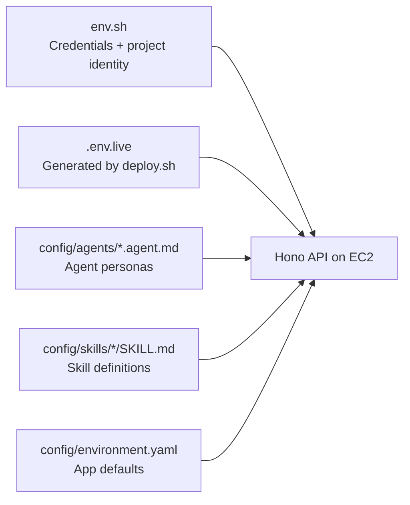

# Configuration Guide

> **Audience:** anyone tuning the system — switching between local/EC2 modes, swapping models, enabling auth, or adjusting tool routing.

Every operational behavior is controlled by **environment variables** read at boot. There is no GUI config, no database-stored settings, and no hot-reloadable `.json` for runtime behavior.

---

## 1. Where config comes from



| Source | Purpose | Loaded by |
|---|---|---|
| `env.sh` | AWS credentials, Atlas creds, project name (gitignored) | Sourced manually before `bun run dev` or `deploy.sh` |
| `.env.live` | Generated by `deploy.sh` Phase 9. Runtime config (ARNs, URIs, mode flags) | Sourced by EC2 systemd unit; sourced manually for local dev |
| `config/agents/*.agent.md` | Agent persona, model, tools list, memory flags | API on every request (mtime-cached) |
| `config/skills/*/SKILL.md` | Skill instructions and references | API when an agent activates the skill |
| `config/environment.yaml` | API port, CORS origins (defaults if env vars unset) | API at boot |

---

## 2. The mode flags

The Hono API is a thin proxy in front of an AgentCore Runtime, so the only meaningful mode switch is whether the orchestrator runtime should run Strands Swarm or single-agent routing.

### `AGENTCORE_ORCHESTRATOR_ARN`

**Required at startup** (asserted by `assertAgentcoreOrchestratorArn()` in `api/src/index.ts`). Set to the orchestrator AgentCore Runtime ARN. The legacy alias `AGENTCORE_RUNTIME_ARN` is also accepted.

In production (EC2), this is set by `deploy.sh` to the orchestrator runtime ARN.

### `ORCHESTRATOR_MODE`

Read by the orchestrator runtime container (not the API).

| Value | Effect |
|---|---|
| `swarm` (default for the orchestrator runtime) | The orchestrator runtime runs Strands Swarm; specialists run in their own runtime containers. |
| `single` / `runtime` / anything else | Single-agent routing — the orchestrator picks one specialist and invokes its runtime ARN directly via `InvokeAgentRuntime`. |

### Tool hosting

There is no `TOOL_HOSTING_MODE` switch. Mongo tool calls use the dedicated MongoDB MCP AgentCore Runtime (`MONGODB_MCP_RUNTIME_ARN` / `MONGODB_MCP_RUNTIME_ENDPOINT`) and are IAM-authorized with `bedrock-agentcore:InvokeAgentRuntime`. The AgentCore Gateway (`AGENTCORE_GATEWAY_URL` / `MCP_SERVER_URL`) remains configured for non-Mongo Gateway tools and JWT-authenticated fallback behavior. The legacy Lambda MCP target is deleted.

---

## 3. AWS resource identifiers

These are typically set in `.env.live` by `deploy.sh`. For local dev with real AWS, set them manually.

### Bedrock + AgentCore

| Variable | Example value | Purpose |
|---|---|---|
| `AWS_REGION` | `us-east-1` | All AWS SDK calls |
| `AGENTCORE_ORCHESTRATOR_ARN` | `arn:aws:bedrock-agentcore:us-east-1:483874864688:runtime/bedrock-ma-use1-orchestrator-dev-...` | EC2 API → orchestrator runtime |
| `AGENTCORE_RUNTIME_ARN_TROUBLESHOOTING` | `arn:aws:bedrock-agentcore:...troubleshooting...` | Orchestrator → specialist (injected on orchestrator runtime env) |
| `AGENTCORE_RUNTIME_ARN_ORDER_MANAGEMENT` | `arn:aws:bedrock-agentcore:...order_management...` | Same |
| `AGENTCORE_RUNTIME_ARN_PRODUCT_RECOMMENDATION` | `arn:aws:bedrock-agentcore:...product_recommendation...` | Same |
| `AGENTCORE_MEMORY_STORE_ID` | `bedrock_ma_use1_memory_dev-aaTMdv52rv` | Long-term memory backend |
| `AGENTCORE_GATEWAY_URL` | `https://bedrock-ma-use1-gw-dev-...gateway.bedrock-agentcore.us-east-1.amazonaws.com/mcp` | Required for Gateway-hosted non-Mongo tools. `deploy.sh` copies this into `MCP_SERVER_URL` on every runtime as the fallback MCP endpoint. |
| `MONGODB_MCP_RUNTIME_ARN` | `arn:aws:bedrock-agentcore:...:runtime/bedrock-ma-use1-mongodb-mcp-dev-...` | Direct MongoDB MCP runtime target used by `api/src/adapters/mongodb-mcp-client.ts`. |
| `MONGODB_MCP_RUNTIME_ENDPOINT` | `https://bedrock-agentcore.../runtimes/.../invocations?qualifier=DEFAULT` | Streamable-HTTP MCP endpoint for the MongoDB MCP AgentCore Runtime. |
| `AGENTCORE_ACTOR_ID` | `default` or JWT sub | AgentCore session actor |
| `BEDROCK_KB_ID` | `YDF16V4CRX` | Default knowledge base for `bedrock_kb_retrieve` |
| `EMBEDDING_MODEL_ID` | `amazon.titan-embed-text-v2:0` | Bedrock embedding model. Used as the **fallback** when `VOYAGE_SAGEMAKER_ENDPOINT` is unset. Must match Atlas vector index dimensionality (Titan v2 = 1024-d). See §3.5 below for the Voyage AI override. |
| `VOYAGE_SAGEMAKER_ENDPOINT` | `mongodb-multiagent3-voyage-3-dev` | Optional. If set, the API + AgentCore runtimes use Voyage AI on SageMaker for query embeddings instead of Bedrock Titan. See §3.5 to enable. |
| `VOYAGE_OUTPUT_DIM` | `1024` | Embedding dimension to request from voyage-3.5-lite. Pinned to 1024 to match the Atlas index. Allowed: `2048` (default), `1024`, `512`, `256`. **Re-seed required if changed.** |

### MongoDB

| Variable | Example value | Purpose |
|---|---|---|
| `MONGODB_URI` | `mongodb+srv://...` (local) or `mongodb://...:1024,...:1025/?ssl=true` (AgentCore Runtime PrivateLink) | Atlas connection string |
| `MONGODB_DB` | `<project>_<env>` (e.g. `mongodb_multiagent_dev`) | Database name; project+env-derived (underscored) by `env.sh` |
| `MONGODB_ALLOW_WRITE` | `1` or `true` | Required for `updateOne` against real Atlas. Default off (read-only). |
| `SHORT_TERM_MEMORY_BACKEND` | `agentcore` (EC2 deploy default) | `agentcore` enables AgentCore short-term event storage when authenticated; otherwise session-store fallback |
| `PERSIST_CHAT_SESSIONS` | unset (default-on when `MONGODB_URI` is set), `0`/`false` to opt out | Persist short-term chat history in MongoDB `chat_sessions`. Defaults to enabled whenever `MONGODB_URI` is configured. |
| `MEMORY_TTL_DAYS` | `30` (EC2 deploy default) | TTL for `agent_memory_facts` long-term facts collection |
| `MEMORY_INJECT_TURNS` | `5` (default) | Number of past turns injected into system prompt as long-term memory |

### Auth

JWKS auth is mandatory — the API refuses to boot without `AUTH_JWKS_URI` + `AUTH_ISSUER` (`assertJwksAuthConfigured()` in `api/src/lib/jwt-verify.ts`). There is no `ALLOW_UNAUTHENTICATED` / `REQUIRE_AUTH=false` bypass.

| Variable | Example | Purpose |
|---|---|---|
| `AUTH_JWKS_URI` | `https://cognito-idp.us-east-1.amazonaws.com/us-east-1_giTk8MWzq/.well-known/jwks.json` | **Required** — JWKS for JWT signature verification |
| `AUTH_ISSUER` | `https://cognito-idp.us-east-1.amazonaws.com/us-east-1_giTk8MWzq` | **Required** — JWT `iss` claim must match |
| `AUTH_APP_CLIENT_ID` | Cognito app client ID | Optional `aud`/`client_id` validation |
| `AUTH_TOKEN_USE` | `access` (recommended) or `id` | Optional Cognito token type pin |

### Streamlit UI

| Variable | Purpose |
|---|---|
| `STREAMLIT_API_URL` | API URL the UI calls. Default: `http://127.0.0.1:3000`. |
| `STREAMLIT_COGNITO_POOL_ID` | If set, UI gates with Cognito hosted-UI or embedded login |
| `STREAMLIT_COGNITO_CLIENT_ID` | Cognito app client ID |
| `STREAMLIT_COGNITO_DOMAIN` | Optional; if set with `REDIRECT_URI` + `CLIENT_SECRET`, uses hosted UI |
| `STREAMLIT_COGNITO_REDIRECT_URI` | OAuth callback |
| `STREAMLIT_COGNITO_CLIENT_SECRET` | Hosted UI mode only |

Notes:
- UI sends Cognito bearer tokens to API.
- Current UI logic prefers `id_token` (contains richer profile claims like email), then falls back to `access_token`.

---

## 3.5 Voyage AI on SageMaker (optional embedding override)

The default embedding path is **Bedrock Titan v2** (1024-d), used by the `generate_embedding` tool and as the query-side embedder for `mongodb_vector_search`. To switch to **Voyage AI** (`voyage-3.5-lite`) on a self-hosted SageMaker endpoint, set `VOYAGE_MODEL_PACKAGE_ARN` in [`env.sh`](../env.sh) and re-run `deploy.sh`.

### What you get vs Titan v2

| | Titan v2 (default) | voyage-3.5-lite (override) |
|---|---|---|
| Hosting | AWS-managed Bedrock API | Self-hosted SageMaker endpoint (your account) |
| Dimensions | 1024-d (fixed) | 256 / 512 / 1024 / 2048 — we pin to **1024** for index compat |
| Context window | 8K tokens | 32K tokens |
| Cost | $0.00002 / 1K tokens | ~$2.45 / hour while endpoint is running (ml.g6.xlarge) |
| Quality | Good baseline | Higher retrieval quality (esp. for long docs); Matryoshka + int8 quant supported |
| Tradeoff | Pay-per-token, no cold start | Always-on cost, but no per-call charges |

### One-time setup

1. **Subscribe to the Marketplace listing** (manual; cannot be automated — requires EULA acceptance):
   - Open [MongoDB voyage-3.5-lite Embedding Model](https://aws.amazon.com/marketplace/pp/prodview-xj76cqxng4wyw)
   - Click **Continue to Subscribe** → **Accept Offer**
2. **Request GPU quota** (if not already granted):
   - Open [SageMaker Service Quotas — us-east-1](https://console.aws.amazon.com/servicequotas/home/services/sagemaker/quotas)
   - Search `ml.g6.xlarge for endpoint usage`. If 0, request increase to 1. Usually instant.
3. **Discover the region-specific Product ARN and persist it to `env.sh`:**
   ```bash
   ./deploy/scripts/setup-voyage-marketplace.sh --model voyage-3-5-lite
   ```
   This appends/updates `VOYAGE_MODEL_PACKAGE_ARN` in `env.sh` (and pushes the value to GitHub Secrets if `gh auth status` is OK).

### Enable on a deployed environment

```bash
source env.sh                              # VOYAGE_MODEL_PACKAGE_ARN is now exported
./deploy/scripts/deploy.sh --auto-approve  # provisions the endpoint, wires env vars

# After deploy.sh finishes, re-seed Atlas embeddings with Voyage (1024-d):
cd db-seeding
MONGODB_URI="$(cd ../deploy/terraform/envs/ec2 && terraform output -raw atlas_connection_string)" \
MONGODB_DB="${ATLAS_DB_NAME}" \
VOYAGE_SAGEMAKER_ENDPOINT="${PROJECT_NAME}-voyage-3-${ENVIRONMENT}" \
REWIRE_EMBEDDINGS=1 \
bun seed-embeddings.ts
```

`REWIRE_EMBEDDINGS=1` wipes the existing `embedding` field on every product + troubleshooting doc and regenerates from scratch. **This is required when switching providers** because Titan and Voyage embeddings live in different vector spaces — mixing them gives garbage similarity scores.

### What deploy.sh does for you

When `VOYAGE_MODEL_PACKAGE_ARN` is non-empty, `deploy.sh` automatically sets `VOYAGE_SAGEMAKER_ENDPOINT` + `VOYAGE_OUTPUT_DIM=1024` on **all three surfaces** that need it:

1. **EC2 API** — written into `/opt/multiagent/.env.live`, picked up on next API restart
2. **Lambda MCP** — not directly (the Lambda receives a precomputed `queryVector`); the runtime + API embed the query first, then pass the vector
3. **AgentCore Runtimes** (orchestrator + 3 specialists) — `aws bedrock-agentcore-control update-agent-runtime --environment-variables ...` in Phase 6b

Forgetting any one of these makes vector search silently degrade to "catalog appears empty" because Titan-generated 1024-d vectors don't match the Voyage-seeded index. See [`memory.md`](../memory.md) for the failure modes.

### Disable / fall back to Titan

Just empty out `VOYAGE_MODEL_PACKAGE_ARN` in `env.sh` and re-run `deploy.sh`. The next apply skips the SageMaker module (`count = 0`), the runtimes get `VOYAGE_SAGEMAKER_ENDPOINT=""`, and the adapters fall through to `bedrockGenerateEmbedding(EMBEDDING_MODEL_ID)`. Then re-seed:

```bash
EMBEDDING_MODEL_ID=amazon.titan-embed-text-v2:0 REWIRE_EMBEDDINGS=1 \
  bun db-seeding/seed-embeddings.ts
```

To also tear down the running endpoint and stop incurring cost: `terraform destroy -target=module.voyage_sagemaker` from `deploy/terraform/envs/ec2/`.

### Verify it's active

```bash
# 1. SageMaker endpoint InService
aws sagemaker describe-endpoint --endpoint-name "${PROJECT_NAME}-voyage-3-${ENVIRONMENT}" \
  --query EndpointStatus

# 2. EC2 API has the env var
aws ssm send-command --instance-ids "$EC2_INSTANCE_ID" --document-name AWS-RunShellScript \
  --parameters 'commands=["grep VOYAGE /opt/multiagent/.env.live"]'

# 3. AgentCore runtimes have the env var
aws bedrock-agentcore-control get-agent-runtime --agent-runtime-id "$RT_ID" \
  --query "environmentVariables.VOYAGE_SAGEMAKER_ENDPOINT"

# 4. End-to-end: the SSE stream from /chat shows score'd vector hits
curl -sN -X POST "http://$EC2_IP:3000/chat" -H "Authorization: Bearer $JWT" \
  -d '{"sessionId":"v","message":"rugged outdoor widget for a workshop, ~$60"}' \
  | grep -E '"embeddingSource":"voyage"|SKU-'
```

---

## 4. Operational tunables

| Variable | Default | Purpose |
|---|---|---|
| `PORT` / `API_PORT` | `3000` | API listen port |
| `CORS_ORIGINS` | from `environment.yaml` | Comma-separated allowed origins |
| `RATE_LIMIT_PER_MIN` | `60` | Per-IP rate limit. Set `RATE_LIMIT_DISABLED=1` to turn off. |
| `LOG_LEVEL` | `info` | `error` / `warn` / `info` / `debug` |
| `SWARM_MAX_STEPS` | `8` | Max iterations in local swarm mode |
| `HTTP_TOOLS_MOCK` | unset | If `1`, all HTTP tools return mock payloads (useful for demos with no Lambda) |
| `HTTP_TOOLS_CONFIG_PATH` | `<CONFIG_ROOT>/http-tools.json` | Override path to global HTTP tools config |
| `SKILL_RESOURCE_MAX_BYTES` | (sensible default) | Cap on file reads via `read_skill_resource` |
| `CONFIG_ROOT` | inferred | Absolute path to `config/` if cwd isn't next to it |

---

## 5. Agent configuration (`config/agents/*.agent.md`)

Each agent is a markdown file with YAML frontmatter:

```yaml
---
id: order-management
name: Order Management Agent
model: us.anthropic.claude-sonnet-4-6
maxTokens: 2048
temperature: 0.2
tools:
  - mongodb_query
  - mongodb_aggregate
  - read_skill_resource
  - run_skill_script
skills:
  - order-management
memory:
  shortTerm: true
  longTerm: true
---

You are the Order Management Agent. You help customers...
```

Frontmatter fields validated by [`api/src/lib/schemas.ts`](../api/src/lib/schemas.ts):

| Field | Type | Notes |
|---|---|---|
| `id` | string | Must match the directory/file name |
| `name` | string | Human-readable label shown in the UI |
| `model` | string | Bedrock inference profile or model ID. Per CLAUDE.md, use `us.anthropic.claude-sonnet-4-6` for all agents. |
| `maxTokens` | number | Cap on output tokens |
| `temperature` | number | 0-1 |
| `tools` | string[] | Names of tools to attach. Built-ins: `mongodb_query`, `mongodb_vector_search`, `mongodb_aggregate`, `bedrock_kb_retrieve`, `generate_embedding`, `read_skill_resource`, `run_skill_script`. Skill HTTP tools: `<skill>/<localName>`. |
| `skills` | string[] | Skills the agent can activate. Skill `read_skill_resource` and `run_skill_script` calls only resolve within these skills. |
| `memory.shortTerm` | bool | Currently informational — short-term is always on |
| `memory.longTerm` | bool | If `true` AND `userId` is known, enable long-term memory read/write |

Body of the markdown is the **system prompt**. Skill instructions get appended when activated.

---

## 6. Skill configuration (`config/skills/<skill>/SKILL.md`)

Skills are bundles of instructions, scripts, and HTTP tool definitions. They're activated on demand by an agent's reasoning. See [skills-authoring-guide.md](skills-authoring-guide.md) for the full guide.

A skill directory looks like:

```
config/skills/order-management/
├── SKILL.md           # Skill instructions (loaded when agent activates)
├── http-tools.json    # Optional. HTTP tool definitions (e.g. Lambda function URLs)
├── scripts/
│   └── compute-refund.mjs
└── references/
    ├── return-policy.md
    └── faq.md
```

`http-tools.json` shape:

```json
{
  "tools": [
    {
      "name": "calculate_shipping",
      "description": "Calculate shipping cost",
      "inputSchema": {},
      "endpoint": {
        "url": "${SHIPPING_FN_URL}",
        "method": "POST"
      }
    }
  ],
  "security": {
    "allowedHosts": ["lambda-url.us-east-1.on.aws"]
  }
}
```

- `${VAR}` placeholders are resolved from environment at load time
- `security.allowedHosts` is the SSRF allowlist — outbound calls to other hosts are rejected

---

## 7. Local development examples

The API requires `AGENTCORE_ORCHESTRATOR_ARN` + AWS credentials at startup, so all local-dev examples assume you have a deployed AgentCore Runtime to point at.

### Local against a deployed AgentCore Runtime

```bash
source env.sh
source .env.live   # exports AGENTCORE_ORCHESTRATOR_ARN, AWS creds, etc.
export PATH="$HOME/.bun/bin:$PATH"
cd api && bun run dev
```

### Local development

```bash
source env.sh
# AUTH_JWKS_URI + AUTH_ISSUER are required for the API to boot. Point them at the
# dev Cognito pool (deploy.sh writes them into .env.live, or copy from your dev
# environment).
export AUTH_JWKS_URI=https://cognito-idp.us-east-1.amazonaws.com/us-east-1_giTk8MWzq/.well-known/jwks.json
export AUTH_ISSUER=https://cognito-idp.us-east-1.amazonaws.com/us-east-1_giTk8MWzq
cd api && bun run dev

# Get a token via Cognito and set it on every request
curl -H "Authorization: Bearer eyJ..." http://localhost:3000/sessions
```

---

## 8. Sanity / introspection endpoints

The API exposes these for debugging:

| Endpoint | What it returns |
|---|---|
| `GET /health` | Dependency status (mongodb, longTermMemory, mcpServer, agentcore, KB, chatSessions) |
| `GET /agents` | All loaded agent configs |
| `GET /agents/:id` | One agent config (parsed) |
| `GET /skills` | All skills, their tool definitions |
| `GET /http-tools` | Configured HTTP tools (per-skill + global) and whether their URLs are set |
| `GET /sessions` | Sessions for the calling user (filtered by JWT sub if auth on) |

```bash
curl -s http://localhost:3000/health | jq .
curl -s http://localhost:3000/agents | jq '.[] | {id, name, model}'
```

---

## 9. Validation scripts

| Script | Purpose |
|---|---|
| `bun run typecheck` | TypeScript type-check |
| `bun run validate:bun` | Bun-specific runtime checks |
| `bun run validate:agentcore` | Constructs `BedrockAgentCoreClient` to verify SDK + creds (no network unless `AGENTCORE_MEMORY_ID` + `AGENTCORE_ACTOR_ID` set) |
| `bun test` | Unit tests |
| `bun run test:integration` | Integration tests (slow — Swarm mock loop) |

---

## 10. Critical files reference

| File | Purpose |
|---|---|
| [`api/src/lib/environment-config.ts`](../api/src/lib/environment-config.ts) | Reads YAML defaults + env vars at boot |
| [`api/src/lib/schemas.ts`](../api/src/lib/schemas.ts) | Zod schemas for agent + skill frontmatter |
| [`api/src/lib/config-scan.ts`](../api/src/lib/config-scan.ts) | Loads + caches `config/` files (mtime-keyed) |
| [`api/src/lib/orchestrator-mode.ts`](../api/src/lib/orchestrator-mode.ts) | Decides Strands Swarm vs single-agent routing inside the orchestrator runtime |
| [`api/src/adapters/agentcore-runtime.ts`](../api/src/adapters/agentcore-runtime.ts) | `invokeAgentRuntime` + the `AGENTCORE_ORCHESTRATOR_ARN` startup guard |
| [`api/src/lib/mongodb-mcp-client.ts`](../api/src/lib/mongodb-mcp-client.ts) | StreamableHTTP MCP client used by every runtime to call the MongoDB MCP AgentCore Runtime, with Gateway fallback |
| [`config/environment.yaml`](../config/environment.yaml) | API port, CORS, defaults |
| [`config/agents/`](../config/agents/) | Agent personas |
| [`config/skills/`](../config/skills/) | Skill bundles |
