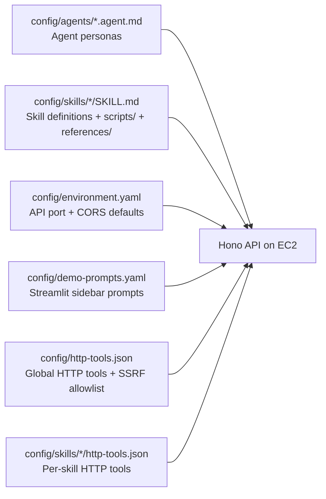

# Configuration Guide

> **Audience:** anyone editing the `config/` folder — adding or tuning agent personas, skills, scripts, references, HTTP tool definitions, app defaults, or demo-prompt seeds.
>
> **Companion:** [`advanced/deploy-tweak-guide.md`](advanced/deploy-tweak-guide.md) covers deploy-time and runtime tuning (mode flags, AWS resource identifiers, embedding providers, operational tunables, local dev wiring, sanity endpoints, validation scripts). [`reference/env-vars.md`](reference/env-vars.md) catalogs **every** environment variable read by the stack with defaults and the file that consumes it.

`config/` is a markdown- and JSON-driven directory that defines every agent persona, skill, tool, reference document, app default, and demo-prompt seed the runtime loads at boot. Everything in this guide is **declarative file content** — no environment variables here. For env-driven runtime behavior see the deploy-tweak guide.

---

## 1. Where `config/` is loaded from



| Source | Purpose | Loaded by | Reload behavior |
|---|---|---|---|
| `config/agents/*.agent.md` | Agent persona, model, tools list, memory flags, handoffs | `api/src/lib/config-scan.ts` | Mtime cache; **AgentCore runtime** behavior requires `./deploy/deploy-agents.sh` |
| `config/skills/<id>/SKILL.md` | Skill instructions + `metadata` block | `api/src/lib/skill-loader.ts` | Discovery cached by skills-dir mtime; body cached by file mtime |
| `config/skills/<id>/scripts/*.mjs` | Dynamically imported by `run_skill_script` | `api/src/lib/base-tools.ts` (on demand) | Node ESM cache — process restart to re-import |
| `config/skills/<id>/references/*.md` | Read by `read_skill_resource` | `api/src/lib/skill-loader.ts` (on demand) | Re-read on each call; capped by `SKILL_RESOURCE_MAX_BYTES` |
| `config/environment.yaml` | API port, CORS origins (defaults if env vars unset) | `api/src/lib/environment-config.ts` | Memoized per process — restart to reload |
| `config/demo-prompts.yaml` | Sidebar "Try a prompt" entries served via `GET /demo-prompts` | `api/src/routes/demo-prompts.ts` | Mtime cache |
| `config/http-tools.json` | Global HTTP tools + `security` host allowlist | `api/src/lib/http-tools-load.ts` | Mtime cache; override path with `HTTP_TOOLS_CONFIG_PATH` |
| `config/skills/<id>/http-tools.json` | Per-skill HTTP tools (no `security` block — root file owns SSRF) | `api/src/lib/skill-http-tools-load.ts` | Mtime cache (per skill) |

> Credentials and runtime ARNs come from `.env` and `.env.live` (generated by `deploy-project.sh`). Those env-driven sources are documented in [`advanced/deploy-tweak-guide.md` § 1](advanced/deploy-tweak-guide.md#1-where-env-config-comes-from).

---

## 2. Agent configuration (`config/agents/*.agent.md`)

Each agent is a markdown file with YAML frontmatter. The file name (without `.agent.md`) **must** match the `id` field.

```yaml
---
id: order-management
name: Order Management Agent
description: Query and manage customer orders from MongoDB Atlas (lookups, status, returns).
model: us.anthropic.claude-haiku-4-5-20251001-v1:0
maxTokens: 2048
temperature: 0.2
tools:
  - mongodb_query
  - mongodb_aggregate
  - read_skill_resource
  - run_skill_script
  - order-management/notify_fulfillment_lambda   # skill-scoped HTTP tool: <skillId>/<localName>
skills:
  - order-management
memory:
  shortTerm: true
  longTerm: true
  longTermCollection: agent_memory_facts          # optional override
handoffs:                                         # used by orchestrator/roster surfaces
  - label: Order issues
    agent: order-management
    prompt: My order #12345 has not arrived
---

You are the Order Management Agent. You help customers...
```

### Frontmatter schema

Validated by [`api/src/lib/schemas.ts`](../api/src/lib/schemas.ts) (`agentFrontmatterSchema`). Unknown extra keys are tolerated; missing required fields fail the load.

| Field | Type | Required | Default | Notes |
|---|---|---|---|---|
| `id` | string (≥ 1 char) | yes | — | Must match the file/directory name |
| `name` | string (≥ 1 char) | yes | — | Human-readable label shown in the UI |
| `description` | string | yes | — | Short blurb shown in the agents catalog and used by the in-API classifier (`agent-classifier.ts`). Empty string passes the schema but defeats classification — write a real sentence. |
| `model` | string | no | (none — Bedrock SDK default) | Bedrock inference profile or model ID. Today's defaults: orchestrator + order-management = `us.anthropic.claude-haiku-4-5-20251001-v1:0`; troubleshooting + product-recommendation = `us.anthropic.claude-sonnet-4-6`. Source of truth: [`config/agents/`](../config/agents/). |
| `maxTokens` | int (> 0) | no | `4096` | Cap on output tokens |
| `temperature` | number `[0, 2]` | no | `0.7` | Sampling temperature |
| `tools` | string[] | no | `[]` | Names of tools to attach. Built-ins: `mongodb_query`, `mongodb_vector_search`, `mongodb_aggregate`, `bedrock_kb_retrieve`, `embed_multimodal_content`, `activate_skill`, `read_skill_resource`, `run_skill_script`. Skill-scoped HTTP tools: `<skillId>/<localName>`. Complete catalog: [`reference/tools.md`](reference/tools.md). |
| `skills` | string[] | no | `[]` | Skills the agent is **allowed** to activate. `read_skill_resource` and `run_skill_script` only resolve within these skills (gate enforced in `base-tools.ts`). |
| `memory.shortTerm` | bool | no | — | Currently informational — short-term is always on |
| `memory.longTerm` | bool | no | — | If `true` AND `userId` is known, enable long-term memory read/write |
| `memory.longTermCollection` | string | no | `agent_memory_facts` | Override the per-agent LTM collection name |
| `handoffs` | array of `{ label, agent, prompt? }` | no | `[]` | Used by the orchestrator persona's roster injection and by UI surfaces that show suggested follow-ups. `agent` should be a sibling agent's `id`. |

Runtime model selection is frontmatter-driven: `api/src/adapters/resolve-model.ts` reads `model`, `maxTokens`, and `temperature` from the selected agent's `.agent.md` and caches the resulting Bedrock model per agent/config/region. To change a specialist's model, edit that specialist's frontmatter; there is no per-agent model environment override.

### Body

Everything below the closing `---` is the **system prompt**. Activated skill bodies (`SKILL.md` content) get appended at chat time. Do **not** copy the framework-canonical `LONG_TERM_MEMORY_RECALL_RULES` block into a persona body — the API injects it automatically when `memory.longTerm: true` (a unit test enforces this for the orchestrator).

For a deeper authoring walkthrough see [`agent-authoring-guide.md`](agent-authoring-guide.md).

---

## 3. Skill configuration (`config/skills/<skill>/`)

Skills are bundles of instructions, scripts, references, and HTTP tool definitions. They are activated on demand by an agent's reasoning (or pre-activated for specialists). For the full authoring tour see [`skills-authoring-guide.md`](skills-authoring-guide.md). For the complete tool surface (MongoDB MCP, Bedrock, skill resource/script tools, skill HTTP tools, global HTTP tools, internal helpers) see [`reference/tools.md`](reference/tools.md).

### Directory layout

```
config/skills/order-management/
├── SKILL.md                       # Skill instructions + frontmatter (loaded when agent activates)
├── http-tools.json                # Optional. Per-skill HTTP tool definitions (e.g. Lambda function URLs)
├── http-tools.example.json        # Optional. Reference template, ignored by the loader
├── scripts/
│   └── validate-return.mjs        # Imported by run_skill_script
└── references/
    ├── return-policy.md           # Read by read_skill_resource
    └── faq.md
```

### `SKILL.md` frontmatter

Validated by `skillFrontmatterSchema` in [`api/src/lib/schemas.ts`](../api/src/lib/schemas.ts).

```yaml
---
name: order-management
description: >-
  Query and manage customer orders from MongoDB Atlas. Use for order lookups,
  status, tracking, and returns.
metadata:
  author: peerislands
  version: "1.0"
  domain: e-commerce
---

# Order Management

Use `mongodb_query` on the `orders` collection ...
```

| Field | Type | Required | Notes |
|---|---|---|---|
| `name` | string (≥ 1 char) | yes | Skill ID. By convention matches the folder name; if it doesn't, the folder name wins for `read_skill_resource` / `run_skill_script` resolution but `name` is what shows up in discovery output. |
| `description` | string | yes | One-liner used by the discovery index (Phase 1 — surfaced to agents before activation). Whitespace is collapsed by the loader. |
| `metadata` | object (arbitrary keys) | no | Free-form. The loader specifically reads `metadata.version` and surfaces it in discovery; other keys are passed through unmodified. Common keys observed in shipped skills: `author`, `version`, `domain`. |

Body of the markdown is the **skill instructions** — appended to the system prompt when the skill is activated. Treat it like a reusable system-prompt module.

### `scripts/` — `run_skill_script` semantics

`run_skill_script` (in [`api/src/lib/base-tools.ts`](../api/src/lib/base-tools.ts)) dynamically imports a `.mjs` file under `config/skills/<skillId>/scripts/` and calls a named export. Rules:

- The skill **must** be in the agent's `skills:` allowlist (`skill_not_allowed_for_agent` otherwise).
- The skill **must** be activated first (`skill_not_activated` otherwise — call `activate_skill` or rely on specialist pre-activation).
- `scriptPath` is relative to the skill directory; path traversal is rejected.
- `exportName` must be a function (sync or async). Other exports are listed in `availableExports` on `export_not_found`.
- The function is called with one argument (`args`) — typically a JSON object. The return value becomes the tool result the model sees on the next step.
- Modules are loaded via Node ESM `import()`, so re-imports respect the ESM cache. To pick up edits in dev, restart the API.
- The path `scripts/mongodb-query.mjs` with `exportName='mongodb_query'` is intercepted as a compatibility shortcut to the shared read-only Mongo query path (see `runMongoQueryCompatibilityScript`).

### `references/` — `read_skill_resource` semantics

`read_skill_resource` (in [`api/src/lib/base-tools.ts`](../api/src/lib/base-tools.ts) → [`api/src/lib/skill-loader.ts`](../api/src/lib/skill-loader.ts)) reads any file under `config/skills/<skillId>/`. Rules:

- Same allow + activation gates as `run_skill_script`.
- `path` is relative to the skill directory; path traversal returns `path_not_under_skill_directory`.
- Files larger than `SKILL_RESOURCE_MAX_BYTES` (default `500_000` bytes) return `file_too_large`.
- Read result is returned as UTF-8 text. Binary files round-trip lossily.
- Reads are recorded in the trace (`recordSkillResourceRead`) for the Trace Viewer.
- Although the gate is enforced under `skills/<id>/`, the convention is to keep public-readable docs under `references/` and executable code under `scripts/` — `read_skill_resource` will happily serve either.

---

## 4. HTTP tool configuration

There are **two** `http-tools.json` files, with different schemas and roles:

| File | Schema | Role |
|---|---|---|
| `config/http-tools.json` (root) | `httpToolsFileSchema` (incl. `security`) | Global HTTP tools + the SSRF host allowlist that **all** HTTP tool calls (per-skill or global) must pass |
| `config/skills/<id>/http-tools.json` | `skillHttpToolsFileSchema` (no `security`) | Per-skill HTTP tools, scoped to that skill. Inherits the root SSRF allowlist. |

Both schemas live in [`api/src/lib/http-tools-schema.ts`](../api/src/lib/http-tools-schema.ts). Both files are loaded with mtime caching. `*.example.json` companions ship as reference templates and are **ignored** by the loaders — they exist only so a fresh clone can copy → edit without invalidating the empty default.

The root file path can be overridden via `HTTP_TOOLS_CONFIG_PATH` (absolute path).

### Tool definition schema

Each entry in `tools[]`:

```json
{
  "name": "notify_fulfillment_lambda",
  "description": "POST order payload to a Lambda Function URL",
  "method": "POST",
  "url": "${ORDER_NOTIFY_LAMBDA_URL}",
  "headers": {
    "Content-Type": "application/json"
  },
  "timeoutMs": 30000,
  "parameters": [
    { "name": "orderId", "type": "string",  "description": "Order id",            "required": true },
    { "name": "event",   "type": "string",  "description": "shipped | cancelled", "required": true }
  ]
}
```

| Field | Type | Required | Default | Notes |
|---|---|---|---|---|
| `name` | string `^[a-z][a-z0-9_]*$` (case-insensitive) | yes | — | Reserved names are skipped: `activate_skill`, `read_skill_resource`, `run_skill_script`, `mongodb_query`, `mongodb_vector_search`, `bedrock_kb_retrieve`, `embed_multimodal_content`. Duplicate names within a file: first wins, others logged as `duplicate`. |
| `description` | string (≥ 1 char) | yes | — | Shown to the model |
| `method` | enum: `GET` / `POST` / `PUT` / `PATCH` / `DELETE` | no | `POST` | HTTP method |
| `url` | string (≥ 1 char) | yes | — | `${ENV_VAR}` placeholders are expanded at call time from `process.env` (missing var → empty string). |
| `headers` | object `<string, string>` | no | — | Static headers. Values can also use `${VAR}` substitution at call time. |
| `timeoutMs` | int 1 – 120_000 | no | `30_000` | Per-call timeout |
| `parameters` | array of `{ name, type, description, required? }` | one of `parameters` / `passThroughBody` | — | Named params become a Zod object schema for the model. `type` ∈ `string` / `number` / `boolean` / `object`; `required` defaults to `true`. |
| `passThroughBody` | bool | one of `parameters` / `passThroughBody` | — | If `true`, the tool input is a single JSON object forwarded as the request body (POST/PUT/PATCH). **Mutually exclusive** with `parameters[]` — the schema validator rejects both. |

### `security` block (root only)

```json
{
  "security": {
    "allowedHostSuffixes": [
      ".lambda-url.us-east-1.on.aws",
      ".lambda-url.eu-west-1.on.aws",
      "execute-api.us-east-1.amazonaws.com"
    ],
    "allowedHosts": ["api.example.com"]
  },
  "tools": [ … ]
}
```

| Key | Match rule |
|---|---|
| `allowedHostSuffixes` | Hostname must **end with** one of these. Preferred for AWS Lambda Function URLs (which embed account-specific subdomains). |
| `allowedHosts` | Hostname must **equal** one of these (exact). |

A request URL whose hostname matches none of the allowed entries is rejected before any network call. Per-skill `http-tools.json` files cannot widen this allowlist — add hosts to the **root** file. The default `config/http-tools.example.json` ships with the AWS Lambda Function URL suffixes for `us-east-1` / `eu-west-1` and an API Gateway example.

### Wiring tools to agents

After defining a per-skill tool, expose it on an agent by listing **`<skillId>/<localName>`** in that agent's `tools:` (e.g. `order-management/notify_fulfillment_lambda`). The skill must also be in the agent's `skills:` list so the activation gate passes. Global tools (root `http-tools.json`) are listed by their bare `name`.

`GET /http-tools` lists configured tools and whether each `url` resolves to a non-empty value after `${VAR}` expansion — useful for sanity checks. It is **not** the full tool catalog; for that see [`reference/tools.md`](reference/tools.md).

---

## 5. App defaults (`config/environment.yaml`)

Loaded by [`api/src/lib/environment-config.ts`](../api/src/lib/environment-config.ts). Validated against:

```yaml
api:
  port: 3000                              # int > 0; overridden by PORT / API_PORT env
  corsOrigins:                            # string[]; overridden by CORS_ORIGINS (comma-separated)
    - http://localhost:8501
    - http://127.0.0.1:8501
```

| Key | Type | Default | Override env |
|---|---|---|---|
| `api.port` | positive int | `3000` (built-in) | `PORT`, then `API_PORT` |
| `api.corsOrigins` | string[] | `["http://localhost:8501","http://127.0.0.1:8501"]` (built-in) | `CORS_ORIGINS` (comma-separated) |

Lookup order (first non-empty wins): env var → `environment.yaml` → built-in default.

The file is **memoized per process** — a restart is required to pick up edits. A missing or invalid file is logged once and ignored (defaults still apply). Unknown keys are tolerated. Other operational tunables (rate limits, log level, etc.) live in env vars only — see [`advanced/deploy-tweak-guide.md` § 5](advanced/deploy-tweak-guide.md#5-operational-tunables).

---

## 6. Demo prompts (`config/demo-prompts.yaml`)

Served verbatim by `GET /demo-prompts` ([`api/src/routes/demo-prompts.ts`](../api/src/routes/demo-prompts.ts)) so the Streamlit sidebar's "Try a prompt" buttons can come from a single source of truth without bind-mounting `config/` into the UI container.

```yaml
groups:
  - title: Routing & handoff
    prompts:
      - label: Order status
        text: Where is my order #12345?
      - label: Product question
        text: What's the difference between the X-2 and X-3 models?
  - title: Memory
    prompts:
      - label: Identity fact
        text: My email is alice@example.com — remember that for future questions.
```

Schema:

| Field | Type | Required | Notes |
|---|---|---|---|
| `groups` | array | yes | Top-level. Each group renders as a section in the UI. |
| `groups[].title` | non-empty string | yes | Section heading. Empty/missing → group dropped. |
| `groups[].prompts` | array | yes | At least one valid prompt or the group is dropped. |
| `groups[].prompts[].text` | non-empty string | yes | What gets sent as the user message when clicked. Empty/missing → prompt dropped. |
| `groups[].prompts[].label` | string | no — defaults to `text` | Button label. |

The loader is mtime-cached and tolerant: missing file or parse failure → `{ groups: [] }` and the UI hides the section. Extra keys are ignored. A group with zero valid prompts is silently dropped.

---

## 7. Critical files reference

| File | Purpose |
|---|---|
| [`api/src/lib/schemas.ts`](../api/src/lib/schemas.ts) | Zod schemas for agent + skill frontmatter (`agentFrontmatterSchema`, `skillFrontmatterSchema`, `agentHandoffSchema`) |
| [`api/src/lib/config-scan.ts`](../api/src/lib/config-scan.ts) | Loads + caches `config/agents/*.agent.md` (mtime-keyed) |
| [`api/src/lib/skill-loader.ts`](../api/src/lib/skill-loader.ts) | Skill discovery, body cache, `read_skill_resource` path resolution + `SKILL_RESOURCE_MAX_BYTES` cap, `SkillRegistry` |
| [`api/src/lib/base-tools.ts`](../api/src/lib/base-tools.ts) | `read_skill_resource`, `run_skill_script`, skill-scoped HTTP tool wiring |
| [`api/src/lib/http-tools-schema.ts`](../api/src/lib/http-tools-schema.ts) | Zod schemas for global + per-skill HTTP tool files |
| [`api/src/lib/http-tools-load.ts`](../api/src/lib/http-tools-load.ts) | Loads root `config/http-tools.json` (or `HTTP_TOOLS_CONFIG_PATH`); `${VAR}` expansion |
| [`api/src/lib/skill-http-tools-load.ts`](../api/src/lib/skill-http-tools-load.ts) | Loads per-skill `config/skills/<id>/http-tools.json`; `<skillId>/<localName>` parser |
| [`api/src/lib/environment-config.ts`](../api/src/lib/environment-config.ts) | Loads `config/environment.yaml`; `resolveApiListenPort`, `resolveCorsOrigins` |
| [`api/src/routes/demo-prompts.ts`](../api/src/routes/demo-prompts.ts) | Loads + serves `config/demo-prompts.yaml` |
| [`config/environment.yaml`](../config/environment.yaml) | API port, CORS, defaults |
| [`config/demo-prompts.yaml`](../config/demo-prompts.yaml) | Sidebar suggested prompts |
| [`config/http-tools.json`](../config/http-tools.json) + [`config/http-tools.example.json`](../config/http-tools.example.json) | Global HTTP tools + SSRF allowlist; example template |
| [`config/agents/`](../config/agents/) | Agent personas |
| [`config/skills/`](../config/skills/) | Skill bundles |
