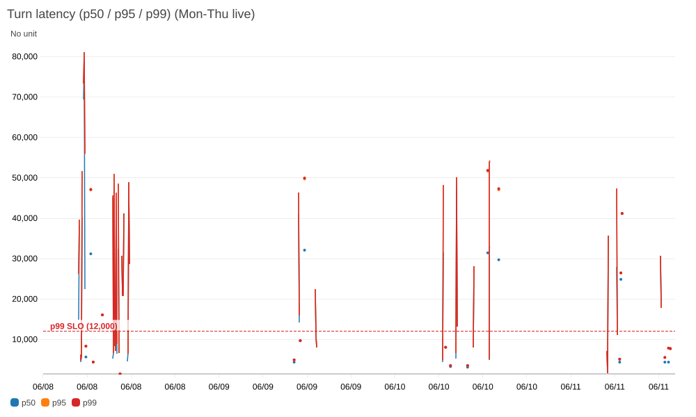
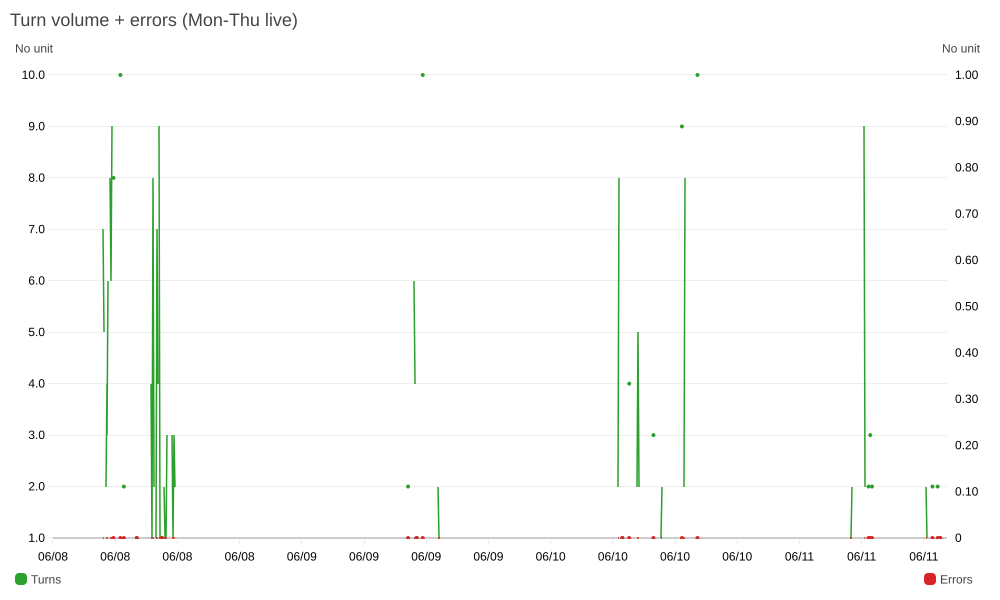
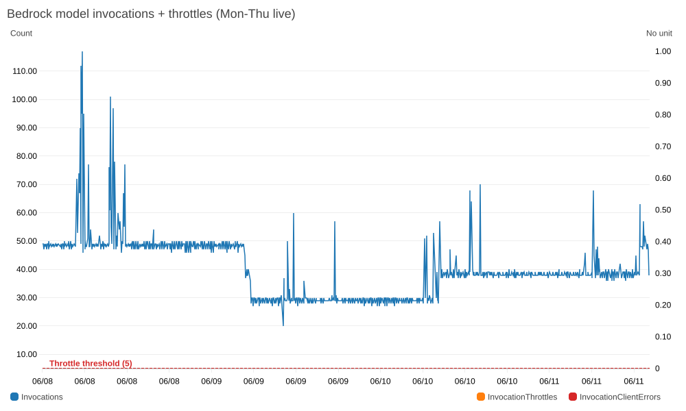
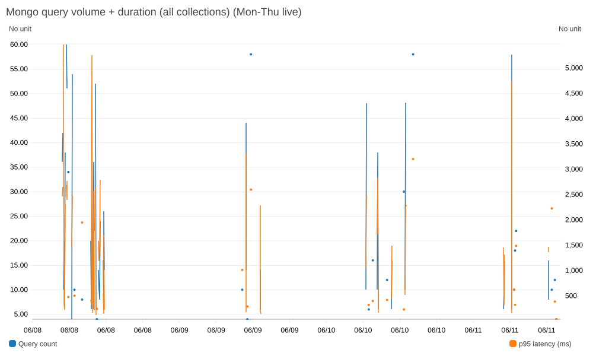
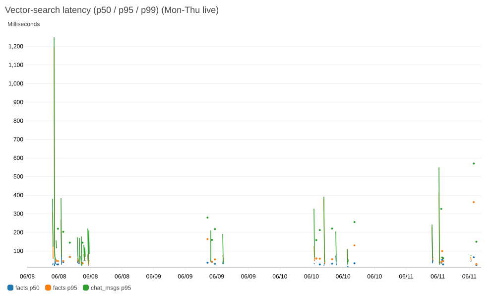
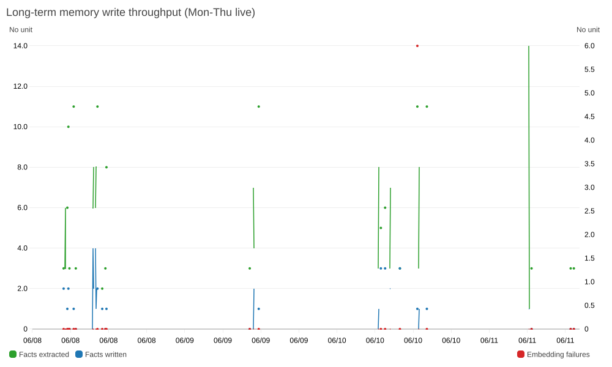
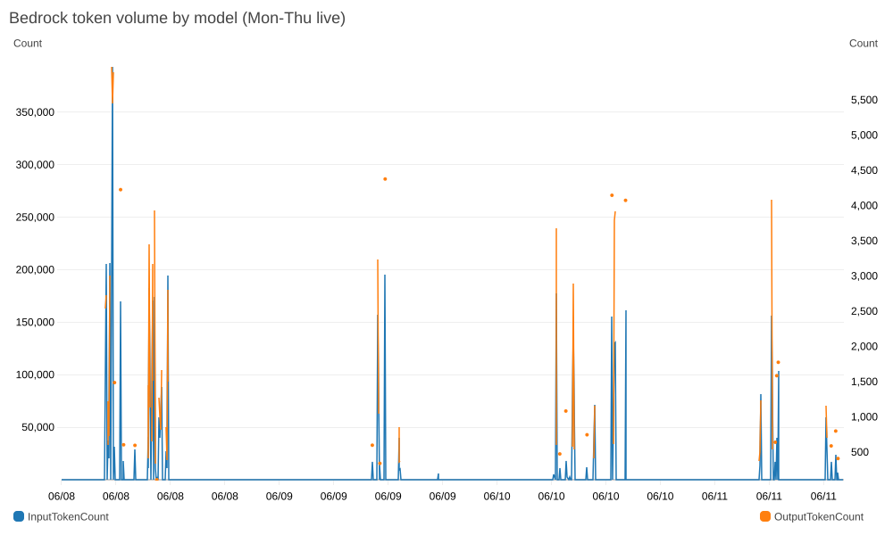
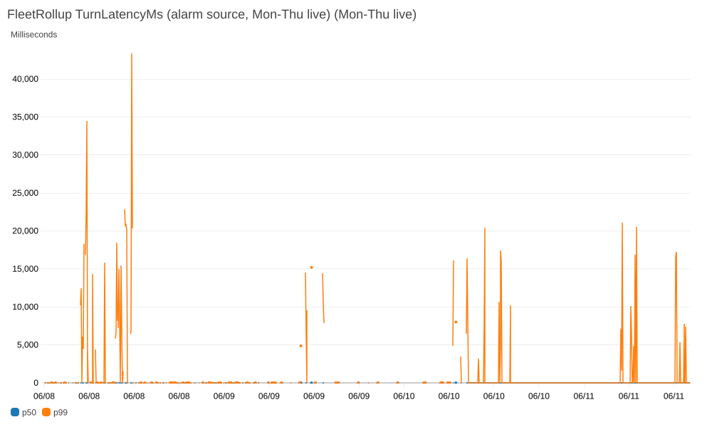

# CloudWatch Dashboards — Reference Guide

> **Note on screenshots.** The PNGs embedded below were captured from the live CloudWatch dashboards for the Monday-through-Thursday window. Your dashboards will look identical structurally but with account-specific values. Regenerate by following [§ Regenerating screenshots](#regenerating-screenshots) at the bottom.
>
> **Console URLs.** The dashboards are named `<SHARED_RESOURCE_PREFIX>-{fleet,mongo,cost,atlas}-<env>`. With the default prefix `multiagent` and environment `dev` they resolve to:
>
> | Dashboard | Console URL |
> |---|---|
> | Fleet (latency · volume · errors) | `https://<region>.console.aws.amazon.com/cloudwatch/home?region=<region>#dashboards/dashboard/<SHARED_RESOURCE_PREFIX>-fleet-<env>` |
> | MongoDB (queries · memory · vector search) | `…/<SHARED_RESOURCE_PREFIX>-mongo-<env>` |
> | Cost & tokens | `…/<SHARED_RESOURCE_PREFIX>-cost-<env>` |
> | Atlas (Prometheus scrape) | `…/<SHARED_RESOURCE_PREFIX>-atlas-<env>` (when `enable_atlas_metrics=true`) |
> | CloudWatch GenAI Observability | `https://<region>.console.aws.amazon.com/cloudwatch/home?region=<region>#generative-ai:agents` |
> | Transaction Search (spans) | `https://<region>.console.aws.amazon.com/cloudwatch/home?region=<region>#logsV2:log-groups/log-group/aws$252Fspans` |
>
> Discover the exact names for your environment: `aws cloudwatch list-dashboards --query 'DashboardEntries[].DashboardName'` or `terraform output -state=deploy/terraform/envs/shared/terraform.tfstate dashboard_names`.

---

## Overview

Three custom dashboards are provisioned by Terraform (`modules/cloudwatch-fleet-dashboards`) and backed by two metric sources:

| Source | Namespace | Populated by | Latency |
|---|---|---|---|
| AWS native | `AWS/Bedrock` | Bedrock service (automatic) | ~1 min |
| Custom EMF (per-agent) | `Multiagent/Chat` `Multiagent/Mongo` `Multiagent/Memory` | API container via `api/src/lib/cw-metrics.ts` | ~5 min |
| Fleet rollup (log filter) | `Multiagent/FleetRollup` | CloudWatch metric filters over API log group | ~5 min |

> **Metric architecture:** EMF records are emitted with dimensions (`agentId`, `kind`, `collection`) for per-agent breakdown. Dashboard widgets use CloudWatch `SEARCH()` expressions to aggregate across all dimension values automatically. Alarms use the `Multiagent/FleetRollup` namespace (populated by log-metric filters) because `SEARCH()` is not supported in CloudWatch alarm metric queries.

> **Why EMF charts are empty on a fresh deploy:** EMF logs are batched and processed server-side. Data appears within 5–15 minutes of first traffic. `AWS/Bedrock` metrics are always immediate.

---

## 1. Fleet Dashboard

**Name:** `<SHARED_RESOURCE_PREFIX>-fleet-dev`
**Purpose:** Real-time agent health — latency SLOs, error rates, Bedrock and AgentCore throughput.

### Widgets

#### Turn latency (p50 / p95 / p99)



- **Metric:** `Multiagent/Chat / TurnLatencyMs` (dimension: `agentId=<agent-name>`) — aggregated via `SEARCH()`
- **Alarm source:** `Multiagent/FleetRollup / TurnLatencyMs` p99 (dimensionless, for reliable alarm evaluation)
- **Alarm:** `<SHARED_RESOURCE_PREFIX>-dev-p99-turn-latency` fires when p99 > 15,000 ms for 2 of 3 5-minute windows
- **What to watch:** p99 > 15 s indicates a slow Bedrock model response or Strands agent loop taking extra tool-call rounds. Check `aws/spans` for the trace.

#### Turn volume + errors



- **Metrics:** `Multiagent/Chat / TurnsTotal Sum` (all agents), `TurnErrors Sum` (right axis) — via `SEARCH()`
- **Alarm:** `<SHARED_RESOURCE_PREFIX>-dev-error-rate` fires when error rate > 2% of turns over 10 minutes
- **What to watch:** Error spike without latency spike = downstream dependency fault (MongoDB, MCP tool). Latency + error together = model overload or rate-limit.

#### Bedrock model invocations + throttles



- **Metrics:** `AWS/Bedrock / Invocations`, `InvocationThrottles`
- **Alarm:** `<SHARED_RESOURCE_PREFIX>-dev-bedrock-throttles` fires on burst > 5 throttles / 5 min
- **What to watch:** Throttle spikes indicate you've hit the on-demand throughput limit for `anthropic.claude-3-5-sonnet`. Request a quota increase or switch to Provisioned Throughput.

#### AgentCore runtime invocations

- **Metric:** `Multiagent/Chat / AgentCoreInvokes` + `AgentCoreInvokeErrors` — via `SEARCH('{Multiagent/Chat,agentId,mode}')`
- **Alarm:** `<SHARED_RESOURCE_PREFIX>-dev-agentcore-failures` fires when failure count > 5 / 5 min
- **What to watch:** Failures here usually mean the AgentCore runtime hit a cold-start or the Strands agent inside it hit a retry loop. Cross-reference with AgentCore vended logs in `/aws/vendedlogs/bedrock-agentcore/`.

---

## 2. MongoDB Dashboard

**Name:** `<SHARED_RESOURCE_PREFIX>-mongo-dev`
**Purpose:** MongoDB Atlas operation health visible from the application side (not Atlas native metrics).

### Widgets

#### Mongo query volume + duration



- **Metrics:** `Multiagent/Mongo / QueryCount Sum` (all collections), `QueryLatencyMs p95` (right axis)
- Dimensions: `collection` + `kind` (find / aggregate / vector_search) — aggregated via `SEARCH()`
- **What to watch:** Sustained p99 > 500 ms indicates Atlas cluster under load or a missing index. Check Atlas Profiler or run `db.currentOp()` via SSM.

#### Vector-search latency (p50 / p95 / p99)



- **Metric:** `Multiagent/Mongo / VectorSearchLatencyMs` with `kind=vector_search` — separate lines per collection (`agent_memory_facts`, `chat_messages`)
- **What to watch:** Vector search slowdown usually precedes long-term memory retrieval timeouts — look for `MEMORY_SEARCH_MAX_TIME_MS exceeded` in API logs.

#### Long-term memory write throughput



- **Metrics:** `Multiagent/Memory / FactsExtracted`, `FactsWritten`, `EmbeddingFailures` — via `SEARCH('{Multiagent/Memory,agentId}')`
- **What to watch:** A flatline (zero writes) after confirmed chat turns means `writeLongTermMemory` is being skipped — check `userId` presence (requires JWT `sub`) and `agent.memory.longTerm: true` in the agent config.

#### Recent Mongo errors

- Logs Insights query pre-saved as `mongodb-multiagent3/dev/top-errors` targeting `/<SHARED_RESOURCE_PREFIX>/<env>/api`

---

## 3. Cost Dashboard

**Name:** `<SHARED_RESOURCE_PREFIX>-cost-dev`
**Purpose:** Token consumption tracking and per-user attribution for FinOps reviews.

### Widgets

#### Bedrock token volume by model



- **Metrics:** `AWS/Bedrock / InputTokenCount`, `OutputTokenCount`
- **What to watch:** Output token spikes are 3–5× more expensive than input. A single long agentic loop (many tool rounds) can spike output by 10×.

#### Per-user token + cost attribution (last 24 h)

- **Source:** Logs Insights query `mongodb-multiagent3/dev/per-user-cost` — requires Bedrock invocation logging + `userId` metadata in request context
- **Note:** Returns no rows until user identity is propagated through `requestMetadata` in Bedrock invocation records. Requires `AUTH_JWKS_URI` to be set (JWT sub → userId flow).

#### Top users by turn count

- Logs Insights query scanning `/<SHARED_RESOURCE_PREFIX>/<env>/api` for `userId` per-turn events

---

## 4. Alarms

All 7 alarms use the `Multiagent/FleetRollup` or `AWS/Bedrock` namespace (both support standard metric alarm queries). Alarms are currently `OK`.

| Alarm | Metric source | Threshold | Period |
|---|---|---|---|
| `p99-turn-latency` | `Multiagent/FleetRollup / TurnLatencyMs p99` | > 15,000 ms | 5 min, 2/3 |
| `error-rate` | `FleetRollup / TurnErrors / TurnsTotal` ratio | > 2% | 5 min, 2/3 |
| `agentcore-failures` | `FleetRollup / AgentCoreInvokeErrors Sum` | > 5 count | 5 min, 1/2 |
| `bedrock-throttles` | `AWS/Bedrock / InvocationThrottles` | > 5 count | 5 min, 1/2 |
| `bedrock-invoke-errors` | `AWS/Bedrock / InvocationClientErrors` | > 5 count | 5 min, 1/2 |
| `audit-findings` | `Multiagent/Audit / AuditFindings` (log filter) | > 10 count | 5 min, 1/1 |
| `slo-burn` | Error-budget burn rate (FleetRollup) | > 14.4× burn | 60 min, 1/1 |

> **FleetRollup vs Multiagent/Chat:** `Multiagent/Chat` is emitted with `agentId` dimension by the EMF emitter. `Multiagent/FleetRollup` is produced by four CloudWatch log metric filters (TurnLatencyMs, TurnsTotal, TurnErrors, AgentCoreInvokeErrors) over the API log group — no dimensions, suitable for alarm metric math.



> **Alarm notifications:** SNS is disabled by default (`enable_sns_alarms = false`). Alarms fire to the CloudWatch console. To enable email/PagerDuty, set `enable_sns_alarms = true` and `alarm_email = "..."` in `terraform.tfvars`.

---

## 5. Transaction Search (spans)

**Log group:** `aws/spans` (AWS-managed, 30-day retention)
**Status:** `Destination = CloudWatchLogs`, `Status = ACTIVE`, sampling = 100%

Every OTLP span emitted by:
- The ADOT sidecar (relays API + UI spans)
- AgentCore runtimes (native Bedrock spans)

…lands in `aws/spans` and is indexed by Transaction Search. Use the [X-Ray Trace Map](https://us-east-1.console.aws.amazon.com/cloudwatch/home?region=us-east-1#xray:traces) to search by trace ID or service name.

The resource policy `XRayWriteToCloudWatchLogs` (managed by Terraform in `modules/cloudwatch-genai`) grants `xray.amazonaws.com` write access to this log group.

---

## 6. CloudWatch GenAI Observability (managed)

The built-in **Agents** and **Model Invocations** tabs in CloudWatch Generative AI Observability are populated by:

- **AgentCore vended logs** — log deliveries wired in `modules/cloudwatch-genai` to
  `/aws/vendedlogs/bedrock-agentcore/memory/APPLICATION_LOGS/<id>` and
  `/aws/vendedlogs/bedrock-agentcore/gateway/APPLICATION_LOGS/<id>`
- **Bedrock invocation logging** — account-scoped, logs to `/aws/bedrock/invocations` (metadata only; prompt bodies off — `text_data_delivery_enabled = false`)
- **Data Protection Policy** — masks `EmailAddress`, `CreditCardNumber`, `AwsSecretKey`, `IpAddress` in the invocation audit log group `/aws/bedrock/invocations-audit`

---

## 7. Regenerating screenshots

Screenshots are generated via `aws cloudwatch get-metric-widget-image` (no browser required). Run after smoke tests so data is present. The checked-in screenshots use `2026-06-08T00:00:00Z` through `2026-06-11T14:14:31Z`.

```bash
source .env

# 1. Turn latency (fleet aggregate, SEARCH)
aws cloudwatch get-metric-widget-image --region us-east-1 \
  --metric-widget '{
    "title":"Turn latency p50/p95/p99 (all agents, Mon-Thu live)",
    "width":1000,"height":600,"start":"2026-06-08T00:00:00Z","end":"2026-06-11T14:14:31Z",
    "metrics":[
      [{"expression":"SUM(SEARCH('"'"'{Multiagent/Chat,agentId} TurnLatencyMs'"'"','"'"'p50'"'"',300))","label":"p50","id":"e1"}],
      [{"expression":"SUM(SEARCH('"'"'{Multiagent/Chat,agentId} TurnLatencyMs'"'"','"'"'p95'"'"',300))","label":"p95","id":"e2"}],
      [{"expression":"SUM(SEARCH('"'"'{Multiagent/Chat,agentId} TurnLatencyMs'"'"','"'"'p99'"'"',300))","label":"p99","id":"e3"}]
    ]
  }' --query 'MetricWidgetImage' --output text | base64 -d > docs/dashboards/turn-latency.png

# 2. Bedrock invocations (native, no dimensions needed)
aws cloudwatch get-metric-widget-image --region us-east-1 \
  --metric-widget '{
    "title":"Bedrock invocations + throttles (Mon-Thu live)",
    "width":1000,"height":600,"start":"2026-06-08T00:00:00Z","end":"2026-06-11T14:14:31Z",
    "metrics":[
      ["AWS/Bedrock","Invocations",{"stat":"Sum"}],
      ["AWS/Bedrock","InvocationThrottles",{"stat":"Sum","yAxis":"right"}]
    ]
  }' --query 'MetricWidgetImage' --output text | base64 -d > docs/dashboards/bedrock-invocations.png

# 3. Fleet rollup latency (alarm source, no SEARCH needed)
aws cloudwatch get-metric-widget-image --region us-east-1 \
  --metric-widget '{
    "title":"FleetRollup TurnLatencyMs (alarm source, Mon-Thu live)",
    "width":1000,"height":600,"start":"2026-06-08T00:00:00Z","end":"2026-06-11T14:14:31Z",
    "metrics":[
      ["Multiagent/FleetRollup","TurnLatencyMs",{"stat":"p50","label":"p50"}],
      ["Multiagent/FleetRollup","TurnLatencyMs",{"stat":"p99","label":"p99"}]
    ]
  }' --query 'MetricWidgetImage' --output text | base64 -d > docs/dashboards/fleet-rollup-latency.png
```
