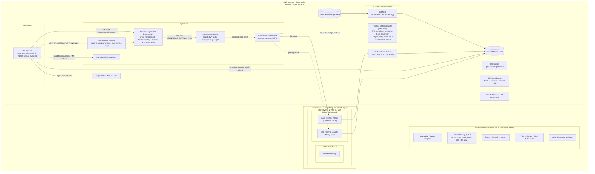
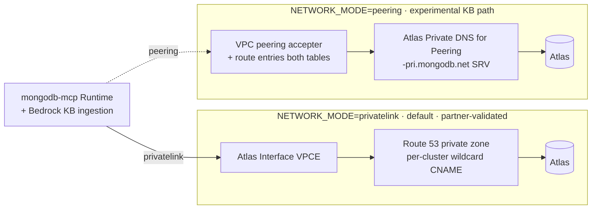

# AWS Infrastructure

> **What this shows:** every AWS and Atlas resource created by a full deploy, grouped by the three live Terraform stacks that own it.
> **Sources of truth:** [`docs/architecture.md` §5](../architecture.md) and [`docs/reference/terraform-modules.md`](../reference/terraform-modules.md).

The infrastructure is split into three live Terraform environments plus a laptop-only one:

- **`envs/network`** — shared VPC + Atlas connectivity. Singleton per `(account, region)`. Publishes SSM under `/<SHARED_VPC_NAME>/<region>/`.
- **`envs/shared`** — SageMaker Voyage endpoint, CloudWatch log groups, dashboards, Bedrock invocation logging. Singleton per `(account, region, environment)`. Publishes SSM under `/<SHARED_VPC_NAME>/<region>/<env>/`.
- **`envs/ec2`** — the per-project app stack (EC2, ECR, Cognito, KB, AgentCore). Reads the SSM published by the two singletons (no `terraform_remote_state` chaining).
- **`envs/local`** — laptop dev (Atlas + KB + Cognito + AgentCore Memory, no EC2). Not shown below.

---

## 1. Three-stack topology



> **Runtime count is dynamic.** The framework's canonical topology is **orchestrator + 3 business specialists + mongodb-mcp = 5 runtimes**, which matches the current `config/agents/` (`orchestrator`, `order-management`, `product-recommendation`, `troubleshooting`). The actual count equals two (orchestrator + mongodb-mcp) plus the number of non-orchestrator agents discovered in `config/agents/` (the `http-tool-test` fixture is excluded by `discover_agents`; sample agents under `config/samples/agents/`, e.g. `mongodb-write-smoke`, are not scanned and not deployed). Add a specialist `.agent.md` to `config/agents/` and the count grows accordingly.

---

## 2. Private Atlas connectivity — two mutually-exclusive modes

`NETWORK_MODE` in `.env` selects the connectivity fabric. The two modes are **mutually exclusive per account+region** — switching requires destroy + redeploy, and an SSM canary (`/<SHARED_VPC_NAME>/<region>/network_mode`) guards against silent swaps.



Mode-aware Terraform modules (see [`terraform-modules.md`](../reference/terraform-modules.md)):

- PrivateLink: `atlas-privatelink` (`envs/network`) + `atlas-privatelink-dns` (`envs/ec2`) + `bedrock-kb-privatelink` (`envs/ec2`).
- Peering: `atlas-vpc-peering` (`envs/network`) + `bedrock-kb-peering` (`envs/ec2`, **EXPERIMENTAL — NLB-over-peering not partner-validated**).

---

## 3. Resource inventory

Per-environment names are emitted into `deploy-manifest.json` after each deploy. Shapes (`<project>` / `<env>` substituted at deploy time):

- **EC2** — instance + EIP + security group: `<project>-ec2-<env>`.
- **ECR** — three repos in the default `code` deployment mode: `<project>-{api,ui,mongodb-mcp}-<env>` (`api`/`ui` from `modules/ecr`; `mongodb-mcp` inline in `envs/ec2`). A 4th `agent-runtime` repo is added only when `TF_VAR_agentcore_runtime_deployment_mode=container`.
- **AgentCore Runtimes** — one per agent via the reusable `agentcore-agent-runtime` module (`orchestrator` + each specialist) plus `mongodb-mcp-runtime`. Canonical set is 5: `<project>-{orchestrator,troubleshooting,order-management,product-recommendation,mongodb-mcp-runtime}-<env>`. Count is `2 + non-orchestrator agents` (see the dynamic-count note above).
- **VPC endpoints (default on)** — ECR `ecr.api` + `ecr.dkr` (Interface) + CloudWatch `logs` (Interface) + `s3` (Gateway), placed in the shared private subnets so the VPC-mode `mongodb-mcp` runtime can pull its image and ship logs without a NAT. Gated by `create_agentcore_runtime_vpc_endpoints` (default `true`); when `false`, existing endpoints are data-sourced instead.
- **AgentCore Memory** — store: `<project>_memory_<env>-<auto-suffix>`.
- **AgentCore Gateway** — `<project>-gw-<env>-<auto-suffix>` with the `mongodb-mcp` target wired to `mongodb-mcp-runtime`.
- **Bedrock KB** — id from `module.bedrock_kb.knowledge_base_id`; MongoDB Atlas vector store + IAM role + KB S3 docs bucket.
- **Atlas** — cluster `<project>-<env>` (M10 default) + connectivity (PrivateLink endpoint or network peering).
- **Cognito** — user pool + app client + JWKS (`jwks_uri` consumed by the API as `AUTH_JWKS_URI`).
- **Route 53** — per-cluster private hosted zone (PrivateLink mode only).
- **S3** — shared bucket `<project>-<env>-<account-id>` (tfstate + KB docs + runtime code bundles).
- **Secrets Manager** — `<project>-bedrock-kb-creds-<env>`.
- **SageMaker** — Voyage real-time endpoint (`voyage-multimodal-3` on `ml.g6.xlarge` by default), name in `VOYAGE_SAGEMAKER_ENDPOINT`. Created only when `voyage_model_package_arn` is set (Voyage Marketplace subscription); otherwise embeddings fall back to Bedrock Titan.
- **CloudWatch** — log groups `/<SHARED_RESOURCE_PREFIX>/<env>/{api,ui,mcp,agentcore,otel,otel-atlas}` (always); fleet/mongo/cost dashboards + 7 fleet alarms when `enable_fleet_dashboards=true` (default on); the `atlas` dashboard + 2 Atlas alarms only when `enable_atlas_metrics=true` (default **off**).
- **Bedrock invocation logging** — `/aws/bedrock/invocations` + `/aws/bedrock/invocations-audit` (account-scoped singleton).

Inspect the live values for an environment:

```bash
jq . deploy-manifest.json
aws ssm get-parameters-by-path --path "/${SHARED_VPC_NAME}/${AWS_REGION}/" --recursive --output table
```

---

## 4. What is deliberately NOT here

These are intentional POC simplifications — do not add them back without explicit approval (see [`architecture.md` §5](../architecture.md)):

- **No NAT Gateway** — the EC2 host sits in a public subnet and reaches AWS APIs over the internet (~$33/mo saved). The VPC-mode `mongodb-mcp` runtime reaches ECR/Logs/S3 through the runtime VPC endpoints above instead of a NAT.
- **No Bedrock or AgentCore *service* VPC interface endpoints** — Bedrock/AgentCore APIs are reached over the public internet with SigV4 signing (~$102/mo saved). Note: this is narrower than "no VPC endpoints" — ECR/Logs/S3 endpoints **are** created for the MCP runtime (see §3).
- **No ALB / CloudFront / auto-scaling** — a single EC2 instance is enough for the POC.
- **No ECS** — Docker runs directly on EC2 via systemd (`multiagent-api`, `multiagent-ui`, `multiagent-adot`).

> Note: `terraform-modules.md` describes the S3 backend as using a DynamoDB lock, while `architecture.md` §5 notes the deploy account's SCP blocks `dynamodb:CreateTable`. State locking is therefore environment-dependent and intentionally omitted from the diagrams above.

---

**Related diagrams:** [request flow](02-request-flow.md) · [memory architecture](03-memory-architecture.md) · [deployment pipeline](04-deployment-pipeline.md)
