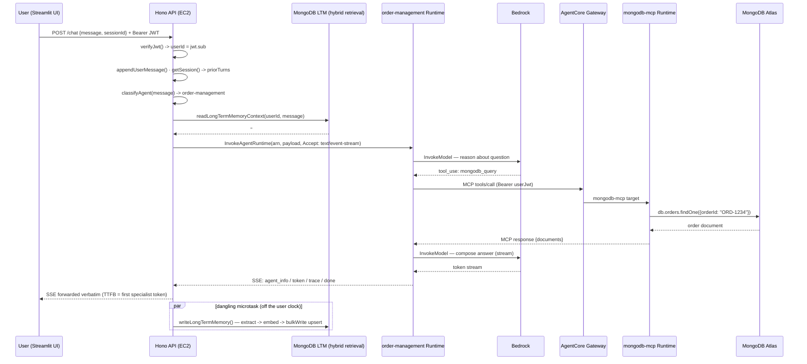
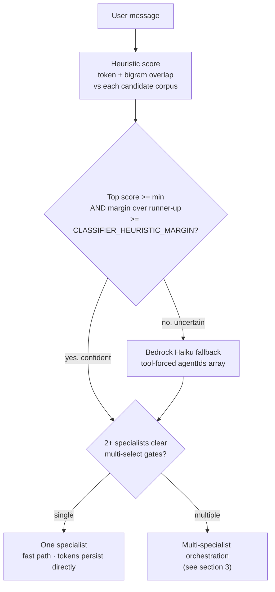
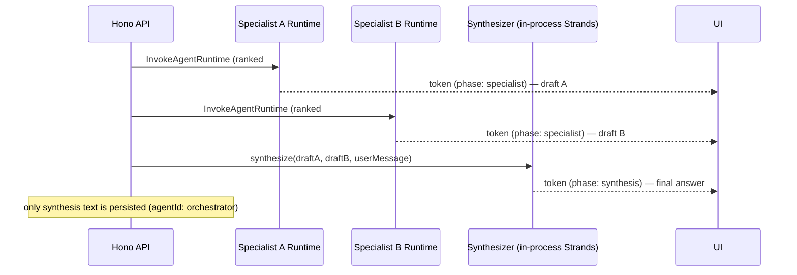
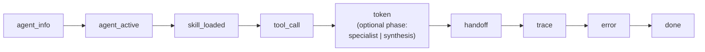
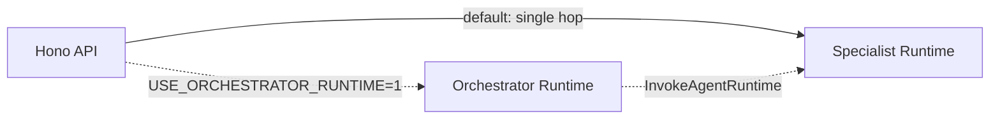

# Request Flow

> **What this shows:** what happens end-to-end when a user sends a chat message — classification, specialist invocation, MongoDB tool calls, SSE streaming, and the dangling long-term-memory write.
> **Sources of truth:** [`docs/architecture.md` §4](../architecture.md), [`api/src/routes/chat.ts`](../../api/src/routes/chat.ts), [`api/src/lib/agent-classifier.ts`](../../api/src/lib/agent-classifier.ts).

The production default is a **single hop**: the Hono API classifies the message in-process and invokes the matching specialist AgentCore Runtime directly. The legacy orchestrator-runtime hop is available only behind `USE_ORCHESTRATOR_RUNTIME=1` as a one-release rollback.

---

## 1. Single-hop happy path

Example: a user asks **"Where is my order ORD-1234?"**

**Key properties:**

- The API stays *outside* AgentCore: it owns sessions, classification, and memory read+write. Runtimes are stateless and receive full context (including `## Relevant prior context`) on every call.
- All MongoDB tool calls route through the AgentCore Gateway to the `mongodb-mcp` runtime — agents never open MongoDB connections directly.
- `InvokeAgentRuntime` with `Accept: text/event-stream` is **true SSE streaming**, so TTFB equals the specialist's first Bedrock token, not the buffered full reply.
- `runtimeSessionId` must be at least 33 characters (an AgentCore requirement); the API pads short session IDs.
- The LTM write is a dangling microtask so it never sits on TTFB. The trace is re-persisted after it settles so `memory.long_term_write` / `memory.long_term_skip` land in the stored trace.

---

## 2. In-API classifier decision

The classifier (`api/src/lib/agent-classifier.ts`) scores the message against the orchestrator's `handoffs:` roster with a heuristic, falling back to Bedrock Haiku only when uncertain.

- `CLASSIFIER_BACKEND=heuristic` disables the Haiku fallback entirely.
- Multi-select gates: `CLASSIFIER_MULTI_MIN_SCORE` (default `3.0`), `CLASSIFIER_MULTI_RELATIVE_MARGIN` (default `1.5`), `CLASSIFIER_MULTI_MAX_AGENTS` (default `2`).
- The Haiku fallback uses the orchestrator's model (`us.anthropic.claude-haiku-4-5-...`).

---

## 3. Multi-specialist orchestration + synthesizer

When the classifier returns 2+ specialists, the API invokes each in ranked order, streams each draft tagged `phase: "specialist"`, then runs an in-process **synthesizer** (a transient Strands `Agent`, `id: "synthesizer"`, no AgentCore runtime, no `.agent.md`) to compose one cohesive answer streamed as `phase: "synthesis"`.

- Specialist drafts live in the trace + live UI only; only the synthesis text persists.
- Single-domain prompts skip all of this (no synthesis, no `phase` field).
- Trace events: `orchestrator.multi_route_decision`, `orchestrator.specialist_draft` (one per specialist), `orchestrator.synthesis`.
- The synthesizer Bedrock call is tagged `agentId: "synthesizer"` for cost attribution.

See [`api/src/lib/multi-specialist-orchestrator.ts`](../../api/src/lib/multi-specialist-orchestrator.ts) and [`api/src/lib/specialist-answer-synthesizer.ts`](../../api/src/lib/specialist-answer-synthesizer.ts).

---

## 4. SSE event lifecycle

The `/chat` endpoint streams these named SSE events (verified in [`api/src/routes/chat.ts`](../../api/src/routes/chat.ts)):

| Event | Meaning |
|---|---|
| `agent_info` | Selected agent + routing metadata at stream start |
| `agent_active` | Which agent is currently producing output |
| `skill_loaded` | A skill was activated for the turn |
| `tool_call` | A tool (e.g. `mongodb_query`) was invoked |
| `token` | A text token; carries `phase` in multi-specialist mode |
| `handoff` | Routing handoff between agents |
| `trace` | A trace event (throttled to the UI by `TRACE_SSE_THROTTLE_MS=100`) |
| `error` | A recoverable/terminal error for the turn |
| `done` | Terminates the stream |

---

## 5. Orchestrator rollback path

`USE_ORCHESTRATOR_RUNTIME=1` reinstates the legacy two-hop path for one-release rollback:

The orchestrator runtime shares the same code bundle as the specialists; `AGENT_ID=orchestrator` selects the persona at boot.

---

**Related diagrams:** [AWS infrastructure](01-aws-infrastructure.md) · [memory architecture](03-memory-architecture.md) · [deployment pipeline](04-deployment-pipeline.md)
