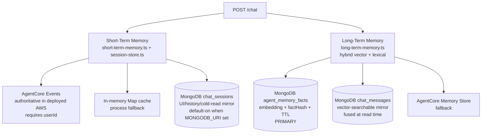
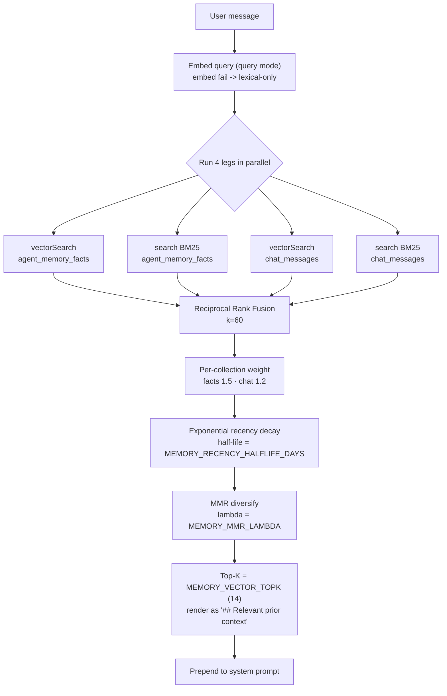

# Memory Architecture

> **What this shows:** the two memory layers — short-term (current conversation) and long-term (cross-session facts) — their backends, the write path, and the hybrid retrieval pipeline.
> **Sources of truth:** [`docs/memory-architecture.md`](../memory-architecture.md), [`AGENTS.md`](../../AGENTS.md) memory section, [`api/src/lib/long-term-memory.ts`](../../api/src/lib/long-term-memory.ts).

Shorthand for architecture discussions:

- **Short-term memory -> AgentCore Memory** (authoritative in deployed AWS).
- **Long-term memory -> MongoDB Atlas** (`agent_memory_facts` + `chat_messages`) with hybrid vector + BM25 retrieval.

---

## 1. Short-term vs long-term split

### Short-term backend selection (per turn)

JWKS auth is mandatory end-to-end, so every authenticated turn has a real `userId = jwt.sub`. The API selects a backend per turn:

- `SHORT_TERM_MEMORY_BACKEND=agentcore` + `AGENTCORE_MEMORY_STORE_ID` set + `MONGODB_URI` set -> **AgentCore events** primary read; writes to AgentCore events **and** `chat_sessions`. Production EC2 default.
- `agentcore` + memory store set + no `MONGODB_URI` -> AgentCore events only.
- `agentcore` + memory store **unset** -> **API refuses to boot** (`assertShortTermBackendConfigured()`), never silently downgrades.
- backend unset + `MONGODB_URI` set -> `chat_sessions` write-through with in-memory cache.
- backend unset + no `MONGODB_URI` -> in-memory `Map` only (tests / single process).

`PERSIST_CHAT_SESSIONS=0` opts out of the Mongo write-through even when `MONGODB_URI` is set.

---

## 2. Long-term write path (dangling microtask)

After a successful reply, the API extracts memorable facts and upserts them — entirely off the user's clock.

```mermaid
flowchart TB
  MSG[User + assistant turn] --> EXT["LLM fact extractor<br/>Bedrock ConverseCommand<br/>tool-forced record_facts<br/>(no regex fallback)"]
  EXT -->|extractor throws| SKIP["Skip write<br/>emit memory.long_term_skip<br/>reason: llm_extractor_failed"]
  EXT -->|facts returned| EMB["Embed each fact<br/>Voyage (or Bedrock Titan fallback)<br/>strict provider — no silent swap"]
  EMB --> UP["bulkWrite upsert<br/>key {userId, factHash}<br/>idempotent"]
  UP --> FACTS[("agent_memory_facts<br/>TTL = MEMORY_TTL_DAYS")]
  MSG -.->|parallel microtask| MIR["Mirror each message<br/>with embedding"]
  MIR --> CM[("chat_messages")]
  EMB -.->|embed fails| WROTE["Row still written<br/>embedding omitted<br/>reachable via BM25 leg"]
```

- `factHash = sha256(userId | agentId | normalized fact)` — re-stating a fact updates nothing.
- Extraction model: `MEMORY_EXTRACTION_MODEL_ID` (default Haiku 4.5), capped by `MEMORY_EXTRACTION_MAX_FACTS` (default `6`).
- Embedding failures are non-fatal: the transcript/lexical row persists; LTM adds `embedding.skipped` + `embedding.skipReason` to the `memory.long_term_write` event.

---

## 3. Hybrid read pipeline

When `agent.memory.longTerm=true` and `userId` is known, the chat route calls `readLongTermMemoryContext(...)` directly against MongoDB (internal code path, not a chat-invoked tool).

- All four legs are scoped by `{ userId }`. RRF works on rank position, neatly handling the cosine-vs-BM25 distribution mismatch.
- Emits a single `memory.scoped_read` trace event enriched with `mode`, `retrieval.vectorHits`, `retrieval.lexicalHits`, `retrieval.perCollection`.
- This is why one specialist can personalize from facts learned in a different specialist's session — retrieval is by semantic relevance to the current message, not by `agentId`.

### Key tuning knobs

| Variable | Purpose | Default |
|---|---|---|
| `MEMORY_VECTOR_TOPK` | Final hits injected after RRF + MMR | `14` |
| `MEMORY_VECTOR_FETCHK` | Per-leg over-fetch before merge | `24` |
| `MEMORY_RECENCY_HALFLIFE_DAYS` | Recency decay half-life (0 disables) | `90` (code) |
| `MEMORY_MMR_LAMBDA` | 1 = pure relevance, 0 = pure diversity | `0.7` |
| `MEMORY_WEIGHT_FACTS` | RRF weight on `agent_memory_facts` | `1.5` |
| `MEMORY_WEIGHT_CHAT_MESSAGES` | RRF weight on `chat_messages` | `1.2` |

> Note on `MEMORY_RECENCY_HALFLIFE_DAYS`: the **code default is `90`** (`long-term-memory.ts`, `?? 90`), but the EC2/demo deploy scripts set it to `30`. `memory-architecture.md` documents the deployed `30`. See [`docs/reference/env-vars.md`](../reference/env-vars.md) for the authoritative per-environment value.

---

## 4. Auth context in memory injection

Beyond long-term facts, each turn's prompt includes an **Authenticated User Context** block from JWT claims (`sub`, `email`, `name`), a Cognito `GetUser` fallback (for access tokens that omit `email`), and Mongo enrichment (customer tier/verified + recent ordered SKUs). This resolves identity-aware prompts like "my orders", "my open tickets", "recommend based on my previous orders" without asking for an email.

---

## 5. What memory does NOT do

- No nightly summarization/consolidation pipeline — the retriever leans on RRF + MMR + recency decay.
- No hard PII classifier before write — the LLM extractor is prompt-instructed to skip ephemeral/non-personal text but is not a PII guard.
- Embedding failures are non-fatal (row still written, reachable via BM25); production should alert on repeated `embeddedCount < factsExtracted.length`.

---

**Related diagrams:** [AWS infrastructure](01-aws-infrastructure.md) · [request flow](02-request-flow.md) · [deployment pipeline](04-deployment-pipeline.md)
