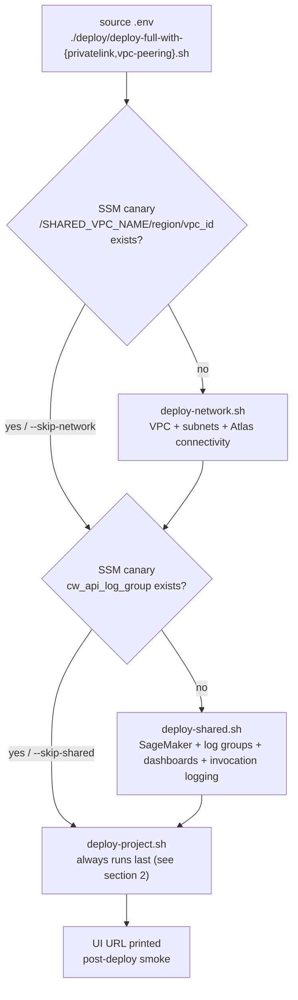
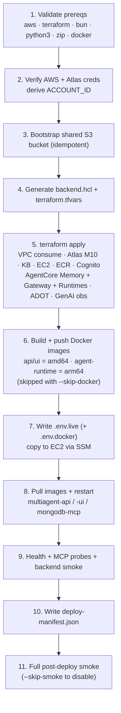
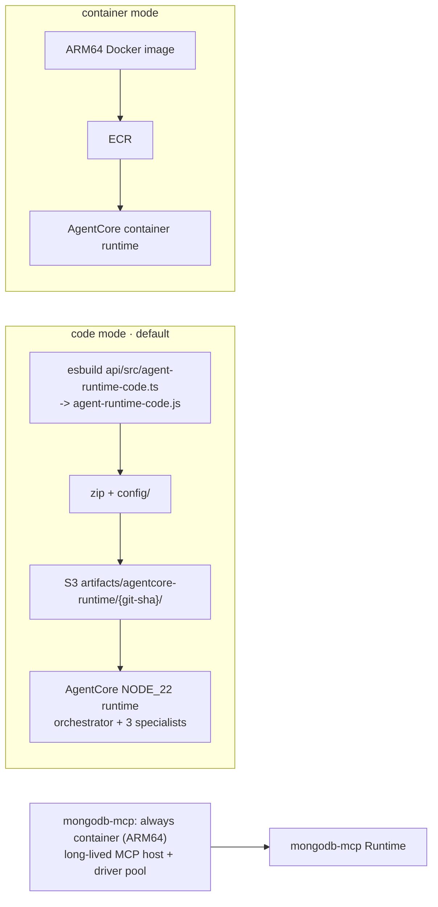
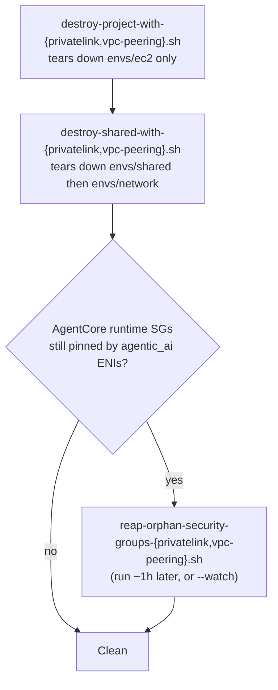

# Deployment Pipeline

> **What this shows:** how the deploy orchestrators sequence the three Terraform stacks, the phase breakdown of the main project deploy, the targeted-redeploy scripts, and teardown ordering.
> **Sources of truth:** [`docs/reference/deploy-scripts.md`](../reference/deploy-scripts.md), [`AGENTS.md`](../../AGENTS.md) deploy section, the scripts under [`deploy/`](../../deploy/).

Two mutually-exclusive orchestrators select the connectivity mode (`NETWORK_MODE`): `deploy-full-with-privatelink.sh` (default) and `deploy-full-with-vpc-peering.sh`. Both run the same three-phase structure, swapping the Atlas/KB connectivity primitives.

---

## 1. Orchestrator flow (SSM-canary gated)

- The orchestrator exports `NETWORK_MODE` before delegating, so sub-scripts route to their PrivateLink vs peering branches and stamp `network_mode` into SSM + tfvars + `deploy-manifest.json`.
- An `envs/ec2` `check` block fails the plan if the tfvars mode disagrees with the SSM canary — guarding against silent mode swaps.
- When `EMBEDDINGS_PROVIDER=voyage`, the shared-stack skip check additionally requires the `voyage_sagemaker_endpoint_name` SSM param to be present (the shared stack must have provisioned the Voyage endpoint) before it will skip `deploy-shared.sh`.

---

## 2. `deploy-project.sh` — phases 1 to 11

The big one: applies `envs/ec2`, builds images, syncs `.env.live`, restarts EC2 services, runs smoke.

- Phase 4d exports the MCP image digest as `TF_VAR_mongodb_mcp_image_digest` so a digest change re-creates the Gateway target and refreshes cached tool schemas.
- The `.env.live` / `.env.docker` pair is written from one canonical schema by `_env-live.sh`: `.env.live` is bash-source-safe (quoted), `.env.docker` is unquoted for `docker run --env-file`.

---

## 3. AgentCore runtime artifacts — code vs container mode

The four agent runtimes default to **code mode**; set `TF_VAR_agentcore_runtime_deployment_mode=container` to switch. The MongoDB MCP runtime is always container mode.

---

## 4. Targeted redeploys

After a full project deploy, three scripts redeploy slices without a full apply:

```mermaid
flowchart TB
  subgraph api [deploy-api.sh]
    A1["Rebuild + push API image"] --> A2["Regenerate .env.live"] --> A3["Restart multiagent-api"] --> A4["Backend smoke"]
  end
  subgraph ui [deploy-ui.sh]
    U1["Rebuild + push UI image"] --> U2["Restart multiagent-ui"] --> U3["Streamlit health"]
  end
  subgraph agents [deploy-agents.sh]
    G1["Discover + validate agents"] --> G2["Build + upload code artifact to S3"] --> G3["Targeted apply: acr_specialists + acr_orchestrator"] --> G4["Inject dynamic env vars per runtime"] --> G5["Refresh API agent cache (no restart)"]
  end
```

- `deploy-api.sh` is the only one that regenerates `.env.live` — run it first when Cognito/Atlas/OTel env vars changed.
- `deploy-ui.sh` does NOT regenerate `.env.live`.
- `deploy-agents.sh` touches only AgentCore runtimes + code artifact; refuses destroy without `--allow-destroy`; `--force` skips handoff-consistency validation.

---

## 5. Teardown ordering

- **Ordering is REQUIRED:** project wrapper first, then shared wrapper. Per-project EC2 reads SSM published by shared + network; destroying those first leaves orphan refs.
- `--with-bootstrap` (shared wrappers only) also empties + destroys the shared S3 state bucket — deletes ALL Terraform state; use only when no other env depends on it.
- Service-managed AgentCore ENIs (`interface-type=agentic_ai`) can't be manually detached, so the project destroy records pinned SGs in `destroy-reports/orphan-security-groups.tsv` and the mode-specific reaper deletes them once AWS releases the ENIs.

---

## 6. Connectivity-mode mutual exclusivity

PrivateLink and VPC peering are **mutually exclusive per account+region**. There is no hybrid path; switching requires destroy + redeploy with the matching orchestrator. The SSM `/<SHARED_VPC_NAME>/<region>/network_mode` canary plus the `envs/ec2` `check` block guard against silent swaps.

---

**Related diagrams:** [AWS infrastructure](01-aws-infrastructure.md) · [request flow](02-request-flow.md) · [memory architecture](03-memory-architecture.md)
