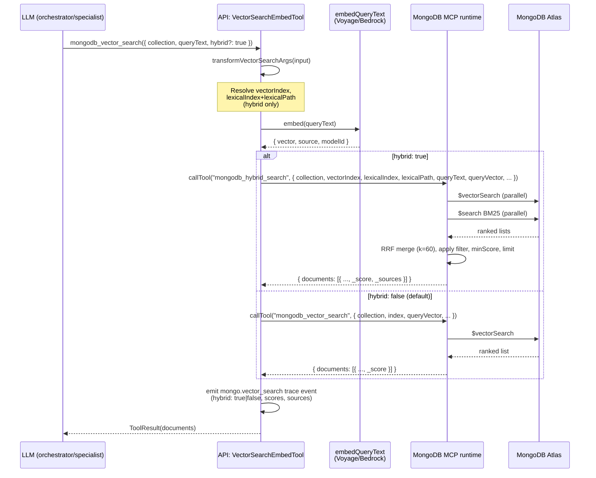

# Hybrid Vector + Lexical Search in MongoDB MCP

How `mongodb_vector_search` (agent-visible) and `mongodb_hybrid_search` (internal helper) work together, and why the split was chosen.

> **TL;DR**
>
> - Agents only ever call `mongodb_vector_search`. That contract is **stable**.
> - When the agent (or an API-side caller) passes `hybrid: true`, the API-side wrapper transparently routes the underlying MCP call to `mongodb_hybrid_search`, an **internal** helper inside the MongoDB MCP runtime.
> - `mongodb_hybrid_search` is registered with the runtime but **filtered out of the agent-visible tool list**, so the LLM never sees it and never picks it directly.
> - The boundary rule still holds: every model-initiated Mongo call goes through the **MongoDB MCP runtime** (no direct driver calls from the chat path). LTM reads are the only exception, and they are an internal API code path, not a chat tool.

---

## 1. Why two tools, not one rename

The hybrid retrieval refactor introduced a new capability — fusing Atlas `$vectorSearch` (semantic) with Atlas `$search` (BM25 lexical) via Reciprocal Rank Fusion. We considered three shapes for exposing it:

| Option | What the agent sees | Status |
|---|---|---|
| A. Rename `mongodb_vector_search` → `mongodb_hybrid_search` and make hybrid the default | new tool name only | **rejected** — breaks every existing `.agent.md`, `SKILL.md`, persona prompt, doc, test fixture, and trace dashboard |
| B. Add `mongodb_hybrid_search` as a **second agent-visible tool** alongside `mongodb_vector_search` | two near-identical tools | **rejected** — doubles the tool surface the LLM has to disambiguate (`mongodb_query`, `mongodb_aggregate`, `mongodb_vector_search`, plus a fourth?); more tools = more wrong picks, not better recall |
| C. Keep `mongodb_vector_search` as the **only** agent-visible vector tool, add an opt-in `hybrid: true` flag, route to an **internal** `mongodb_hybrid_search` MCP handler behind it | one tool with one flag | **chosen** |

### Why option C wins

1. **Backward-compatible contract.** Every `.agent.md` that lists `tools: ["mongodb_vector_search"]` keeps working unchanged. No retraining of prompts, no SKILL.md churn, no migration window. Pure-vector callers don't need to know hybrid exists.
2. **Discoverability without surface area.** The hybrid capability is documented in the single tool's `inputSchema.description`, so the LLM picks it up the same way it picks up `limit` or `filter` — by reading the schema the runtime advertises. We didn't have to add another tool the model has to learn to choose between.
3. **Boundary preserved.** Chat-invoked Mongo tools still execute through the MongoDB MCP runtime. The runtime owns the actual `$vectorSearch` + `$search` aggregation pipelines and the RRF merge; the API just orchestrates one MCP call instead of two.
4. **Internal helper, not internal API.** `mongodb_hybrid_search` is registered with the MCP server (so the API-side wrapper can call it through the same MCP transport — no special-case bypass), but it is filtered out of the agent-visible tool list at load time. The model never sees it; it cannot pick it directly; the LLM-as-a-router problem stays simple.
5. **Future-proof.** If we later add a pure-lexical opt-in, or a per-collection re-ranker, they slot in as additional flags on the same single tool. The agent's mental model — "I have one vector-ish search tool, it has knobs" — does not get more crowded.

The cost of option C is one piece of indirection: the wrapper has to know **both** how to call `mongodb_vector_search` and how to call `mongodb_hybrid_search`, and pick at request time. That cost is localized to one TypeScript class (`VectorSearchEmbedTool`) and one transform function (`transformVectorSearchArgs`), both fully unit-tested. We thought that was a good trade.

---

## 2. End-to-end request flow



Key points:

- The **embedding happens upstream of the MCP boundary**. The MCP runtime never calls Voyage / Bedrock itself — it just receives an already-vectorized `queryVector`. This keeps the runtime stateless w.r.t. embedding providers and gives one place (`embedQueryText` in [`api/src/lib/embed-query.ts`](../api/src/lib/embed-query.ts)) to swap embedders.
- In hybrid mode the wrapper sends **both** `queryText` (for the lexical leg) and `queryVector` (for the semantic leg) to the runtime in a single MCP call. There is no round-trip per leg.
- The runtime issues the two Atlas aggregations **in parallel** and merges them server-side; the wire format the wrapper handles is one merged list.

---

## 3. Where the moving parts live

| Layer | File | Role |
|---|---|---|
| Agent-visible tool spec | [`api/src/adapters/mongodb-mcp-client.ts`](../api/src/adapters/mongodb-mcp-client.ts) → `VECTOR_SEARCH_TOOL_SPEC` | The schema the LLM sees. Has `hybrid`, `lexicalIndex`, `lexicalPath`, `fetchK`, `minScore`. Single tool name: `mongodb_vector_search`. |
| Args transform | `transformVectorSearchArgs` | Pure function. Reads what the LLM passed, picks vector vs hybrid mode, resolves indexes, runs the embedder, builds the right wire-shape for the chosen target tool. Returns `{ mode, targetToolName, args, ... }`. Exported for unit tests. |
| Wrapper | `VectorSearchEmbedTool` | A Strands `Tool` that holds a reference to **two** underlying MCP `Tool` handles: `vectorUnderlying` (always present) and `hybridUnderlying` (present only when the runtime advertises `mongodb_hybrid_search`). `stream()` picks based on `transform.mode`. |
| Tool discovery + filtering | `loadMcpTools` (same file) | Calls `client.listTools()`, finds `mongodb_hybrid_search` and stashes it as `hybridAliased`, then **filters internal-only names out** of the agent-visible list via `isInternalOnlyMcpTool` before wrapping. |
| Internal-only registry | `INTERNAL_ONLY_MCP_TOOL_NAMES = new Set(["mongodb_hybrid_search"])` | Single source of truth on the API side for "tools that must not be exposed to the LLM." Mirrors the runtime-side `INTERNAL_ONLY_TOOL_NAMES` in [`mcp-runtimes/mongodb-mcp/src/vendor/handlers.mjs`](../mcp-runtimes/mongodb-mcp/src/vendor/handlers.mjs). |
| MCP handler — vector | `mongodb_vector_search` in [`handlers.mjs`](../mcp-runtimes/mongodb-mcp/src/vendor/handlers.mjs) | Single-leg `$vectorSearch` with `numCandidates` default 200, optional `minScore`. |
| MCP handler — hybrid | `mongodb_hybrid_search` in [`handlers.mjs`](../mcp-runtimes/mongodb-mcp/src/vendor/handlers.mjs) | Parallel `$vectorSearch` + `$search` BM25, RRF merge with `k=60`, supports per-leg `fetchK` over-fetch, `minScore` floor on the merged score, propagates `filter` into both legs. |
| MCP server registration | [`mcp-runtimes/mongodb-mcp/src/server.ts`](../mcp-runtimes/mongodb-mcp/src/server.ts) | Registers both handlers with their Zod input schemas. The runtime **does** advertise `mongodb_hybrid_search` over MCP — the filtering is API-side, so the wrapper can still discover and call it. |
| Default indexes | `DEFAULT_VECTOR_INDEX_BY_COLLECTION` + `DEFAULT_LEXICAL_INDEX_BY_COLLECTION` | Per-collection convention map: `products → products-vector-index` / `products-text-index`, `agent_memory_facts → agent_memory_facts-vector-index` / `agent_memory_facts-text-index`, etc. Lets the LLM call `{collection: "products", queryText: "...", hybrid: true}` without spelling out index names. |
| Index seeding | [`db-seeding/seed-indexes.ts`](../db-seeding/seed-indexes.ts) | Creates the matching Atlas Vector Search + Atlas Search (BM25) indexes for `products`, `troubleshooting_docs`, `agent_memory_facts`, `chat_messages`. |
| Unit tests | [`api/tests/unit/mongodb-vector-search-wrapper.test.ts`](../api/tests/unit/mongodb-vector-search-wrapper.test.ts) | Pins the routing decision: `hybrid: true` → `mongodb_hybrid_search`, missing helper → structured `hybrid_unsupported` error, internal-only filter dropping `mongodb_hybrid_search` from the agent-visible list. |
| Ranking eval | [`api/tests/unit/retrieval-eval.test.ts`](../api/tests/unit/retrieval-eval.test.ts) | Deterministic fixtures showing the qualitative wins hybrid adds over pure vector (polarity, recency, collection weight, additivity). |

---

## 4. Why `mongodb_hybrid_search` lives in the MCP runtime (not in the API)

The simpler-sounding alternative would be: keep `mongodb_vector_search` in MCP, and have the API run the lexical leg + RRF merge locally when `hybrid: true`. We deliberately did **not** do that.

| Concern | "Hybrid in API" alternative | What we shipped (hybrid in MCP) |
|---|---|---|
| Boundary rule ("chat-invoked Mongo calls go through MCP") | API now issues `$search` aggregations directly to Atlas — boundary breach | Both legs run inside the MCP runtime; the API never opens a Mongo connection on the chat path |
| Round trips | Vector via MCP + lexical direct from API = 2 different network paths to Atlas | One MCP call, runtime does both legs in parallel server-side |
| Guardrails | Atlas Search filter validation, max limits, error mapping would need to be re-implemented in the API | Reuses the same `assertSafeFilter` / `clampLimit` / `MongoGuardError` guard layer the runtime already enforces for every other Mongo tool |
| Tracing | Two stacked spans the UI has to reconcile | One `mongo.vector_search` trace event with `hybrid: true` and merged scores/sources |
| PrivateLink topology | The API would need its own Atlas connection (and credentials, and IAM) for the lexical leg | The API stays Atlas-free — only the MCP runtime is wired through PrivateLink |

LTM retrieval is different: it is **not a chat tool**. It is an internal API code path that runs **before** the LLM gets the turn, on a budget that is part of TTFB. For LTM we accepted a direct Mongo call (`api/src/lib/long-term-memory.ts` → `readLongTermMemoryContext`) using the same `vector-retrieval.ts` helpers, because routing it through MCP would add a network hop to the user-facing latency and gain nothing in safety (the API already owns the `userId` filter at that point). The hybrid handler in the MCP runtime is therefore for **chat tools only**; LTM has its own implementation of the same algorithm via shared pure helpers.

---

## 5. The agent-facing surface (what the LLM actually sees)

When agents list tools through Strands, they get exactly **one** vector-shaped tool:

```jsonc
{
  "name": "mongodb_vector_search",
  "description": "Run an Atlas $vectorSearch on a MongoDB collection. ... Set `hybrid: true` to fuse vector + Atlas Search BM25 results with Reciprocal Rank Fusion for higher recall on rare keywords. ...",
  "inputSchema": {
    "type": "object",
    "required": ["collection"],
    "properties": {
      "collection":     { "type": "string" },
      "queryText":      { "type": "string", "description": "Natural-language query. Embedded server-side. Required for hybrid: true." },
      "queryVector":    { "type": "array", "items": { "type": "number" }, "description": "Pre-computed embedding. Advanced; usually omit." },
      "indexName":      { "type": "string" },
      "limit":          { "type": "integer", "minimum": 1, "maximum": 50 },
      "numCandidates":  { "type": "integer", "minimum": 1, "maximum": 1000 },
      "filter":         { "type": "object" },
      "path":           { "type": "string", "default": "embedding" },
      "hybrid":         { "type": "boolean", "description": "Fuse $vectorSearch with Atlas $search BM25 via RRF." },
      "lexicalIndex":   { "type": "string" },
      "lexicalPath":    { "type": "string" },
      "fetchK":         { "type": "integer", "minimum": 1, "maximum": 100 },
      "minScore":       { "type": "number" }
    }
  }
}
```

`mongodb_hybrid_search` is **not in this list** — `isInternalOnlyMcpTool("mongodb_hybrid_search")` returns `true`, and the load step in `loadMcpTools` filters it out before `wrapGatewayTool` ever sees it.

Typical agent-side invocations:

```jsonc
// Pure-vector — unchanged from before the refactor.
{ "name": "mongodb_vector_search",
  "input": { "collection": "products", "queryText": "lightweight running shoes", "limit": 5 } }

// Hybrid — same tool name; opt-in flag.
{ "name": "mongodb_vector_search",
  "input": { "collection": "troubleshooting_docs", "queryText": "device error PWR-001", "hybrid": true, "limit": 5 } }

// Hybrid with explicit overrides — escape hatch.
{ "name": "mongodb_vector_search",
  "input": {
    "collection": "support_corpus",
    "queryText": "shipping label printer offline",
    "hybrid": true,
    "lexicalIndex": "support-corpus-text-index",
    "lexicalPath": "body",
    "fetchK": 24,
    "minScore": 0.001
  } }
```

If the LLM hallucinates a call to `mongodb_hybrid_search` directly, Strands will report **tool not found** (it isn't on the tool list); the model corrects on the next step and falls back to `mongodb_vector_search`. We've never observed this in practice — the model picks tools from the listed schemas, not from prior training memory.

---

## 6. Failure modes and how the design handles them

| Failure | What happens | Why this is safe |
|---|---|---|
| Embedder is unreachable | `transformVectorSearchArgs` returns `{ ok: false, code: "<embedder error>" }`; wrapper emits an error tool-result with that code | The LLM gets a structured error and can retry with a pre-computed `queryVector` or `hybrid: false`. No silent failure. |
| Hybrid requested on a collection with no Atlas Search index in `DEFAULT_LEXICAL_INDEX_BY_COLLECTION` and no override | Transform returns `{ ok: false, code: "missing_lexical_index" }` | Failure is early, loud, and tells the model exactly what's missing — much better than the runtime returning an opaque `$search` error. |
| Runtime does not advertise `mongodb_hybrid_search` (older MCP image) | Wrapper finds `hybridUnderlying === undefined`; on `hybrid: true` it emits `{ status: "error", code: "hybrid_unsupported", message: "Retry with hybrid: false, or update the MongoDB MCP runtime." }` | Backward-compatible. Pure-vector calls keep working; hybrid degrades to a clear error rather than a silent topology mismatch. |
| Internal-only filter accidentally drops `mongodb_hybrid_search` from `loadMcpTools`'s discovery (e.g. someone forgets to keep `hybridRaw` lookup before the filter) | Wrapper would lose the hybrid helper handle; all hybrid calls would surface the `hybrid_unsupported` error above | Unit test `loadMcpTools filters internal-only tools after capturing the hybrid helper` (in [`mongodb-vector-search-wrapper.test.ts`](../api/tests/unit/mongodb-vector-search-wrapper.test.ts)) pins this ordering. |
| Lexical leg returns 0 hits but vector leg succeeds | RRF merge still produces a fused list (it's strictly additive — see `retrieval-eval.test.ts` "strictly additive" case) | The hybrid path never returns **fewer** results than pure vector would. Adding the lexical leg can only add rows, never drop them. |
| Atlas index drift (lexical index renamed by a hand-edit) | Runtime `$search` aggregation throws; MCP returns a structured error; wrapper surfaces it to the LLM | Seeded names live in `seed-indexes.ts`; any drift is caught at the next deploy of `db-seeding`. |

---

## 7. Operational implications

- **Deploy ordering.** The MCP runtime image and the API image can be deployed in either order. If the API image with hybrid support hits production before the new MCP image, hybrid calls cleanly surface `hybrid_unsupported` errors and pure-vector calls keep working. If the new MCP image hits first, the old API simply never sets `hybrid: true` and the new handler stays idle. Neither ordering causes a runtime-level outage.
- **Index dependencies.** Each collection that wants hybrid behaviour needs **two** Atlas indexes (vector + Atlas Search), both seeded by [`db-seeding/seed-indexes.ts`](../db-seeding/seed-indexes.ts). Without the lexical index, the API rejects the call with `missing_lexical_index` before it ever reaches the runtime.
- **Cost model.** Hybrid runs two aggregations per call instead of one; for the same `limit`, expect roughly 1.5× the Atlas compute and the same number of round trips (because both legs run in parallel inside the runtime). Lexical search has no embedding cost; vector search shares the existing per-call embedder bill.
- **Observability.** The `mongo.vector_search` trace event carries `hybrid: boolean`, `embeddingSource`, `embeddingModel`, the vector preview, and a per-document score array. The Trace UI distinguishes the two modes by the `hybrid` flag, so you can filter to "show me hybrid calls only" in support investigations.
- **Per-collection defaults are conventions, not contracts.** Renaming an Atlas index without updating `DEFAULT_*_INDEX_BY_COLLECTION` will cause `missing_index` / `missing_lexical_index` errors on the next call. Treat the index name table in `mongodb-mcp-client.ts` as the source of truth and keep `seed-indexes.ts` aligned with it.

---

## 8. What this is *not*

- **Not a query router.** `mongodb_vector_search` does not auto-choose hybrid vs vector based on heuristics about the query. The flag is opt-in. Personas / SKILLs that benefit from rare-keyword recall (troubleshoot codes, SKU IDs, named entities) should pass `hybrid: true`; personas doing pure semantic browsing can leave it off.
- **Not a re-ranker.** The runtime performs RRF only. Cross-encoder re-ranking (Cohere Rerank, Voyage rerank-2, etc.) is a future extension and would fit as another optional flag (`rerank: true`) on the same tool — no new agent-visible tool would need to be added.
- **Not a replacement for `mongodb_query` / `mongodb_aggregate`.** Structured key-based lookups (`{ orderId: "ORD-1234" }`) belong on those tools. Hybrid is only useful when the query is unstructured natural language.
- **Not a leak of internal helpers.** `mongodb_hybrid_search` is registered with the MCP server only so the API-side wrapper can call it through the same MCP transport as everything else. The runtime filters it from `tools/list` for agent-facing consumers by participating in the same `INTERNAL_ONLY_TOOL_NAMES` convention; the API-side filter (`isInternalOnlyMcpTool`) is defence in depth. Both layers would have to fail for the LLM to ever see this tool.

---

## 9. Related docs

- [`memory-architecture.md`](memory-architecture.md) — full memory architecture, including the LTM read path that uses the same hybrid algorithm directly (no MCP) for latency reasons.
- [`api-reference.md`](api-reference.md) — `mongo.vector_search` trace event shape.
- [`../AGENTS.md`](../AGENTS.md) — agent-author conventions and the `tools:` field.
- [`../getting-started/why-structured-memory-beats-vector-memory.md`](../getting-started/why-structured-memory-beats-vector-memory.md) — narrative defence of the structured-plus-hybrid design for field discussions.
- Source of truth on the routing decision: [`api/src/adapters/mongodb-mcp-client.ts`](../api/src/adapters/mongodb-mcp-client.ts) (`transformVectorSearchArgs`, `VectorSearchEmbedTool`, `loadMcpTools`).
- Source of truth on the server-side merge: [`mcp-runtimes/mongodb-mcp/src/vendor/handlers.mjs`](../mcp-runtimes/mongodb-mcp/src/vendor/handlers.mjs) (`mongodb_hybrid_search`).
