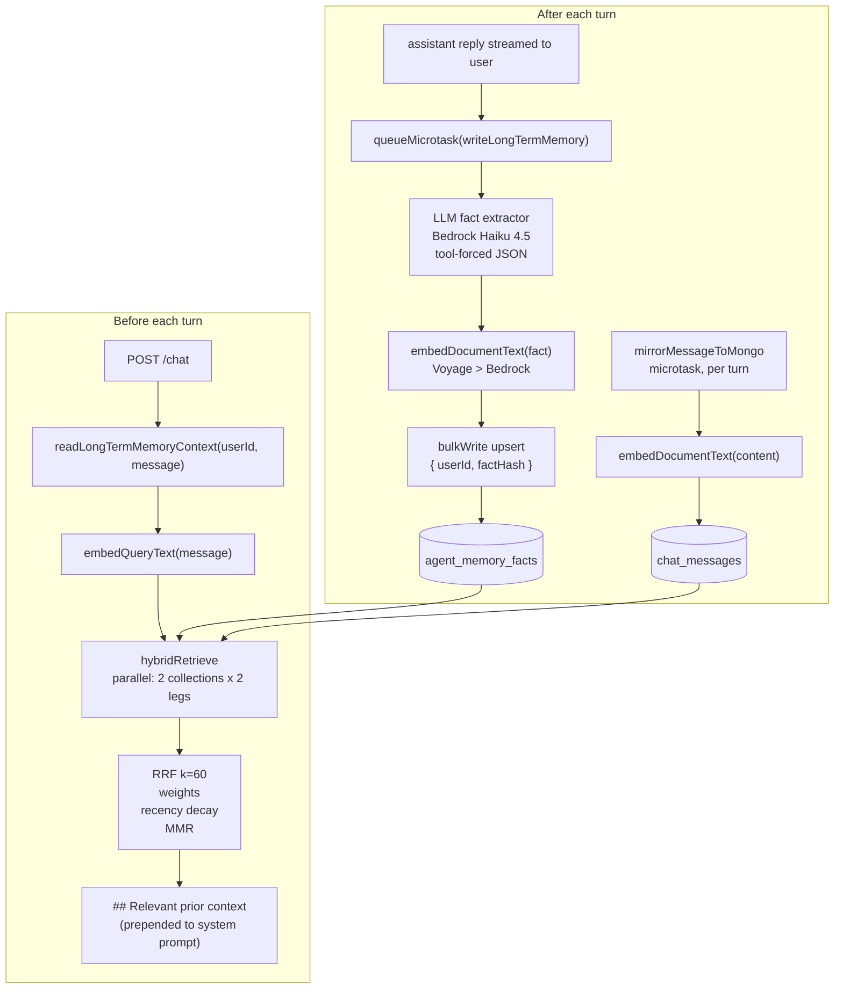

# Long-Term Memory: Design and Rationale

How long-term memory (LTM) is implemented today, why every major design choice was made, and what the system deliberately does **not** do.

> **Companion docs**
>
> - [`memory-architecture.md`](memory-architecture.md) — short-term + long-term + auth-context overview (the "where things live" map).
> - [`hybrid-search.md`](hybrid-search.md) — the same hybrid retrieval algorithm but **as exposed to agents** through `mongodb_vector_search`. LTM does not go through MCP; it uses the underlying primitives directly.
> - [`../give client/why-structured-memory-beats-vector-memory.md`](../give%20client/why-structured-memory-beats-vector-memory.md) — narrative defence of the hybrid design for client conversations.
>
> This doc focuses on **internal-only LTM**: the per-user fact store and chat-message mirror that the API reads from before every turn and writes to after every turn.

---

## 1. What LTM is — and what it is not

LTM is **cross-session personalization**: things the agent should remember about a specific user between sessions. It is not:

- **Short-term conversation history.** That's short-term memory, keyed by `sessionId` and backed by AgentCore Memory in deployed AWS. The in-memory map and MongoDB `chat_sessions` collection are cache/mirror/fallback layers, not the SoW short-term memory authority. See [`memory-architecture.md §1`](memory-architecture.md).
- **The knowledge base.** Product catalog, troubleshooting docs, etc. live in `products` / `troubleshooting_docs` and are retrieved by `mongodb_vector_search` / `bedrock_kb_retrieve`. The agent does the same hybrid lookup against those collections, but those rows are not "memory" — they are reference data.
- **A summary / consolidation layer.** There is no nightly job that rewrites or condenses facts. Recall leans on retrieval ranking, not on consolidation.

LTM **is**:

- Per-`userId` (JWT `sub` claim), optionally further scoped by `agentId`.
- LLM-curated facts about the user (`agent_memory_facts`) plus a vector-searchable mirror of every chat message (`chat_messages`).
- Retrieved with a hybrid `$vectorSearch` + Atlas `$search` (BM25) pipeline fused with Reciprocal Rank Fusion, weighted, recency-decayed, MMR-diversified.
- Activated only when an agent opts in with `memory.longTerm: true` in its `.agent.md` frontmatter and a real `userId` is present from the JWT.

---

## 2. End-to-end picture



The write path is fully off the user-visible TTFB clock (microtasks). The read path is on the TTFB clock and is the **only** path that is allowed to bypass the MongoDB MCP runtime — see §6 for why.

---

## 3. Design decisions and their rationale

Each row is a decision that meaningfully changes how the system behaves. Read top-to-bottom for the dependency order.

| # | Decision | What was chosen | What was rejected | Why |
|---|---|---|---|---|
| 1 | **Where do facts live?** | MongoDB Atlas, collection `agent_memory_facts` (primary), AgentCore Memory Store as a write-fallback. | A separate vector DB (Pinecone / Weaviate / Qdrant) for memory only. | The platform is already MongoDB-native. Adding a second store would add a backup story, a second permissioning story, and a cross-store consistency story — for a working-set that fits comfortably in Atlas under the 30-day TTL. AgentCore Memory Store is wired only as a fallback for the rare case where Mongo write throws (e.g. transient PrivateLink hiccup) so the turn isn't entirely lost. |
| 2 | **What is the storage unit?** | LLM-curated **facts** in `agent_memory_facts`, plus a vector-searchable **mirror** of each chat turn in `chat_messages`. | (a) Raw conversation turns only. (b) Embedded chat chunks only (no curated facts). | Raw turns give recall but are noisy and unboundedly large; curated facts give precision but lose paraphrase recall. Storing both, and **fusing them at read time with different weights**, gets the best of both: the LLM-curated `agent_memory_facts` row is the canonical truth (and wins ties), but `chat_messages` rescues recall when the extractor missed a useful detail. |
| 3 | **Who decides what counts as a "fact"?** | A **forced LLM tool call** with a JSON schema (`record_facts` → `[{text, category, reason}]`), Bedrock Claude Haiku 4.5 by default. Categories: `identity`, `preference`, `contact`, `address`, `order_id`, `device`, `other`. Caps: 8–220 chars per fact, ≤6 facts per turn. | (a) Regex / pattern heuristics. (b) The same LLM but with free-form output. | Regex false positives are catastrophic — *"check the status of my order ORD-1234"* would match an `order` pattern and store a wrong fact forever. Free-form LLM output would have to be parsed and validated; tool-forced output gives a guaranteed schema. The category-based prompt also implicitly does light PII routing (we know which fields are likely to be sensitive). |
| 4 | **What happens when the extractor fails?** | **Skip the write entirely.** Emit `memory.long_term_skip` with `reason: "llm_extractor_failed"`. No regex fallback, no best-effort save. | Best-effort fallback to regex. | False "facts" stored on every Bedrock blip are worse than missing the fact entirely. The user can re-state the fact in the next turn, and the next turn's extractor will likely succeed. |
| 5 | **Are facts deduplicated?** | Yes, by a content-derived **`factHash`** (`sha256(userId | agentId | normalize(fact))`) used as the upsert key in a `bulkWrite` with `updateOne({upsert: true})`. | (a) Append-only inserts. (b) Server-side dedup by exact string match. | Append-only would bloat the collection (a user re-states facts often). Exact-string dedup would miss casing / whitespace variants; `normalize().toLowerCase().replace(/\s+/g, " ")` collapses those. The hash also makes the dedup index small (one short string per fact). |
| 6 | **Is the fact embedded at write time, or lazily at read time?** | At write time, with `embedDocumentText` (`input_type: "document"`). | Lazy embedding on first query. | Lazy embedding would force the read path to spend embedder time on cold facts, wrecking TTFB. Write-time embedding keeps the read path strictly two aggregations + one query-side embed. **Embedding failures are non-fatal** — the row still lands without `embedding`, and the lexical (BM25) leg still surfaces it while telemetry reports the degraded write. |
| 7 | **How is recall done at read time?** | Hybrid `$vectorSearch` + Atlas `$search` (BM25) in parallel across **both** `agent_memory_facts` and `chat_messages`, fused with RRF (`k=60`). Then collection weight, then recency decay, then MMR diversification. | (a) Pure vector ranking. (b) Pure recency (the original implementation). (c) Re-ranker model on top of vector. | Pure vector has well-known polarity / negation / rare-token failure modes (see [`hybrid-search.md`](hybrid-search.md) §6). Pure recency missed paraphrased queries. A re-ranker would add another model dependency on the TTFB path. Hybrid + RRF gives most of the recall a re-ranker would, with no extra model call and with the lexical leg as a graceful-degradation path when the embedder is down. |
| 8 | **Where does retrieval physically run?** | **Direct Mongo** from the API (`api/src/lib/long-term-memory.ts → readLongTermMemoryContext` calling the pure helpers in `api/src/lib/vector-retrieval.ts`). | Through the MongoDB MCP runtime, like every other Mongo call. | LTM retrieval is internal — it runs **before** the LLM gets the turn, on the user-visible TTFB clock. Routing it through the MCP runtime would add a network round-trip and serialise through `BedrockAgentCoreClient`. It also doesn't help any of the boundary rules MCP enforces: the `userId` filter is API-owned (it comes from the verified JWT claim), so there is no LLM-supplied filter for MCP to guard. **Chat tools** still go through MCP — that's what `hybrid-search.md` covers. See §6 for the full argument. |
| 9 | **What is the data lifecycle?** | TTL index on `ts` (default 30 days for prod / EC2 deploy, 90 days dev default). Auto-created on the first production write. | Manual purge cron. | The MongoDB TTL monitor already runs every 60 seconds; piggy-backing on it is free. 30 days matches Casey / Alex demo expectations and keeps the per-user fact set bounded (typically <100 rows). |
| 10 | **How is the prompt rendered?** | Bullet list under a `## Relevant prior context` heading, prepended to the system prompt by `buildSystemPrompt` after the auth-context block. Each line is either `- <fact>` or `- [<date> <role>] <chat content>`. | A free-form paragraph; an XML wrapper; a JSON block. | Bullets keep the model's attention focused; the date/role tag on chat-message rows tells the model it is looking at past dialog vs. curated fact. The heading is what powers the well-known prompt-engineering pattern "I will now show you context from previous sessions." |
| 11 | **Privacy & redaction in traces.** | Fact strings are **redacted from trace events** by default (`MEMORY_TRACE_VALUES=0`). Audit log records bytes + count, never content. | Always log content (easier debugging); never log content (harder debugging). | Defaults to safe: trace exports never leak personal data. Operators can enable content logging per environment when investigating an issue (`MEMORY_TRACE_VALUES=1`). |

---

## 4. Data model

### `agent_memory_facts` — curated user facts

```ts
type MemoryFact = {
  userId: string;          // JWT sub
  agentId: string;         // which agent collected this turn
  fact: string;            // user's original wording, ≤ 220 chars
  source: "user";          // reserved for future "assistant" / "system"
  ts: string;              // ISO timestamp
  factHash: string;        // sha256(userId | agentId | normalize(fact))
  embedding?: number[];    // 1024-d Voyage AI (or Bedrock Titan v2 fallback)
  embeddingModel?: string; // "voyage" | "bedrock:<modelId>"
};
```

**Indexes** (seeded by [`db-seeding/seed-indexes.ts`](../db-seeding/seed-indexes.ts)):

| Index | Type | Purpose |
|---|---|---|
| `{ ts: 1 }` with `expireAfterSeconds = MEMORY_TTL_DAYS * 86400` | TTL | Auto-purge old facts (default 30 days in EC2 deploy). Auto-created on first production write. |
| `{ userId: 1, factHash: 1 }` unique | regular | Deduplication key for the `bulkWrite` upsert. |
| `agent_memory_facts-vector-index` (`embedding`, 1024-d cosine, filter `userId, agentId`) | Atlas Vector Search | Semantic leg of hybrid retrieval. |
| `agent_memory_facts-text-index` (`fact`, BM25, filter `userId, agentId`) | Atlas Search | Lexical leg of hybrid retrieval. |

### `chat_messages` — vector-searchable mirror

```ts
type ChatMessageDoc = {
  messageId: string;       // matches ChatMessage.id (unique)
  sessionId: string;
  userId?: string;
  agentId?: string;        // assistant role only
  role: "user" | "assistant";
  content: string;
  timestamp: string;       // ISO string from the original turn
  ts: Date;                // used for recency decay
  embedding?: number[];
  embeddingModel?: string;
};
```

**Indexes**:

| Index | Type | Purpose |
|---|---|---|
| `{ sessionId: 1, timestamp: 1 }` | regular | Replay a single session in order. |
| `{ messageId: 1 }` unique | regular | Idempotent retries during the microtask insert. |
| `{ userId: 1, ts: -1 }` | regular | Cascade delete on session deletion; cross-session "what did the user say recently" debugging. |
| TTL on `ts` | TTL | Same lifecycle as `agent_memory_facts`. |
| `chat_messages-vector-index` (`embedding`, 1024-d cosine, filter `userId, sessionId, role`) | Atlas Vector Search | Semantic leg. |
| `chat_messages-text-index` (`content`, BM25, filter `userId, sessionId, role`) | Atlas Search | Lexical leg. |

`DELETE /sessions/:id` cascade-deletes `chat_messages` rows for that session — this is what makes the privacy contract symmetric: deleting a session removes both the structured session metadata and the vector-searchable mirror.

### Why the two collections, not one

A single collection would either pollute curated facts with chat noise (lower precision on the facts leg) or force chat messages into a `fact`-shaped envelope (more write cost, lossier representation). Two collections let the retriever:

- Apply a higher RRF weight to curated facts (`MEMORY_WEIGHT_FACTS=1.5`) vs raw chat (`MEMORY_WEIGHT_CHAT_MESSAGES=1`).
- Render them differently in the prompt (bullet vs dated quote).
- Manage TTLs and indexes independently if needed in the future.

---

## 5. Write path (post-turn)

Triggered from `api/src/routes/chat.ts` immediately after the SSE stream completes successfully, inside a `queueMicrotask` so it never blocks the response:

```ts
queueMicrotask(() => {
  void writeLongTermMemory(userId, routeAgentId, userMessage, reply).catch(...);
});
```

`writeLongTermMemory` flow:

1. **Guards** — bail with a `memory.long_term_skip` trace event if no `userId`, or if `assistantReply` is empty (no information added this turn).
2. **Truncate** — `userMessage` capped at 2 000 chars, `assistantReply` at 4 000 chars before the extractor sees them, to bound LLM input cost.
3. **Extract** — call `extractFactCandidates(userMessage)`, which runs `extractFactsWithLlm` against Bedrock Haiku 4.5 with a tool-forced `record_facts` schema:

   ```jsonc
   {
     "facts":   [{ "text": "I have a peanut allergy", "category": "preference", "reason": "stated dietary restriction" }],
     "ignored": [{ "text": "hi there", "reason": "greeting" }]
   }
   ```

   The system prompt explicitly lists what to store / what to skip and instructs the model to **use the user's original wording** for high-precision recall. Extractor never throws — Bedrock failures are caught and bubble up as `extractorError` on the result, which the caller treats as a hard skip.

4. **Persist** — if any facts were accepted:
   - `Promise.all(facts.map(embedDocumentText))` — embed each fact in parallel. Failures don't block; the row goes in without `embedding`.
   - `computeFactHash(userId, agentId, fact)` per fact.
   - `bulkWrite([{ updateOne: { filter: {userId, factHash}, update: {$setOnInsert: doc}, upsert: true }}], { ordered: false })`.
   - `$setOnInsert` (not `$set`) means re-stating an old fact never overwrites its original `ts` — preserving the first-mention timestamp for recency analytics.
5. **Audit** — emit a single `memory.long_term_write` trace event with the candidate list, extractor latency, `op: "bulkWrite"`, `docsInserted`, `duplicatesSkipped`, `embeddedCount`, `embeddingModel`, primary + fallback outcomes, and byte counts. Audit-channel log line is separate (`logger.audit().info(...)`) — count + bytes only, no content.
6. **Fallback** — if the Mongo write itself throws, attempt `agentcoreWrite(turn)` against AgentCore Memory Store; outcome reflected in the trace event.

In parallel, every call to `appendUserMessage` / `appendAssistantMessage` on `session-store` schedules a `mirrorMessageToMongo` microtask that embeds and inserts the message into `chat_messages`. The mirror is best-effort and a failure here never affects the chat response.

### Why microtask, not sync

The user's turn ends when the SSE `done` event flushes. Memory writes happen after that, on the same Node process, off the response timeline. If the API process crashes between `done` and the microtask draining, that turn's facts are lost — we accepted that trade for predictable TTFB.

---

## 6. Read path (pre-turn)

Triggered from `api/src/routes/chat.ts` after JWT verification, before the orchestrator runtime is invoked:

```ts
const ltm = await readLongTermMemoryContext(userId, body.message, {
  agentId: requestedAgentId,
  priorTurns,
});
if (ltm) blocks.push(`## Relevant prior context\n\n${ltm}`);
```

`readLongTermMemoryContext` flow (in `api/src/lib/long-term-memory.ts`):

1. **Guards** — return `null` if `userId` is empty or `queryText` is empty (no point spending an embedder call on a no-op).
2. **Resolve Mongo** — `getMongoDb()`. If `MONGODB_URI` is unset (e.g. local dev with `DEV_MOCK_BACKENDS=1`), emit an empty `memory.scoped_read` event and return `null`.
3. **Embed the query** — `embedQueryText(message)` runs against Voyage SageMaker first (`input_type: "query"`), then Bedrock Titan/Cohere if Voyage is unconfigured or fails. On full embedder failure the mode drops to `"lexical"` instead of failing the turn — the BM25 leg still works without a vector.
4. **Build two collection specs** for `hybridRetrieve`:
   - `agent_memory_facts` with `filter: { userId }`, weight `MEMORY_WEIGHT_FACTS`.
   - `chat_messages` with `filter: { userId }`, weight `MEMORY_WEIGHT_CHAT_MESSAGES`.
5. **Run hybrid retrieval** (`hybridRetrieve` in `api/src/lib/vector-retrieval.ts`) which:
   - Fires four aggregations in parallel: `$vectorSearch` and `$search` (BM25) per collection, each capped at `MEMORY_VECTOR_FETCHK=24` rows.
   - **RRF merges** the four ranked lists with `score = Σ 1 / (k + rank)`, `k = 60`. RRF works on rank position so the BM25 score scale (0–10ish) and the cosine score scale (0–1) don't have to be normalised.
   - Applies the per-collection weight (`hit.rrfScore *= weight`).
   - Applies exponential recency decay (`hit.rrfScore *= exp(-Δdays / MEMORY_RECENCY_HALFLIFE_DAYS)`).
   - Runs **MMR** to pick `MEMORY_VECTOR_TOPK=14` final rows from the top `fetchK` candidates, balancing relevance and diversity by `lambda = MEMORY_MMR_LAMBDA=0.7`.
6. **Render** — facts become `- <fact>` bullets; chat messages become `- [YYYY-MM-DD <role>] <content...>` bullets (content truncated at 400 chars).
7. **Trace** — single `memory.scoped_read` event with hybrid metadata:

   ```jsonc
   {
     "scope": "scoped",
     "userId": "...",
     "agentId": "product-recommendation",
     "entryCount": 4,
     "bytesInjected": 312,
     "collectionsQueried": ["agent_memory_facts", "chat_messages"],
     "mode": "hybrid",                     // or "lexical" if the embedder was down
     "embeddingSource": "voyage-sagemaker",
     "embeddingModel": "voyage-3.5-lite",
     "retrieval": {
       "topK": 6,
       "fetchK": 24,
       "vectorHits": 8,
       "lexicalHits": 6,
       "rrfMergedCount": 11,
       "perCollection": [
         { "collection": "agent_memory_facts", "vectorReturned": 5, "lexicalReturned": 3 },
         { "collection": "chat_messages",      "vectorReturned": 3, "lexicalReturned": 3 }
       ]
     },
     "latencyMs": 87
   }
   ```

The render block is returned to the route; the route prepends it to the system prompt. If `entryCount === 0`, nothing is injected — the model gets the bare persona + skills.

### Why the MCP boundary doesn't apply here

The repo-wide rule is *"chat-invoked Mongo tools must go through the MongoDB MCP runtime."* LTM retrieval is **not** a chat-invoked tool — it is an API code path that runs before the LLM gets the turn. The boundary exists to keep the LLM-controlled tool surface auditable and rate-limited: filter validation, allowlists, guardrails, and a uniform trace event. None of those concerns apply to LTM:

- The filter (`{userId}`) is **API-owned**, derived from the verified JWT claim. The LLM never supplies it.
- The collection names (`agent_memory_facts`, `chat_messages`) are hard-coded in source. The LLM cannot redirect them.
- The aggregation pipeline is built by `vector-retrieval.ts` from a fixed template. The LLM cannot inject stages.
- The latency budget is part of TTFB. An extra `BedrockAgentCoreClient.invoke` round trip would add ~50–100 ms with zero security gain.

This is the single exception. **Every other Mongo touchpoint from the chat path — including the hybrid path the model can opt into with `hybrid: true` — goes through MCP.** See [`hybrid-search.md §4`](hybrid-search.md) for the equivalent argument from the other direction.

### 6.5 The three reader functions — which one runs, when

`long-term-memory.ts` exports three readers. Only one is in the active code path today; the others are kept around because their function signatures appear in older docs, fixtures, and external clients.

| Function | What it does | Called from `api/src/` today? | Notes |
|---|---|---|---|
| `readLongTermMemoryContext(userId, queryText, { agentId, priorTurns })` | The active hybrid retriever described in §6. Vector + BM25 across `agent_memory_facts` + `chat_messages`, RRF + weights + recency + MMR. | **Yes** — `api/src/routes/chat.ts` calls it once per chat turn when `agent.memory.longTerm && userId`. | The only LTM reader the prompt builder sees. |
| `readLongTermMemory(userId, agentId)` | Legacy reader. Pure recency: `find({userId, agentId}).sort({ts:-1}).limit(MEMORY_INJECT_TURNS)`. Falls back to AgentCore `ListEvents` on Mongo failure. | **No.** | Kept exported because external smoke tests and the older draw.io diagram still reference it. Will be removed once those are migrated. |
| `readSharedLongTermMemory(userId)` | Legacy cross-agent reader. Same shape as `readLongTermMemory` but without the `agentId` filter, with case-insensitive deduplication. | **No.** | Same status as above. |

**The `priorTurns` parameter on `readLongTermMemoryContext` is accepted but currently unused.** It exists as forward-looking API surface so a future change can use the immediate prior turns as a second retrieval signal (e.g. re-ranking by recent dialog context). For now, only the current user message drives retrieval. Don't rely on it.

If you are wiring up a new caller, use `readLongTermMemoryContext`. The legacy readers exist only so the dead grep can resolve.

---

## 7. Enabling LTM on an agent

In the agent's `.agent.md` frontmatter:

```yaml
---
name: Product Recommendation Specialist
id: product-recommendation
memory:
  longTerm: true       # opt in; default false
  # longTermCollection: agent_memory_facts   # override only if you renamed the collection
skills: [...]
tools: [...]
---
```

The schema is enforced in [`api/src/lib/schemas.ts`](../api/src/lib/schemas.ts). At chat time, `wantsScoped = agent.memory?.longTerm === true`. With `longTerm: false` (or unset), the LTM read is skipped entirely — no embedder call, no aggregation. The write path is **always on** when `userId` is present; opting out of `longTerm` only suppresses the *read* of injected context, not the *write* of facts. (Rationale: a user's fact set is one logical resource — it should not be partially populated based on which agent happened to be active.)

---

## 8. Tuning knobs

All knobs are read at call time so they can be flipped at runtime without restart. Defaults are conservative; production EC2 deploys tune them in [`deploy/scripts/deploy-project.sh`](../deploy/scripts/deploy-project.sh).

| Variable | Purpose | Default | Source |
|---|---|---|---|
| `MEMORY_TTL_DAYS` | TTL on `agent_memory_facts.ts` and `chat_messages.ts`. EC2 deploy sets 30. | `90` (dev) / `30` (deploy) | `long-term-memory.ts → ensureTtlIndex` |
| `MEMORY_EXTRACTION_MODEL_ID` | Bedrock model id for the LLM extractor (must support tool use). | `us.anthropic.claude-haiku-4-5-20251001-v1:0` | `llm-fact-extractor.ts → DEFAULT_LLM_EXTRACTOR_MODEL_ID` |
| `MEMORY_EXTRACTION_MAX_FACTS` | Cap on facts persisted per turn. | `6` | `long-term-memory.ts → extractFactsWithLlm` |
| `MEMORY_INJECT_TURNS` | Legacy cap on injected turns. Respected by `readLongTermMemory` / `readSharedLongTermMemory`, neither of which is called from `api/src/` today (kept for backward-compat / fixtures — see §6.5). | `5` | `long-term-memory.ts → maxInjectTurns` |
| `MEMORY_VECTOR_TOPK` | Final number of hits the retriever injects after RRF + MMR. | `6` | `memoryTopK()` |
| `MEMORY_EMBED_TIMEOUT_MS` | Read-side query embedding timeout (abort-controlled). On timeout the retriever drops from `hybrid` to `lexical` mode so the chat turn is never blocked on the embedder. | `5000` | `memoryEmbedTimeoutMs()` |
| `MEMORY_VECTOR_FETCHK` | Per-leg over-fetch before RRF merge. | `24` | `memoryFetchK()` |
| `MEMORY_VECTOR_NUM_CANDIDATES` | `$vectorSearch.numCandidates` width. Atlas guidance: ≥ 10× limit. | `200` | `memoryNumCandidates()` |
| `MEMORY_SEARCH_MAX_TIME_MS` | Server/client timeout per Atlas vector/BM25 aggregation leg. | `8000` | `memorySearchMaxTimeMs()` |
| `MEMORY_EMBED_TIMEOUT_MS` | Query embedding timeout before lexical fallback. | `5000` | `memoryEmbedTimeoutMs()` |
| `MEMORY_RECENCY_HALFLIFE_DAYS` | Exponential recency decay half-life. `0` disables decay. | `30` | `memoryRecencyHalfLifeDays()` |
| `MEMORY_MMR_LAMBDA` | MMR diversification: `1` = pure relevance, `0` = pure diversity. | `0.7` | `memoryMmrLambda()` |
| `MEMORY_MIN_SCORE` | Drop merged items below this RRF score (after weight/recency). | `0` | `memoryMinScore()` |
| `MEMORY_WEIGHT_FACTS` | RRF weight multiplier on `agent_memory_facts` hits. | `1.5` | `memoryWeightFacts()` |
| `MEMORY_WEIGHT_CHAT_MESSAGES` | RRF weight multiplier on `chat_messages` hits. | `1` | `memoryWeightChatMessages()` |
| `MEMORY_TRACE_VALUES` | When `1` / `true`, fact strings appear in trace event payloads. Off by default. | unset | `memoryTraceValuesEnabled()` |
| `CHAT_MESSAGES_COLLECTION` | Override the vector-searchable chat mirror collection name. | `chat_messages` | `chat-messages-collection.ts → chatMessagesCollectionName` |
| `AGENTCORE_MEMORY_STORE_ID` | When set, AgentCore Memory Store is used as the write-fallback on Mongo failure. | unset | `long-term-memory.ts → hasAgentcoreMemoryStore` |
| `VOYAGE_SAGEMAKER_ENDPOINT` | When set, Voyage embeddings via SageMaker (1024-d) is the primary embedder for both `query` and `document` mode. | unset (EC2 deploy sets it) | `voyage-embedding.ts → getVoyageEndpoint` |
| `EMBEDDING_MODEL_ID` | Bedrock embedding model fallback when Voyage is unconfigured/fails. | `amazon.titan-embed-text-v2:0` | `bedrock-embedding.ts` |

---

## 9. Observability

### Trace events (visible in the Trace Viewer UI)

| Event | When emitted | Key fields |
|---|---|---|
| `memory.scoped_read` | Every chat turn that calls `readLongTermMemoryContext` (regardless of whether it returned any rows). | `mode`, `entryCount`, `bytesInjected`, `embeddingSource`, `embeddingModel`, `retrieval.{topK, fetchK, vectorHits, lexicalHits, rrfMergedCount, perCollection[]}`, `latencyMs`, `primaryFailed`, `retrievalErrorClass`, `retrievalErrorMessage` |
| `memory.long_term_write` | Every chat turn that completed a write attempt (whether persisted, skipped, or failed). | `op: "bulkWrite"`, `docsInserted`, `duplicatesSkipped`, `embeddedCount`, `embeddingModel`, `factCandidates[]`, `factsExtracted[]`, `primaryBackend`, `primaryOutcome`, `fallbackBackend`, `fallbackOutcome`, `extractorModelId`, `extractorLatencyMs`, `extractorInput/OutputTokens`, byte counts, `latencyMs` |
| `memory.long_term_skip` | When the write was deliberately not attempted. | `reason ∈ {no_user_id, empty_assistant_reply, llm_extractor_failed, mongodb_unavailable, no_fact_candidates}` plus an excerpt of the user message and, on extractor failure, `extractorError` |

Event **names** are preserved across the hybrid refactor — only payloads were enriched — so the Trace UI didn't need a parser change. The Streamlit `ui/lib/inline_summary.py` aggregator counts `entryCount` + `docsInserted` against the per-turn summary, and pinning that contract is what [`api/tests/unit/retrieval-eval.test.ts`](../api/tests/unit/retrieval-eval.test.ts) and [`ui/tests/test_inline_summary.py → test_memory_hybrid_retrieval_payload_back_compat`](../ui/tests/test_inline_summary.py) guard.

### Structured logs

Production runs emit JSON Lines at `LOG_LEVEL=info`:

```text
[memory] TTL index ensured on agent_memory_facts { expireAfterSeconds: 2592000 }
[memory] long-term memory facts persisted   { userId, agentId, backend: "mongodb", factCount: 2, ... }   (audit channel)
[memory] LLM fact extractor failed; skipping long-term write { error }
[memory] fact embedding failed; storing fact without vector { userId, agentId, code, message }
[memory] hybrid retrieval failed { userId, error }
[memory] query embedding failed; falling back to lexical-only retrieval { userId, code, message }
```

The audit channel (`logger.audit()`) is separate from the regular channel and never carries fact content — only counts and bytes. CloudWatch shipping is documented in [`logging-architecture.md`](logging-architecture.md).

### Inline cards in the chat UI

Each turn's trace summary in the chat UI shows `memory_facts_read` and `memory_facts_written` so the demo audience can see "the agent learned 2 new things this turn / surfaced 4 prior facts." Implemented in [`ui/lib/inline_summary.py`](../ui/lib/inline_summary.py).

---

## 10. Failure modes — and how each one is handled

| Failure | Behaviour | Trace artefact |
|---|---|---|
| User is unauthenticated (no `userId`) | LTM read returns `null`; LTM write is skipped. | `memory.long_term_skip { reason: "no_user_id" }`. No `memory.scoped_read`. |
| Assistant reply was empty (model produced nothing) | LTM write is skipped. | `memory.long_term_skip { reason: "empty_assistant_reply" }` |
| `MONGODB_URI` not set / DB unreachable | Read returns `null`; write skips with `primaryFailed: true`. If AgentCore fallback is configured, write is mirrored there. | `memory.scoped_read { primaryFailed: true, entryCount: 0 }` and `memory.long_term_skip { reason: "mongodb_unavailable" }` (or `memory.long_term_write { primaryOutcome: "failed", fallbackOutcome: "persisted" }`) |
| Bedrock extractor failed (throttling / access denied / network) | Write is skipped. No regex fallback. | `memory.long_term_skip { reason: "llm_extractor_failed", extractorModelId, extractorError }` |
| Extractor ran but returned 0 facts | Write is skipped. | `memory.long_term_skip { reason: "no_fact_candidates" }` |
| Embedder failed (Voyage SageMaker unreachable, Bedrock unconfigured) on **write** | Row is persisted without `embedding`; lexical leg still surfaces it. | `memory.long_term_write { embeddedCount < accepted.length }` and a warn log |
| Embedder failed on **read** | Retrieval mode drops from `"hybrid"` to `"lexical"`; only the BM25 leg runs. | `memory.scoped_read { mode: "lexical" }` and a warn log |
| One Atlas index missing (e.g. lexical index not seeded) | `hybridRetrieve` catches the per-leg failure and records it in `perCollection[i].error`; other legs still merge. | `memory.scoped_read { retrieval.perCollection[i].error: "..." }` |
| All four retrieval legs throw | Empty result; `retrievalErrorClass` + `retrievalErrorMessage` populated. No prompt block injected. | `memory.scoped_read { entryCount: 0, primaryFailed: true, retrievalErrorMessage }` |
| TTL purges a fact under the user's nose | The next read just won't see it; nothing else happens. | (no event — the row is gone) |
| `bulkWrite` partial failure (`ordered: false`) | Successful ops persist; failed ops bubble up as `errorMessage` on the write trace event. | `memory.long_term_write { primaryOutcome: "failed", errorClass, errorMessage }` |

The principle across all of these: **a memory failure must never break the chat turn.** The user sees a normal response; observability captures the degradation; the next turn might recover.

---

## 11. Privacy and compliance

- **Per-user isolation by construction.** Every read passes `{ userId }` as a hard `filter` clause inside both `$vectorSearch` and `$search`. The filter is enforced at the Atlas index level (declared as `filter` fields on the vector + Atlas Search indexes), so a missing filter is a query error, not a silent leak.
- **GDPR / right-to-be-forgotten.** Two `deleteMany({ userId })` calls — one on `agent_memory_facts`, one on `chat_messages` — fully purge a user's LTM. Embeddings disappear with the row; there is no separate vector store to chase.
- **Session deletion symmetry.** `DELETE /sessions/:id` cascade-deletes `chat_messages` rows for that session. Deleting the session deletes the mirror.
- **Truncation at write.** `userMessage` ≤ 2 000 chars, `assistantReply` ≤ 4 000 chars, each fact ≤ 220 chars. Long PII paragraphs cannot land verbatim.
- **Trace redaction by default.** `MEMORY_TRACE_VALUES=0`; trace events carry counts + categories + bytes, not fact strings. Operators flip the env var per environment when investigating.
- **Audit log.** `logger.audit().info("[memory] long-term memory facts persisted", { ... })` on every persist; `logger.audit().warn("[memory] failed to write long-term memory", { ... })` on every failure. Audit lines are shipped to a separate CloudWatch log group.
- **Tool-forced extractor categories.** The extractor labels each stored fact (`identity`, `preference`, `contact`, `address`, `order_id`, `device`, `other`), making downstream PII review or category-based redaction tractable later.

---

## 12. What LTM does *not* do (current limitations)

- **Embedding-provider outages degrade recall instead of failing turns.** If Voyage / Bedrock is unreachable when a fact is written, that row relies on the lexical leg and the write trace shows `embeddedCount < factsExtracted.length`; monitoring should alert on repeated occurrences.
- **No consolidation / summarization.** No nightly process rewrites "User mentioned peanut allergy 5 times" into a single canonical fact. The dedup hash keeps duplicates out, but semantic near-duplicates can both persist until one is evicted by TTL or MMR doesn't pick it.
- **No PII classifier.** The LLM extractor is prompt-instructed to skip non-personal text; it is not a regulated PII guard. For PHI / financial use cases an explicit redactor would be needed before write.
- **No cross-user "shared knowledge" facts.** Every fact is `userId`-scoped. Organisation-wide facts (e.g. "premium tier customers get free shipping") belong in a different collection / a different retrieval path.
- **No per-agent privacy partition.** Facts are filtered by `userId`. The active reader (`readLongTermMemoryContext`) intentionally reads cross-agent — user-level facts ("my email is alice@example.com") are visible to every agent the user talks to. The legacy `readLongTermMemory(userId, agentId)` exists for agent-scoped reads but is not currently called from `api/src/`.
- **AgentCore fallback is write-only.** When Mongo writes fail and AgentCore Memory Store is configured, the *write* lands in AgentCore. The *read* path does not yet pull from AgentCore — facts in AgentCore-only state are not retrieved until Mongo is healthy again and the next write succeeds. Read-side fallback is a clear future extension.
- **No agent-supplied embeddings.** Embedding is always done by `embedDocumentText` / `embedQueryText` on the API side; agents cannot bring their own pre-computed vectors for LTM rows.

---

## 13. Performance budget and cost model

LTM sits on the user-visible TTFB clock on the read path, and on the post-stream microtask on the write path. Representative numbers from EC2 deploys (Voyage SageMaker `ml.g6.xlarge`, MongoDB Atlas M10, `us-east-1`):

### Read path (TTFB-critical)

| Step | Typical | P95 | Notes |
|---|---|---|---|
| `embedQueryText` (Voyage SageMaker) | 40–100 ms | 200 ms | Capped by `MEMORY_EMBED_TIMEOUT_MS=5000`. On timeout, mode drops to `lexical` and the turn continues. |
| Four parallel Atlas aggregations (2 vector + 2 BM25, `fetchK=24`) | 20–80 ms warm | 150 ms cold | Atlas Vector Search warms its kNN cache on the first few queries after deploy. Cold reads on a fresh `agent_memory_facts-vector-index` can take 200–400 ms. |
| RRF + recency + MMR (pure JS) | < 2 ms | < 5 ms | `O(fetchK × topK)` for MMR; everything else is `O(fetchK)`. |
| **Total LTM read path** | **~60–180 ms** | **~350 ms** | Visible as `latencyMs` on the `memory.scoped_read` trace event. |

If you see total LTM read > 500 ms consistently: `embeddingSource` in the trace event will tell you whether the embedder is the culprit; `retrieval.perCollection[].error` will tell you if an Atlas index is missing or backfilling.

### Write path (off TTFB; runs after `done` SSE)

| Step | Typical | Notes |
|---|---|---|
| Bedrock Haiku extractor (`ConverseCommand` with tool-forced output, T=0, maxTokens=1024) | 300–800 ms | The biggest variable cost on the write path. Throttling under load extends this. |
| `Promise.all(facts.map(embedDocumentText))` (`N` parallel calls) | 40–150 ms | Bounded by `MEMORY_EXTRACTION_MAX_FACTS=6`. |
| `bulkWrite` upsert + `countDocuments` × 2 | 10–40 ms | `countDocuments` is best-effort and skipped on error. |
| **Total LTM write path** | **~400–1000 ms** | Visible as `latencyMs` on the `memory.long_term_write` trace event. Doesn't affect user-perceived latency. |

### Cost model (illustrative, `us-east-1`, May 2026 pricing)

Per chat turn that exercises LTM:

| Component | Quantity per turn | Unit cost | Per-turn cost |
|---|---|---|---|
| Bedrock Haiku 4.5 (extractor) | ~600 input + ~200 output tokens | ≈$0.001 + $0.005 / 1k tokens | **~$0.0014** |
| Voyage SageMaker embeddings (write) | 0–6 facts × ~30 tokens | Endpoint-hour priced — marginal cost effectively $0 once the endpoint is up | **~$0** marginal |
| Voyage SageMaker embedding (read) | 1 query × ~10–50 tokens | Same | **~$0** marginal |
| MongoDB Atlas (4 aggregations + 1 `bulkWrite`) | 5 ops | Within Atlas M10 baseline | **~$0** marginal |
| **Marginal per-turn LTM cost** | | | **~$0.0014 + SageMaker hourly fraction** |

Voyage SageMaker on `ml.g6.xlarge` is the dominant *fixed* cost (~$1/hour). Atlas storage for `agent_memory_facts` + `chat_messages` is negligible until per-user fact counts exceed the 30-day TTL working set (see §16 capacity).

LTM is therefore **cheap per turn but has a fixed-cost floor** dominated by the SageMaker endpoint. Switching to Bedrock Titan embeddings (no fixed endpoint cost, per-call billing) is the right move below ~10 turns/min sustained load.

---

## 14. Local dev and `DEV_MOCK_BACKENDS=1`

LTM is designed to degrade gracefully in local-only environments where neither MongoDB nor Bedrock is wired.

| Environment | What happens to LTM |
|---|---|
| `MONGODB_URI` set, valid JWKS, Voyage/Bedrock reachable | Full hybrid retrieval. The production-typical path. |
| `MONGODB_URI` set, but Voyage **and** Bedrock both unreachable | Read path runs in `mode: "lexical"` — only the BM25 leg fires. Write path still extracts + dedupes, but rows land without `embedding`. Vector recall returns once the embedder is healthy and a future write touches a new `factHash`. |
| `MONGODB_URI` **unset** (`DEV_MOCK_BACKENDS=1`, `bun run dev` with stub fixtures) | `getMongoDb()` returns `null`. `readLongTermMemoryContext` short-circuits, emits a `memory.scoped_read { entryCount: 0, primaryFailed: true }` event, and returns `null` — no prompt block is injected. `writeLongTermMemory` skips with `reason: "mongodb_unavailable"`. The chat loop still works end-to-end against fixtures, just without persistent memory. |
| `MONGODB_URI` unset, but Bedrock extractor reachable | The extractor still *runs* (to keep the write-path trace shape consistent), but its output is discarded because Mongo isn't available. Avoid leaving an open Bedrock connection if you don't need to test the extractor — set `MEMORY_EXTRACTION_MODEL_ID=""` to short-circuit. |

The result: a developer can run `cd api && bun run dev` against the in-process mock loop and see the entire prompt-assembly + chat-stream path without any AWS or Atlas dependency. LTM trace events are still emitted (empty-result variants) so the Trace Viewer renders the same panel layout as production.

---

## 15. Operational gotchas

### 15.1 Atlas Vector Search and Atlas Search indexes take time to come online

`db-seeding/seed-indexes.ts` issues `createSearchIndex` calls and returns immediately — index creation is **asynchronous** on Atlas. Both vector and BM25 indexes spend ~5–20 minutes in `STATUS: PENDING` before reaching `READY` on a new cluster, and a few minutes longer on the first build for a large collection.

While indexes are pending:

- `$vectorSearch` returns `Index '...' not found` → surfaces as `retrieval.perCollection[i].error` on `memory.scoped_read`. The retriever does **not** fail the turn — the other legs still run.
- The `entryCount` in the prompt drops to whatever the non-pending legs return.
- Once the indexes flip to `READY`, the next call recovers automatically.

After a `seed-indexes.ts` run, poll status with:

```bash
mongosh "$MONGODB_URI" --eval '
  use mongodb_multiagent_dev;
  db.agent_memory_facts.aggregate([{ $listSearchIndexes: {} }]).toArray()
    .forEach(i => print(i.name, i.status));
'
```

The smoke script ([`e2e-smoke/e2e-smoke.sh`](../e2e-smoke/e2e-smoke.sh) §6) has a soft-assert on `mode: "hybrid"` for exactly this reason — fresh deploys can show `mode: "lexical"` for a window after `seed-indexes`.

### 15.2 Embedding dimension mismatch

Both `agent_memory_facts-vector-index` and `chat_messages-vector-index` are created with `numDimensions: 1024` (Voyage default). If the embedder is ever switched to a different dimension (Bedrock Titan v2 = 1024, but Titan v1 = 1536), every existing row's `embedding` becomes incompatible with the index:

- Atlas `$vectorSearch` will throw `Query vector dimensions do not match index dimensions`.
- The error lands in `retrieval.perCollection[i].error`; the BM25 leg still surfaces rows.

There is **no automatic re-embed job today**. The recovery procedure is:

1. Stop writes (or accept that incoming writes will land at the new dimension and be unsearchable until step 4 finishes).
2. Drop the vector index: `db.agent_memory_facts.dropSearchIndex("agent_memory_facts-vector-index")`.
3. Re-run `db-seeding/seed-indexes.ts` with the new `EMBEDDING_DIMENSIONS` to recreate it.
4. Backfill embeddings for existing rows (manual `bulkWrite` walking the collection). A scripted backfill is on the roadmap.

Until that's done, recall degrades to BM25-only — the chat path keeps working but with lower recall on paraphrased queries.

### 15.3 Concurrent writes for the same `userId`

Two API processes (or two parallel turns from the same user) can fire `writeLongTermMemory` for the same `userId` simultaneously. The design is safe under this load:

- `factHash = sha256(userId | agentId | normalize(fact))` — identical input produces an identical hash.
- The unique index `{ userId: 1, factHash: 1 }` guarantees exactly one row wins.
- `bulkWrite([{ updateOne: { filter: {userId, factHash}, update: {$setOnInsert: doc}, upsert: true }}], { ordered: false })` — `ordered: false` means a duplicate-key error (`E11000`) on one op never blocks the others, and `$setOnInsert` ensures the loser silently no-ops without overwriting the winner's `ts`.
- `bulkWrite` surfaces `writeErrors` in its result; the duplicate-key entries appear there but the call itself does not throw.

What you observe in traces under concurrent load:

- `docsInserted` may be lower than `accepted.length`.
- `duplicatesSkipped = accepted.length - docsInserted` reflects the no-ops.
- Both the racing turn and the winning turn produce a `memory.long_term_write` event.

What we deliberately do **not** do:

- Cross-process locking. Adding a lock would buy nothing — the dedup key already provides the safety guarantee, and locking would serialise writes for high-frequency users.

### 15.4 Legacy `agent_memory` collection in older deployments

Before the hybrid refactor, facts lived in a collection literally named `agent_memory`. `db-seeding/seed-indexes.ts` detects this collection and emits a one-line warning at the end of the run; it does **not** migrate the data. If you are upgrading a deployment with a populated `agent_memory`:

```bash
# Option A — drop and let the LLM extractor repopulate over time
db.agent_memory.drop()

# Option B — preserve the old rows for audit, but they will not be retrieved
# (no embedding, no factHash, wrong collection name)
db.agent_memory.renameCollection("agent_memory_legacy_pre_2026_05")
```

The active code path never reads `agent_memory` — only `agent_memory_facts` and `chat_messages`. Old rows are inert.

---

## 16. Capacity assumptions

The retriever's tuning targets a **per-user working set of < 100 facts** under the 30-day TTL — empirically the upper end of what a single user accumulates with `MEMORY_EXTRACTION_MAX_FACTS=6` per turn and typical session frequency.

Beyond that range, the failure modes order is:

1. **At ~200–500 facts/user:** MMR starts losing diversity to near-duplicates that survived the `factHash` dedup (paraphrases the extractor wrote with different wording). You'd notice the same fact appearing twice in `## Relevant prior context`. Mitigation: lower `MEMORY_MMR_LAMBDA` toward 0.5 to prefer diversity over relevance.
2. **At ~1 000 facts/user:** `$vectorSearch` with `numCandidates=200` no longer covers the search space — recall on rare-token queries drops. Mitigation: raise `MEMORY_VECTOR_NUM_CANDIDATES` to 500–1000 (max).
3. **At ~5 000+ facts/user:** Atlas index memory pressure on the M10 tier becomes the first thing to fail. Mitigation: tier up the cluster or shorten the TTL.

`chat_messages` scales with chat volume, not fact count — the per-user volume is bounded by session frequency. A heavy user can hit ~1 000 mirrored messages/month, which the indexes handle without tuning.

If a future use case puts the per-user fact count consistently into the hundreds, the right architectural move is **summarisation / consolidation**: a nightly job that picks the top-K most-cited facts and rewrites them into a single canonical row. That's currently in §12 (limitations) — not implemented.

---

## 17. Migration from the recency-only LTM

For deployments upgrading from the previous LTM (recency-sorted reads from `agent_memory_facts` with no embeddings), the rollout is **forward-only**:

| Concern | Behaviour during the rollout window |
|---|---|
| Old rows without `embedding` | The BM25 leg surfaces them by their `fact` text. Vector recall returns once the row is overwritten (which happens naturally as the user re-states facts) or via a manual backfill. |
| Old code that called `readLongTermMemory` directly | The function is still exported and works (recency-only, agent-scoped). Callers can migrate to `readLongTermMemoryContext` at their leisure; both readers can coexist. |
| Trace events | Names preserved (`memory.scoped_read`, `memory.long_term_write`, `memory.long_term_skip`). Payloads are *enriched* with new fields (`mode`, `retrieval`, `embeddedCount`, `duplicatesSkipped`, `embeddingModel`) — old Trace UIs that ignore unknown fields keep working. |
| Atlas indexes | `seed-indexes.ts` is idempotent. Re-running it on an existing cluster adds the new vector + BM25 indexes for `agent_memory_facts` and `chat_messages` without touching `products` / `troubleshooting_docs`. |
| Configuration | All new env vars (`MEMORY_VECTOR_TOPK`, `MEMORY_RECENCY_HALFLIFE_DAYS`, etc.) have safe defaults — no flag is required to flip on the new behaviour. The deploy script bumps `MEMORY_TTL_DAYS` from 90 → 30 in EC2 mode; legacy environments can keep 90 by leaving the env var unset. |

There is no blue-green migration required. The old and new paths can coexist on the same database. The recommended sequence:

1. Deploy the new API image (writes start producing embedded + hashed rows; reads start using the hybrid retriever).
2. Run `bun db-seeding/seed-indexes.ts` against the prod cluster.
3. Wait for the indexes to reach `READY` (5–20 min) — recall is BM25-only during this window.
4. Optionally rename the old `agent_memory` collection (see §15.4).

---

## 18. Debugging cheat sheet

### Did the user's last turn actually persist a fact?

```bash
# In MongoDB Atlas Data Explorer or mongosh:
use mongodb_multiagent_dev   # project+env-derived; from `env.sh`
db.agent_memory_facts.find({ userId: "<sub-from-jwt>" }).sort({ ts: -1 }).limit(10)
```

If the row is not there, look at the most recent `memory.long_term_skip` or `memory.long_term_write` trace event for that turn in the Trace Viewer — the `reason` / `primaryOutcome` / `extractorError` will tell you whether the extractor declined, the embedder failed, or the bulk write threw.

### Why didn't a fact get recalled this turn?

Open the turn in the Trace Viewer and look at `memory.scoped_read`:

- `mode: "lexical"` → embedder is down or unconfigured; only BM25 is running.
- `retrieval.vectorHits: 0` with `mode: "hybrid"` → Atlas Vector Search index likely missing or stale.
- `retrieval.lexicalHits: 0` → Atlas Search index missing for the collection.
- `entryCount: 0` with hits in `retrieval` → the recency decay / MMR / `minScore` filter dropped everything. Lower `MEMORY_MIN_SCORE` or raise `MEMORY_VECTOR_TOPK`.
- `retrievalErrorMessage: "..."` → the pipeline threw. Usually an index name mismatch — re-run `db-seeding/seed-indexes.ts`.

### Why does the agent "remember" something the user never said?

Read `agent_memory_facts.find({ userId: "...", fact: /.../ })` and check `ts` + `source`. If the row is there with `source: "user"` and the user genuinely didn't say it, two possibilities:

1. The LLM extractor over-generalised — open the corresponding `memory.long_term_write` event in the trace and check `factCandidates[i].note` / `category`. The extractor will have logged its reasoning.
2. A previous user session under the same `userId` (e.g. test data, fixture seeding) injected it. Cross-check `ts`.

### Why is the agent "forgetting" old facts?

Check the TTL:

```bash
db.agent_memory_facts.getIndexes()   # look for { ts: 1 } with expireAfterSeconds
```

EC2 deploy default is 30 days; older facts age out by design. To extend, bump `MEMORY_TTL_DAYS` and recreate the index (Mongo TTL is immutable in place — drop + recreate).

---

## 19. Critical files reference

| File | Role |
|---|---|
| [`api/src/lib/long-term-memory.ts`](../api/src/lib/long-term-memory.ts) | The whole LTM contract: `writeLongTermMemory`, `readLongTermMemoryContext` (active reader), `readLongTermMemory` + `readSharedLongTermMemory` (legacy, recency-only paths kept exported for backward-compat — see §6.5), `computeFactHash`, TTL index management. |
| [`api/src/lib/llm-fact-extractor.ts`](../api/src/lib/llm-fact-extractor.ts) | Bedrock-backed extractor; tool-forced `record_facts` schema; system prompt + few-shot. |
| [`api/src/lib/embed-query.ts`](../api/src/lib/embed-query.ts) | `embedQueryText` (`input_type: "query"`) + `embedDocumentText` (`input_type: "document"`). Voyage primary, Bedrock fallback. |
| [`api/src/lib/vector-retrieval.ts`](../api/src/lib/vector-retrieval.ts) | Shared pure helpers: pipeline builders, `rrfMerge`, `applyRecencyDecay`, `applyCollectionWeights`, `mmrDiversify`, `cosineSimilarity`, the high-level `hybridRetrieve` orchestrator. |
| [`api/src/lib/chat-messages-collection.ts`](../api/src/lib/chat-messages-collection.ts) | `chat_messages` schema, index seeding, `persistChatMessage`, `deleteMessagesBySession`. |
| [`api/src/lib/session-store.ts`](../api/src/lib/session-store.ts) | Owns the microtask that mirrors every turn into `chat_messages`. |
| [`api/src/routes/chat.ts`](../api/src/routes/chat.ts) | Read-hook (before invoke), write-hook (after stream completes), `## Relevant prior context` prepend. |
| [`api/src/lib/schemas.ts`](../api/src/lib/schemas.ts) | `.agent.md` frontmatter validation — the `memory.longTerm` flag. |
| [`api/src/lib/trace-types.ts`](../api/src/lib/trace-types.ts) | Trace event payload shapes for `memory.scoped_read`, `memory.long_term_write`, `memory.long_term_skip`. |
| [`db-seeding/seed-indexes.ts`](../db-seeding/seed-indexes.ts) | Atlas vector + Atlas Search index definitions for both `agent_memory_facts` and `chat_messages`. |
| [`api/tests/unit/llm-fact-extractor.test.ts`](../api/tests/unit/llm-fact-extractor.test.ts) | Bedrock extractor wiring + tool-forced output parsing + cap on accepted facts. |
| [`api/tests/unit/vector-retrieval.test.ts`](../api/tests/unit/vector-retrieval.test.ts) | Pure-helper tests for RRF, MMR, recency, cosine, pipeline builders. |
| [`api/tests/unit/retrieval-eval.test.ts`](../api/tests/unit/retrieval-eval.test.ts) | Deterministic ranking eval: polarity / recency / collection weight / strict additivity. |
| [`api/tests/unit/mongodb-vector-search-wrapper.test.ts`](../api/tests/unit/mongodb-vector-search-wrapper.test.ts) | MCP wrapper routing for the chat-tool side of hybrid (peer to LTM but shares the same primitives). |
| [`ui/tests/test_inline_summary.py`](../ui/tests/test_inline_summary.py) | Pins the backwards-compatible payload shape the Trace UI consumes (`entryCount`, `docsInserted`, hybrid fields). |
| [`e2e-smoke/e2e-smoke.sh`](../e2e-smoke/e2e-smoke.sh) §6 | Live cross-session recall test on a deployed environment with retry polling + payload assertions. |

---

## 20. Related docs

- [`memory-architecture.md`](memory-architecture.md) — the "where things live" map for **both** short-term and long-term memory.
- [`hybrid-search.md`](hybrid-search.md) — the same hybrid retrieval algorithm but **as exposed to agents** through `mongodb_vector_search` over MCP. Read this if you want to understand why LTM is the lone exception to the MCP-only rule for chat-path Mongo calls.
- [`api-reference.md`](api-reference.md) — full schema of every memory trace event.
- [`logging-architecture.md`](logging-architecture.md) — how the audit channel ships separately from regular logs.
- [`../give client/why-structured-memory-beats-vector-memory.md`](../give%20client/why-structured-memory-beats-vector-memory.md) — the same design from a client narrative angle.
- [`../give client/long-term-memory-for-agents.md`](../give%20client/long-term-memory-for-agents.md) — vendor-neutral landscape of LTM patterns in industry.
