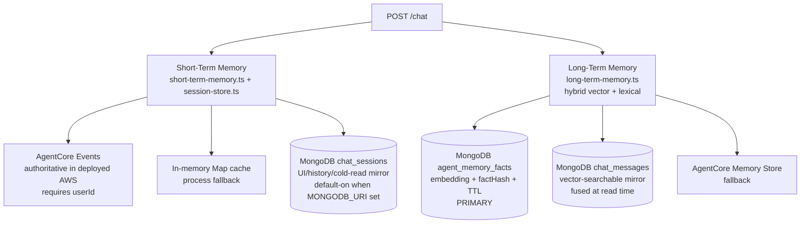

# Memory Architecture

> **Audience:** anyone trying to reason about what the system remembers, when it remembers, and where that data lives.

The system uses **two memory layers** with different jobs and different backends. For architecture discussions, use this shorthand:

- **Short-term memory → AgentCore Memory** in deployed AWS.
- **Long-term memory → MongoDB Atlas** (`agent_memory_facts` + `chat_messages`) with hybrid vector + BM25 retrieval.

MongoDB `chat_sessions` is still useful, but it is a session mirror for UI/history/cold-read fallback, not the primary short-term memory authority in production deployment.



For an editable picture: [`diagrams/03-memory-architecture.drawio`](diagrams/03-memory-architecture.drawio).

---

## 1. Short-Term Memory (current conversation)

**What it is:** per-turn chat transcript for a `sessionId`.

**Primary path in EC2 auth mode:** AgentCore short-term events keyed by `(memoryId, actorId=userId, sessionId)`. This is the production default and the deploy-script default.

### Read/write flow

1. API appends user turn to `session-store`.
2. If AgentCore short-term is enabled (`SHORT_TERM_MEMORY_BACKEND=agentcore`, memory ID present, and authenticated `userId`), API reads prior turns from AgentCore first.
3. If AgentCore read returns nothing or fails, API falls back to `session-store` (in-memory or Mongo cold read when enabled).
4. After assistant reply, API writes assistant turn to `session-store` and best-effort writes user/assistant events to AgentCore.

### Backends

| Backend | When | Behavior |
|---|---|---|
| **AgentCore events** | `SHORT_TERM_MEMORY_BACKEND=agentcore` + `AGENTCORE_MEMORY_STORE_ID` + `userId` | Primary durable short-term memory in deployed AWS. |
| **In-memory map** | Always | Fast process cache/fallback. Lost on API restart. |
| **MongoDB `chat_sessions`** | `MONGODB_URI` set (default-on; opt out with `PERSIST_CHAT_SESSIONS=0`) | Write-through mirror for the Sessions page, audit/debug history, and cold-read fallback. Not the primary short-term memory backend in deployed AWS. |

### Decision tree (which backend serves a given turn)

JWKS auth is **mandatory end-to-end** (see `assertJwksAuthConfigured()` in [`api/src/lib/jwt-verify.ts`](../api/src/lib/jwt-verify.ts)), so every authenticated turn has a real `userId = jwtPayload.sub`. The matrix below describes how the API selects a short-term backend per turn:

| `SHORT_TERM_MEMORY_BACKEND` | `AGENTCORE_MEMORY_STORE_ID` | `MONGODB_URI` | Primary read | Persisted write | Notes |
|---|---|---|---|---|---|
| `agentcore` | set | set | **AgentCore events** (per `(memoryId, actorId=userId, sessionId)`) | AgentCore events **and** `chat_sessions` (write-through) | Production EC2 default; survives API restarts. |
| `agentcore` | set | unset | **AgentCore events** | AgentCore events only | Cold-start replay needs AgentCore reachable; in-memory map is a transient cache. |
| `agentcore` | **unset** | — | — | — | **API refuses to boot** — `assertShortTermBackendConfigured()` in [`api/src/lib/short-term-memory.ts`](../api/src/lib/short-term-memory.ts) throws so a misconfigured deploy never silently downgrades to the in-memory map. |
| any other / unset | — | set | `chat_sessions` (write-through with in-memory cache) | `chat_sessions` only | Used when AgentCore is intentionally off; durable across API restarts via Mongo. |
| any other / unset | — | unset | In-memory `Map` only | none | Ephemeral mode — only safe for tests / a single API process. |

`PERSIST_CHAT_SESSIONS=0` opts out of the Mongo write-through even when `MONGODB_URI` is set; the in-memory `Map` then becomes the only short-term store for that process.

The runtime never silently downgrades from AgentCore to the in-memory `Map`: if you opt into the AgentCore backend, you must wire the memory store id, otherwise the API refuses to start.

---

## 2. Long-Term Memory (cross-session personalization)

**What it is:** extracted user facts/preferences/profile signals that persist across sessions.

**Where it lives:** [`api/src/lib/long-term-memory.ts`](../api/src/lib/long-term-memory.ts).

### Backend strategy

| Backend | Role |
|---|---|
| **MongoDB `agent_memory_facts`** | Primary long-term memory store |
| **AgentCore Memory Store** | Fallback when Mongo write/read fails |

### What gets stored

The API extracts fact-like snippets from each user message and upserts documents like:

```javascript
{
  userId,
  agentId,
  fact,
  source: "user",
  ts,
  factHash,           // sha256(userId | agentId | normalized fact) — dedup key
  embedding,          // 1024-d Voyage / Bedrock Titan v2 vector (absent if embed failed)
  embeddingModel      // "voyage" | "bedrock:<modelId>"
}
```

- Collection: `agent_memory_facts`
- Write op: `bulkWrite` upsert keyed on `{ userId, factHash }`. Re-stating the same fact in a later turn updates nothing (idempotent), so the collection stays clean.
- TTL index: `MEMORY_TTL_DAYS * 86400` seconds (EC2 deploy sets 30 days)
- Atlas indexes: `agent_memory_facts-vector-index` (knn) + `agent_memory_facts-text-index` (BM25 on `fact`)

In parallel, every chat message is mirrored to **`chat_messages`** with its own embedding so the long-term retriever can fuse curated facts with the raw conversation history:

```javascript
{
  messageId,         // matches ChatMessage.id (unique)
  sessionId,
  userId,
  agentId,           // assistant role only
  role,              // "user" | "assistant"
  content,
  timestamp,
  ts,                // Date — used for recency decay
  embedding,
  embeddingModel
}
```

The mirror runs in a microtask after the in-memory session update, so it never sits on the chat hot path. Atlas indexes: `chat_messages-vector-index` + `chat_messages-text-index` (BM25 on `content`). Deleting a session via `DELETE /sessions/:id` cascade-deletes the mirror rows so the user's privacy contract holds.

### Fact extractor (LLM)

Extraction lives in [`api/src/lib/long-term-memory.ts`](../api/src/lib/long-term-memory.ts):

| Backend | Behavior |
|---|---|
| **LLM** ([`api/src/lib/llm-fact-extractor.ts`](../api/src/lib/llm-fact-extractor.ts)) | Calls Amazon Bedrock `ConverseCommand` with a tool-forced JSON schema (`record_facts`); model returns categorized facts + ignored snippets. This is the only extractor — there is no regex fallback. |

**Bedrock runtime failure → skip the write.** When the LLM extractor throws (throttling, AccessDenied, network), the write is skipped and a `memory.long_term_skip` event is emitted with `reason: "llm_extractor_failed"` plus extractor diagnostics (`extractorModelId`, `extractorError`). Rationale: a regex fallback would produce false positives — e.g. "Can you check the status of order ORD-1234?" matches an `order` topic pattern — and silently storing wrong "facts" on every Bedrock blip is worse than skipping. The user can re-state the fact in a future turn.

**Env vars**

| Variable | Purpose | Default |
|---|---|---|
| `MEMORY_EXTRACTION_MODEL_ID` | Bedrock model id (or cross-region inference profile id) used by the LLM extractor. Must support tool use. | `us.anthropic.claude-haiku-4-5-20251001-v1:0` |
| `MEMORY_EXTRACTION_MAX_FACTS` | Cap on facts persisted per turn | `6` |

**Trace event** `memory.long_term_write` records `extractorModelId`, `extractorLatencyMs`, and per-candidate `category` + `note`, all visible in the trace UI.

### Read path: hybrid vector + lexical retrieval

When `agent.memory.longTerm=true` and `userId` is known, the chat route calls a single retriever:

```ts
await readLongTermMemoryContext(userId, body.message, { agentId, priorTurns });
```

Implementation: [`api/src/lib/long-term-memory.ts → readLongTermMemoryContext`](../api/src/lib/long-term-memory.ts). For low latency the retrieval runs **directly against MongoDB** (it is an internal API code path, not a chat-invoked tool) using the shared primitives in [`api/src/lib/vector-retrieval.ts`](../api/src/lib/vector-retrieval.ts):

1. **Embed the query** in query-mode (`embedQueryText`). On embed failure the retriever falls back to lexical-only mode rather than returning nothing.
2. **Run two `$vectorSearch` + two `$search` legs in parallel** across `agent_memory_facts` (curated user facts) and `chat_messages` (raw conversation history), each scoped by `{ userId }`.
3. **Fuse with Reciprocal Rank Fusion (k=60)** across the four ranked lists. RRF works on rank position, not raw score — it neatly handles the cosine-vs-BM25 distribution mismatch.
4. **Apply per-collection weight** (`MEMORY_WEIGHT_FACTS=1.5`, `MEMORY_WEIGHT_CHAT_MESSAGES=1.2` — both favor curated facts slightly while still giving raw chat messages a fair shot at the top of the merged list) and **exponential recency decay** (`MEMORY_RECENCY_HALFLIFE_DAYS=30`).
5. **MMR diversify** the top hits (`MEMORY_MMR_LAMBDA=0.7`) to avoid stacking near-duplicate facts.
6. Render the merged top-K (`MEMORY_VECTOR_TOPK=14` — raised from `6` to `10` to `14` across 2026-05 so that conversation-specific signals like codenames, exact phrasing, or in-session list data don't lose the top-K race to higher-weighted facts; the 14-row default leaves enough headroom for transient chat-message content to coexist with fresh same-run profile facts) as a "## Relevant prior context" block and prepend to the system prompt.

The retriever emits a single `memory.scoped_read` trace event (event name preserved for UI compat) enriched with `mode`, `retrieval.vectorHits`, `retrieval.lexicalHits`, `retrieval.perCollection`, and embedding metadata so the Trace Viewer can show what was fused.

This is why specialist flows can personalize from facts learned in a different specialist session — facts are retrieved by **semantic relevance to the current user message** rather than by agentId alone.

### Tuning knobs (long-term retrieval)

| Variable | Purpose | Default |
|---|---|---|
| `MEMORY_VECTOR_TOPK` | Final number of hits injected after RRF+MMR | `14` |
| `MEMORY_VECTOR_FETCHK` | Per-leg over-fetch before merge | `24` |
| `MEMORY_VECTOR_NUM_CANDIDATES` | `$vectorSearch.numCandidates` width | `200` |
| `MEMORY_SEARCH_MAX_TIME_MS` | Timeout per Atlas vector/BM25 aggregation leg | `8000` |
| `MEMORY_EMBED_TIMEOUT_MS` | Query embedding timeout before lexical fallback | `5000` |
| `MEMORY_RECENCY_HALFLIFE_DAYS` | Exponential decay half-life. 0 disables decay | `30` |
| `MEMORY_MMR_LAMBDA` | 1 = pure relevance, 0 = pure diversity | `0.7` |
| `MEMORY_MIN_SCORE` | Drop merged items below this RRF score | `0` |
| `MEMORY_WEIGHT_FACTS` | Multiplier on `agent_memory_facts` RRF score | `1.5` |
| `MEMORY_WEIGHT_CHAT_MESSAGES` | Multiplier on `chat_messages` RRF score | `1.2` |
| `MEMORY_TRACE_VALUES` | When `1`, write fact text into the trace event | unset |

> **Why the 2026-05 retune?** Live diagnostic runs (see `e2e-smoke/memory-recall-diagnostic.py`) showed that chat-message hits were routinely being evicted from the final top-K by the heavier fact weight. The bumps — `MEMORY_VECTOR_TOPK` from `6` → `10` → `14` and `MEMORY_WEIGHT_CHAT_MESSAGES` from `1.0` → `1.2` — restore conversational recall (codenames, exact phrasing, in-session list data) without disturbing the fact-priority semantics that fact-heavy queries rely on. The second TOPK bump (10 → 14) was added after the harness showed C/D failing when same-run profile facts (e.g. "favorite color is teal", "pet's name is Mango-…") crowded out a fresh transient chat-message-only codename. Re-run the harness with `--cleanup --cleanup-after` after any further retuning.

### Memory-recall instructions (uniform across personas)

The system prompt's "Memory recall rules" block is the **single source** of memory-recall instructions for every memory-enabled agent. It lives in [`api/src/lib/prompt.ts → LONG_TERM_MEMORY_RECALL_RULES`](../api/src/lib/prompt.ts) and is appended by `withLongTermMemory(...)`. Persona files MUST NOT copy these rules inline — `api/tests/unit/orchestrator-ltm-flag.test.ts` enforces that the orchestrator and order-management personas stay clean. To change the recall behavior, update the constant (and its lock-down test), not the persona files.

### Memory-write surface in the UI

`memory.long_term_write` / `memory.long_term_skip` events emit AFTER the SSE `done` event because fact extraction is intentionally dangling (off the user's clock). `POST /chat` re-persists the trace doc once the microtask settles, so a single `GET /traces/:id` ~1-2 s after `done` exposes the post-write events. The Streamlit chat panel does exactly that: see [`ui/lib/inline_summary.py → merge_post_done_memory_events`](../ui/lib/inline_summary.py) for the merge helper and `_render_memory_panel` for the "Learned …" expander + `st.toast` notification.

### Chat-invoked Mongo tools (boundary preserved)

Long-term memory uses direct Mongo for efficiency, but **chat-invoked Mongo tools always route through AgentCore Gateway to the Mongo MCP runtime** ([`mcp-runtimes/mongodb-mcp/src/vendor/handlers.mjs`](../mcp-runtimes/mongodb-mcp/src/vendor/handlers.mjs)). That includes the new hybrid path: when the model sets `hybrid: true` on a `mongodb_vector_search` call, the API-side wrapper in [`api/src/adapters/mongodb-mcp-client.ts → VectorSearchEmbedTool`](../api/src/adapters/mongodb-mcp-client.ts) rewrites the args and invokes the runtime's `mongodb_hybrid_search` helper — the API never bypasses MCP for chat tools.

---

## 3. Auth Context in Memory Injection

In addition to long-term facts, chat prompt context includes an **Authenticated User Context** block from:

- JWT claims (`sub`, `email`, `name`, etc.)
- Cognito `GetUser` fallback (important for access tokens that omit `email`)
- Mongo enrichment (`customers` tier/verified and recent ordered SKUs)

This drives identity-aware prompts like:
- "my orders"
- "my open tickets"
- "recommend based on my previous orders"

---

## 4. What Memory Currently Does Not Do

- No full memory summarization/consolidation pipeline (the retriever leans on RRF + MMR + recency decay; there is no nightly job that rewrites facts).
- No hard PII classifier before memory write. The LLM extractor is prompt-instructed to skip ephemeral / non-personal text and label what it stores by category, but it is not a PII guard.
- Embedding failures are non-fatal: the row is still written and remains reachable through the lexical (BM25) leg. Production should alert on repeated `embeddedCount < factsExtracted.length` in `memory.long_term_write` rather than blocking the chat turn.

---

## 5. Debugging Memory

### Check AgentCore short-term events

```bash
aws bedrock-agentcore list-events \
  --memory-id "$AGENTCORE_MEMORY_STORE_ID" \
  --actor-id "<userId>" \
  --session-id "<sessionId>" \
  --include-payloads \
  --region us-east-1
```

### Check Mongo long-term facts

```bash
# Database name is project+env-derived (underscored). Example for
# PROJECT_NAME=mongodb-multiagent / ENVIRONMENT=dev:
use mongodb_multiagent_dev
db.agent_memory_facts.find({ userId: "<userId>" }).sort({ ts: -1 }).limit(20)
```

### Useful logs (`LOG_LEVEL=debug`)

```text
[chat] injecting long-term memory { userId, agentId }
[memory] wrote facts to MongoDB agent_memory_facts { userId, agentId }
[auth-context] failed to enrich auth context from Mongo ...
```

---

## 6. Critical files reference

| File | Purpose |
|---|---|
| [`api/src/lib/short-term-memory.ts`](../api/src/lib/short-term-memory.ts) | AgentCore short-term read/write |
| [`api/src/lib/session-store.ts`](../api/src/lib/session-store.ts) | Fallback chat session cache + optional Mongo persistence + chat_messages mirror |
| [`api/src/lib/chat-sessions-collection.ts`](../api/src/lib/chat-sessions-collection.ts) | `chat_sessions` collection access |
| [`api/src/lib/chat-messages-collection.ts`](../api/src/lib/chat-messages-collection.ts) | `chat_messages` vector-searchable mirror (indexes, persist, cascade delete) |
| [`api/src/lib/long-term-memory.ts`](../api/src/lib/long-term-memory.ts) | Long-term facts read/write, hybrid retrieval orchestrator, AgentCore fallback |
| [`api/src/lib/vector-retrieval.ts`](../api/src/lib/vector-retrieval.ts) | Shared retrieval primitives: pipeline builders, RRF, MMR, recency decay |
| [`api/src/lib/embed-query.ts`](../api/src/lib/embed-query.ts) | `embedQueryText` (query mode) + `embedDocumentText` (write mode) |
| [`api/src/lib/llm-fact-extractor.ts`](../api/src/lib/llm-fact-extractor.ts) | Bedrock-backed LLM fact extractor (tool-forced JSON output) |
| [`api/src/lib/auth-user-context.ts`](../api/src/lib/auth-user-context.ts) | Authenticated identity enrichment for prompts |
| [`api/src/routes/chat.ts`](../api/src/routes/chat.ts) | End-to-end read/write hook integration |
| [`api/src/adapters/mongodb-mcp-client.ts`](../api/src/adapters/mongodb-mcp-client.ts) | `mongodb_vector_search` wrapper + hybrid routing through the MCP runtime |
| [`mcp-runtimes/mongodb-mcp/src/vendor/handlers.mjs`](../mcp-runtimes/mongodb-mcp/src/vendor/handlers.mjs) | `mongodb_vector_search` + `mongodb_hybrid_search` MCP runtime handlers |
| [`db-seeding/seed-indexes.ts`](../db-seeding/seed-indexes.ts) | Atlas vector + Search indexes for all four collections |
