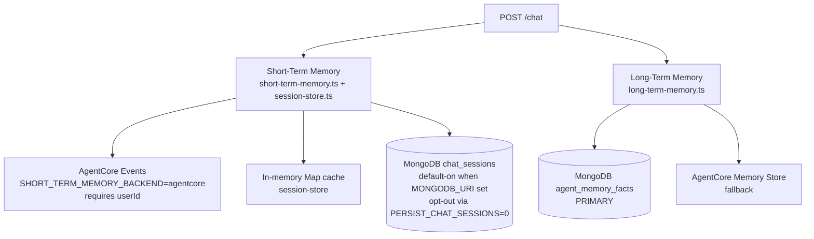

# Memory Architecture

> **Audience:** anyone trying to reason about what the system remembers, when it remembers, and where that data lives.

The system uses **two memory layers** with different jobs and different backends.



For an editable picture: [`diagrams/03-memory-architecture.drawio`](diagrams/03-memory-architecture.drawio).

---

## 1. Short-Term Memory (current conversation)

**What it is:** per-turn chat transcript for a `sessionId`.

**Primary path in EC2 auth mode:** AgentCore short-term events keyed by `(memoryId, actorId=userId, sessionId)`.

### Read/write flow

1. API appends user turn to `session-store`.
2. If AgentCore short-term is enabled (`SHORT_TERM_MEMORY_BACKEND=agentcore`, memory ID present, and authenticated `userId`), API reads prior turns from AgentCore first.
3. If AgentCore read returns nothing or fails, API falls back to `session-store` (in-memory or Mongo cold read when enabled).
4. After assistant reply, API writes assistant turn to `session-store` and best-effort writes user/assistant events to AgentCore.

### Backends

| Backend | When | Behavior |
|---|---|---|
| **AgentCore events** | `SHORT_TERM_MEMORY_BACKEND=agentcore` + `AGENTCORE_MEMORY_STORE_ID` + `userId` | Primary durable short-term memory in EC2 mode. |
| **In-memory map** | Always | Fast cache/fallback. Lost on API restart. |
| **MongoDB `chat_sessions`** | `MONGODB_URI` set (default-on; opt out with `PERSIST_CHAT_SESSIONS=0`) | Write-through persistence for `session-store`. |

---

## 2. Long-Term Memory (cross-session personalization)

**What it is:** extracted user facts/preferences/profile signals that persist across sessions.

**Where it lives:** [`api/src/lib/long-term-memory.ts`](../api/src/lib/long-term-memory.ts).

### Backend strategy

| Backend | Role |
|---|---|
| **MongoDB `agent_memory_facts`** | Primary long-term memory store |
| **AgentCore Memory Store** | Fallback when Mongo write/read fails |

### What gets stored

The API extracts fact-like lines from user messages and writes documents like:

```javascript
{
  userId,
  agentId,
  fact,
  source: "user",
  ts
}
```

- Collection: `agent_memory_facts`
- TTL index: `MEMORY_TTL_DAYS * 86400` seconds (EC2 deploy sets 30 days)

### Read path injected into prompts

When `agent.memory.longTerm=true` and `userId` is known:

- read shared user facts (`readSharedLongTermMemory(userId)`) across all agents
- read agent-scoped facts (`readLongTermMemory(userId, agentId)`)
- prepend both into system prompt as memory context

This is why specialist flows can personalize from facts learned in a different specialist session.

---

## 3. Auth Context in Memory Injection

In addition to long-term facts, chat prompt context includes an **Authenticated User Context** block from:

- JWT claims (`sub`, `email`, `name`, etc.)
- Cognito `GetUser` fallback (important for access tokens that omit `email`)
- Mongo enrichment (`customers` tier/verified and recent ordered SKUs)

This drives identity-aware prompts like:
- "my orders"
- "my open tickets"
- "recommend based on my previous orders"

---

## 4. What Memory Currently Does Not Do

- No vector-similarity recall over memory facts (recall is rule-based + recency-oriented).
- No full memory summarization/consolidation pipeline.
- No hard PII classifier before memory write (facts are heuristic-extracted text).

---

## 5. Debugging Memory

### Check AgentCore short-term events

```bash
aws bedrock-agentcore list-events \
  --memory-id "$AGENTCORE_MEMORY_STORE_ID" \
  --actor-id "<userId>" \
  --session-id "<sessionId>" \
  --include-payloads \
  --region us-east-1
```

### Check Mongo long-term facts

```bash
# Database name is project+env-derived (underscored). Example for
# PROJECT_NAME=mongodb-multiagent / ENVIRONMENT=dev:
use mongodb_multiagent_dev
db.agent_memory_facts.find({ userId: "<userId>" }).sort({ ts: -1 }).limit(20)
```

### Useful logs (`LOG_LEVEL=debug`)

```text
[chat] injecting long-term memory { userId, agentId }
[memory] wrote facts to MongoDB agent_memory_facts { userId, agentId }
[auth-context] failed to enrich auth context from Mongo ...
```

---

## 6. Critical files reference

| File | Purpose |
|---|---|
| [`api/src/lib/short-term-memory.ts`](../api/src/lib/short-term-memory.ts) | AgentCore short-term read/write |
| [`api/src/lib/session-store.ts`](../api/src/lib/session-store.ts) | Fallback chat session cache + optional Mongo persistence |
| [`api/src/lib/chat-sessions-collection.ts`](../api/src/lib/chat-sessions-collection.ts) | `chat_sessions` collection access |
| [`api/src/lib/long-term-memory.ts`](../api/src/lib/long-term-memory.ts) | Long-term facts and fallback logic |
| [`api/src/lib/auth-user-context.ts`](../api/src/lib/auth-user-context.ts) | Authenticated identity enrichment for prompts |
| [`api/src/routes/chat.ts`](../api/src/routes/chat.ts) | End-to-end read/write hook integration |
