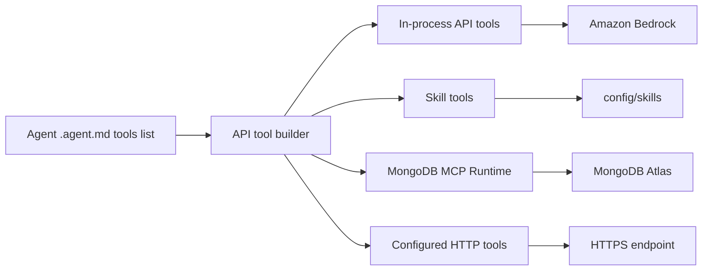

# Agent Tools - Reference

This is the canonical developer catalog for tools an agent can use in this repo. If you are adding an agent, debugging a tool call, or wiring a new external action, start here.

Tool names are attached in `config/agents/<agent>.agent.md` frontmatter under `tools:`. Some tools are also registered automatically at runtime.

## 1. Tool surfaces at a glance



| Tool family | Agent-facing names | Runtime home | Configure in |
|---|---|---|---|
| MongoDB MCP tools | `mongodb_query`, `mongodb_vector_search`, `mongodb_aggregate` | `mcp-runtimes/mongodb-mcp/`, wrapped by `api/src/adapters/mongodb-mcp-client.ts` | Agent `tools:` list + Mongo env vars |
| Bedrock in-process tools | `bedrock_kb_retrieve`, `embed_multimodal_content` | `api/src/lib/base-tools.ts` | Agent `tools:` list + Bedrock/Voyage env vars |
| Skill loading tools | `activate_skill`, `read_skill_resource` | `api/src/lib/base-tools.ts` + `api/src/lib/skill-loader.ts` | Agent `skills:` list and skill folders |
| Skill script tool | `run_skill_script` | `api/src/lib/base-tools.ts` | Agent `tools:` list + `config/skills/<skill>/scripts/*.mjs` |
| Skill HTTP tools | `<skill>/<localName>` | `api/src/lib/http-tools-runtime.ts` | `config/skills/<skill>/http-tools.json` + root allowlist |
| Global HTTP tools | `<toolName>` | `api/src/lib/http-tools-runtime.ts` | `config/http-tools.json` |
| Internal-only Mongo helper | `mongodb_hybrid_search` | `mcp-runtimes/mongodb-mcp/src/server.ts` | Not listed in agent configs |

## 2. How tools are attached to agents

Agent definitions live in `config/agents/*.agent.md`. The frontmatter field:

```yaml
tools:
  - mongodb_query
  - mongodb_vector_search
  - read_skill_resource
  - run_skill_script
  - bedrock_kb_retrieve
  - order-management/notify_fulfillment_lambda
```

Rules:

- List only tools the agent's skills actually instruct it to use.
- `activate_skill` is automatic. You do not list it in `tools:`.
- Specialists pre-activate their configured `skills:` before the first model call, so they usually do not need to call `activate_skill`.
- `read_skill_resource`, `run_skill_script`, and skill HTTP tools are gated by the agent's `skills:` allowlist and by skill activation.
- MongoDB tool calls never open a MongoDB driver inside the chat runtime. They go through AgentCore Gateway, whose target invokes the MongoDB MCP AgentCore Runtime.
- `GET /http-tools` lists configured HTTP tools only. It is not the full tool catalog.

## 3. MongoDB MCP tools

MongoDB tools are served through AgentCore Gateway. The Gateway target invokes the dedicated MongoDB MCP AgentCore Runtime under `mcp-runtimes/mongodb-mcp/`. The API/runtime wrapper in `api/src/adapters/mongodb-mcp-client.ts` handles transport, trace events, user scoping, vector embedding, and compatibility with the agent-facing tool names.

### `mongodb_query`

Use for deterministic reads and small guarded writes against MongoDB Atlas.

| Item | Details |
|---|---|
| Agent-facing name | `mongodb_query` |
| Runtime implementation | `mcp-runtimes/mongodb-mcp/src/vendor/handlers.mjs` |
| Registered by | `mcp-runtimes/mongodb-mcp/src/server.ts` |
| Typical operations | `find`, `findOne`, `aggregate`, `insertOne`, `updateOne` |
| Writes | Gated by `MONGODB_ALLOW_WRITE` |
| User scoping | API wrapper injects JWT `sub` for non-public collections |
| Public collections | `products`, `troubleshooting_docs` by default; override with `MONGODB_PUBLIC_COLLECTIONS` |
| Trace/debug events | `tool.mcp`, `mongo.query`, `mongo.result` |

Prefer this for exact filters such as order IDs, customer records, status checks, and counts. Prefer `mongodb_vector_search` for semantic lookup.

### `mongodb_vector_search`

Use for semantic retrieval over Atlas Vector Search indexes. Agents pass natural language `queryText`; the API computes the embedding server-side.

| Item | Details |
|---|---|
| Agent-facing name | `mongodb_vector_search` |
| Runtime implementation | `mcp-runtimes/mongodb-mcp/src/vendor/handlers.mjs` |
| API wrapper | `api/src/adapters/mongodb-mcp-client.ts` (`VECTOR_SEARCH_TOOL_SPEC`) |
| Input agents should prefer | `collection`, `queryText`, optional `limit`, optional `hybrid: true` |
| Embedding provider | Voyage SageMaker when configured; Bedrock embedding fallback |
| Known vector indexes | `products-vector-index`, `troubleshooting-vector-index`, `agent_memory_facts-vector-index`, `chat_messages-vector-index` |
| Hybrid mode | `hybrid: true` fuses vector + Atlas Search BM25 with Reciprocal Rank Fusion |
| Trace/debug events | `tool.mcp`, `mongo.vector_search`, `mongo.result` |

Known collection defaults are inferred by the wrapper:

| Collection | Vector index | Lexical index for hybrid mode |
|---|---|---|
| `products` | `products-vector-index` | Product text index seeded by `db-seeding/seed-indexes.ts` |
| `troubleshooting_docs` | `troubleshooting-vector-index` | Troubleshooting text index seeded by `db-seeding/seed-indexes.ts` |
| `agent_memory_facts` | `agent_memory_facts-vector-index` | Memory facts BM25 index |
| `chat_messages` | `chat_messages-vector-index` | Chat messages BM25 index |

### `mongodb_aggregate`

Use for bounded aggregation pipelines when a simple `mongodb_query` is not enough.

| Item | Details |
|---|---|
| Agent-facing name | `mongodb_aggregate` |
| Runtime implementation | `mcp-runtimes/mongodb-mcp/src/vendor/handlers.mjs` |
| Input | `collection`, `pipeline`, optional `limit` |
| User scoping | API wrapper prepends a `$match` with `userId` for non-public collections when missing |
| Trace/debug events | `tool.mcp`, `mongo.query`, `mongo.result` |

Keep pipelines small and deterministic. Do not use this as a substitute for semantic search.

### `mongodb_hybrid_search` (internal only)

This is not agent-facing. Agents should call `mongodb_vector_search` with `hybrid: true`; the API-side vector-search wrapper routes that call to `mongodb_hybrid_search` internally.

| Item | Details |
|---|---|
| Agent-facing? | No |
| Runtime implementation | `mcp-runtimes/mongodb-mcp/src/server.ts` + `vendor/handlers.mjs` |
| Purpose | Vector + lexical fusion with RRF |
| Attach in `.agent.md`? | Never |

## 4. Bedrock in-process tools

These run in the API/runtime process and are defined in `api/src/lib/base-tools.ts`.

### `bedrock_kb_retrieve`

Retrieves passages from an Amazon Bedrock Knowledge Base.

| Item | Details |
|---|---|
| Agent-facing name | `bedrock_kb_retrieve` |
| Runtime implementation | `api/src/lib/base-tools.ts` -> `api/src/adapters/bedrock-retrieval.ts` |
| Input | `query`, optional `knowledgeBaseId`, optional `numberOfResults` |
| Default KB | `BEDROCK_KB_ID` |
| Used by | Troubleshooting/RAG flows |
| Trace/debug events | `tool.call`, Bedrock retrieval events in trace |

Use this when the answer should come from the Bedrock KB corpus, not directly from MongoDB product/order collections.

### `embed_multimodal_content`

Generates embeddings for multimodal inputs (interleaved text + images) — the only embedding tool the SDK exposes after the multimodal-only migration. Replaces the legacy text-only `generate_embedding`.

| Item | Details |
|---|---|
| Agent-facing name | `embed_multimodal_content` |
| Runtime implementation | `api/src/lib/base-tools.ts` → `embedQueryText` / `embedDocumentText` in `api/src/lib/embed-query.ts` |
| Input | `inputs: MultimodalItem[]`, optional `input_type` (`query` or `document`). Each item: `{ content: Array<{ type: "text", text } \| { type: "image_url", image_url } \| { type: "image_base64", image_base64 }> }`. Schema is a `z.discriminatedUnion("type", ...)`. |
| Provider | Voyage SageMaker when `EMBEDDINGS_PROVIDER=voyage` (full multimodal); Bedrock Titan when `=titan` (text-only — rejects image segments with `titan_no_multimodal`). |
| Common use | Mostly internal/diagnostic; `mongodb_vector_search` embeds `queryText` automatically. |
| Trace events | `tool.call` on success (with per-item segment counts), `error` on failure (base64 data redacted via `redactBase64Segments`). |

Most agents should prefer `mongodb_vector_search` with `queryText` instead of manually calling this tool. See [`docs/reference/voyage.md`](voyage.md) for the canonical request envelope.

## 5. Skill tools

Skills live under `config/skills/<skill>/`. See `../skills-authoring-guide.md` for the authoring guide.

### `activate_skill`

Loads a skill's `SKILL.md` body into the active agent context.

| Item | Details |
|---|---|
| Agent-facing name | `activate_skill` |
| Listed in `.agent.md`? | No, registered automatically when inactive skills are available |
| Runtime implementation | `api/src/lib/base-tools.ts` |
| Input | `skillName` |
| Gate | Skill must exist in the registry |

Specialist agents pre-activate their listed skills, so this is most useful for the orchestrator or any broad agent with optional skills.

### `read_skill_resource`

Loads files from a skill folder on demand.

| Item | Details |
|---|---|
| Agent-facing name | `read_skill_resource` |
| Runtime implementation | `api/src/lib/base-tools.ts` + `api/src/lib/skill-loader.ts` |
| Input | `skillName`, `path` |
| Allowed paths | Files under `config/skills/<skill>/`, commonly `references/*.md` or `scripts/*.mjs` |
| Gate | Skill must be in the agent's `skills:` list and activated |
| Trace/debug events | `tool.call`, `skill.resource_read` rollups |

Use this for progressive disclosure: keep `SKILL.md` concise and load bulky schemas, policies, examples, or references only when needed.

### `run_skill_script`

Dynamically imports a skill-local `.mjs` script and calls a named export.

| Item | Details |
|---|---|
| Agent-facing name | `run_skill_script` |
| Runtime implementation | `api/src/lib/base-tools.ts` |
| Input | `skillName`, `scriptPath`, `exportName`, `args` |
| Allowed scripts | `.mjs` files under `config/skills/<skill>/scripts/` |
| Gate | Skill must be in the agent's `skills:` list and activated |
| Common use | Deterministic policy checks, validation, formatting, small calculations |

Keep scripts deterministic and side-effect-light. If a script calls an external service, consider an HTTP tool instead so URL, timeout, and SSRF policy are explicit.

## 6. HTTP tools

HTTP tools let an agent call an HTTPS endpoint without TypeScript changes. They are configured as JSON and executed by `api/src/lib/http-tools-runtime.ts`.

### Skill-scoped HTTP tools: `<skill>/<localName>`

Defined in `config/skills/<skill>/http-tools.json`.

```json
{
  "tools": [
    {
      "name": "notify_fulfillment_lambda",
      "description": "POST order event to the fulfillment Lambda.",
      "method": "POST",
      "url": "${ORDER_NOTIFY_LAMBDA_URL}",
      "parameters": [
        { "name": "orderId", "type": "string", "description": "Order id", "required": true }
      ]
    }
  ]
}
```

Attach it to an agent as:

```yaml
tools:
  - order-management/notify_fulfillment_lambda
```

Rules:

- The skill must be in the agent's `skills:` list.
- The skill must be activated before the tool call succeeds.
- Host allowlists are still read from root `config/http-tools.json` under `security`.
- Use `GET /http-tools` to check whether the URL env placeholders are configured.

### Global HTTP tools: `<toolName>`

Defined in root `config/http-tools.json`.

```json
{
  "security": {
    "allowedHosts": ["example.execute-api.us-east-1.amazonaws.com"],
    "allowedHostSuffixes": ["lambda-url.us-east-1.on.aws"]
  },
  "tools": [
    {
      "name": "lookup_ticket",
      "description": "Look up a support ticket.",
      "method": "GET",
      "url": "${TICKET_API_URL}",
      "parameters": [
        { "name": "ticketId", "type": "string", "description": "Ticket id", "required": true }
      ]
    }
  ]
}
```

Attach it to an agent as:

```yaml
tools:
  - lookup_ticket
```

Global HTTP tools are not skill-activation gated. Use them only when the tool is genuinely shared across agents.

### HTTP tool security and debugging

| Topic | Detail |
|---|---|
| SSRF guard | `security.allowedHosts` or `security.allowedHostSuffixes` is mandatory whenever HTTP tools are registered |
| Env placeholders | `${VAR}` placeholders are expanded from process env at load time |
| Mock mode | `HTTP_TOOLS_MOCK=1` returns mock payloads instead of making real outbound calls |
| Metadata endpoint | `GET /http-tools` lists root and skill HTTP tools plus URL configured/unconfigured status |
| Trace/debug events | `tool.http`, structured logs from `http-tools-runtime.ts` |

## 7. Tool selection guidance

| Need | Prefer this tool |
|---|---|
| Exact record lookup by id/status | `mongodb_query` |
| Semantic product/troubleshooting/memory search | `mongodb_vector_search` |
| Semantic + rare keyword recall | `mongodb_vector_search` with `hybrid: true` |
| Bounded aggregation | `mongodb_aggregate` |
| Bedrock KB/RAG passages | `bedrock_kb_retrieve` |
| Load a long schema/reference file | `read_skill_resource` |
| Deterministic skill-local policy check | `run_skill_script` |
| Call Lambda Function URL / API Gateway | Skill HTTP tool or global HTTP tool |
| Generate an embedding directly | `embed_multimodal_content` |

## 8. Debug checklist

1. Confirm the tool is listed in the agent's `tools:` array, except for `activate_skill`.
2. Confirm the required skill is listed in the agent's `skills:` array and is activated for skill-gated tools.
3. For Mongo tools, verify `/health` shows `mcpServer: "connected"` and check `AGENTCORE_GATEWAY_URL` in `.env.live`. Use `MCP_SERVER_URL` only for explicit local-development overrides.
4. For vector search, verify indexes with `db-seeding/seed-indexes.ts` and confirm the embedding provider env (`VOYAGE_SAGEMAKER_ENDPOINT` or `EMBEDDING_MODEL_ID`).
5. For HTTP tools, call `GET /http-tools` and check URL configured status plus root SSRF allowlist.
6. Open the Trace Viewer for a failed chat turn and inspect `tool.call`, `tool.mcp`, `tool.http`, `mongo.query`, and `mongo.vector_search` events.
7. Check service logs by component: API logs for tool registration/wrapping, AgentCore runtime logs for model-side tool choice, MCP runtime logs for Mongo guard failures.

## 9. Adding a new MCP runtime behind the AgentCore Gateway

When you add another MCP server runtime alongside `mcp-runtimes/mongodb-mcp/` (e.g. a payments MCP, an inventory MCP, a third-party SaaS MCP wrapped as a runtime), **every tool's input schema must spread the `_meta` passthrough or it will fail every gateway-routed call with `ValidationException - property '_meta' is not defined in the schema`**. The AgentCore Gateway proxies `tools/call` upstream with `_meta` populated (correlation IDs, progress tokens, etc.) and AWS validates the forwarded arguments against the tool's declared `inputSchema`.

Required pattern (mirror from `mcp-runtimes/mongodb-mcp/src/schemas.ts`):

```typescript
import { z } from "zod";

export const META_PASSTHROUGH = { _meta: z.record(z.string(), z.unknown()).optional() };

export const myToolInputSchema = {
  // ...real fields...
  ...META_PASSTHROUGH,
};
```

And strip `_meta` in your dispatch before invoking the underlying handler so the handler's own validation/logging never sees the envelope key:

```typescript
async function dispatch(toolName, args) {
  const { _meta: _ignored, ...handlerArgs } = args ?? {};
  // ...invoke handler with handlerArgs...
}
```

Pinned by `api/tests/unit/mcp-meta-passthrough.test.ts`. Add your tool to `ALL_TOOL_INPUT_SCHEMAS` in `mcp-runtimes/<your-mcp>/src/schemas.ts` and the test's `baseArgsFor()` switch so the regression auto-covers it.

Also update `_agents-common.sh::force_mcp_runtime_image_sync` (or add a sibling helper) so the operator-driven deploy bumps your runtime's container version after every image push — without it the AgentCore runtime keeps serving the previous image because `:latest` is a constant string in Terraform. See [`docs/status/debugging.md`](../status/debugging.md) "AgentCore Runtime image push does not auto-trigger a runtime version bump" and "AgentCore Gateway target caches tool schemas — refresh after MCP runtime change".

## 10. Source of truth

| Concern | Source file |
|---|---|
| Static Bedrock + skill tools | `api/src/lib/base-tools.ts` |
| Mongo tool wrapper, vector embedding, user scoping | `api/src/adapters/mongodb-mcp-client.ts` |
| Mongo MCP server registration | `mcp-runtimes/mongodb-mcp/src/server.ts` |
| Mongo MCP tool input schemas (incl. `_meta` passthrough) | `mcp-runtimes/mongodb-mcp/src/schemas.ts` |
| Mongo guard/handler behavior | `mcp-runtimes/mongodb-mcp/src/vendor/handlers.mjs`, `mcp-runtimes/mongodb-mcp/src/vendor/guards.mjs` |
| HTTP tool schema | `api/src/lib/http-tools-schema.ts` |
| Root HTTP tool loading | `api/src/lib/http-tools-load.ts` |
| Skill HTTP tool loading | `api/src/lib/skill-http-tools-load.ts` |
| HTTP tool execution | `api/src/lib/http-tools-runtime.ts` |
| Agent config schema | `api/src/lib/schemas.ts` |
| MCP runtime image-sync + gateway-target refresh | `deploy/scripts/_agents-common.sh::force_mcp_runtime_image_sync` |

